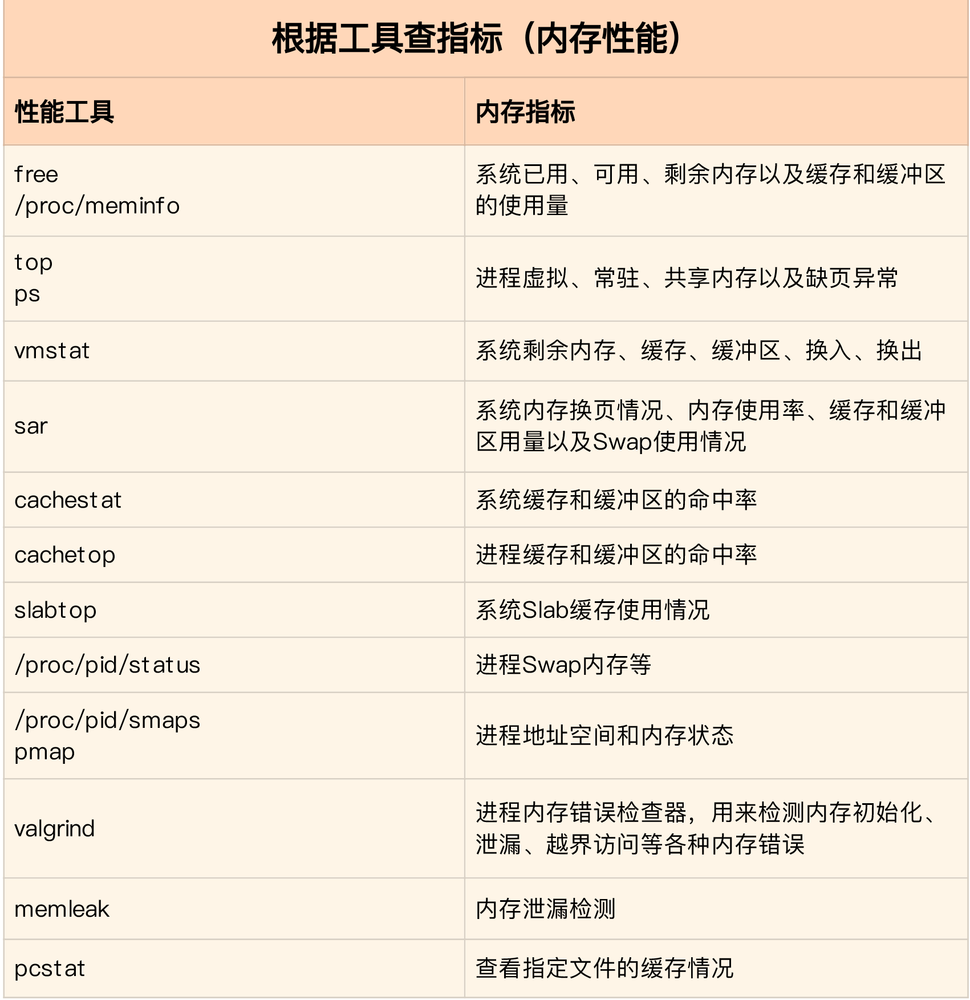

内存性能篇

# 2.1 Linux内存是怎么工作的

## 2.1.1 内存映射
到内存，你能说出你现在用的这台计算机内存有多大吗？我估计你记得很清楚，因为这是我们购买时，首先考虑的一个重要参数，比方说，我的笔记本电脑内存就是 8GB 的 。

我们通常所说的内存容量，就像我刚刚提到的 8GB，其实指的是物理内存。物理内存也称为主存，大多数计算机用的主存都是动态随机访问内存（DRAM）。只有内核才可以直接访问物理内存。那么，进程要访问内存时，该怎么办呢？

<u>Linux 内核给每个进程都提供了一个独立的虚拟地址空间，并且这个地址空间是连续的。这样，进程就可以很方便地访问内存，更确切地说是访问虚拟内存。</u>

虚拟地址空间的内部又被分为内核空间和用户空间两部分，不同字长（也就是单个 CPU 指令可以处理数据的最大长度）的处理器，地址空间的范围也不同。比如最常见的 32 位和 64 位系统，我画了两张图来分别表示它们的虚拟地址空间，如下所示：

通过这里可以看出，32 位系统的内核空间占用 1G，位于最高处，剩下的 3G 是用户空间。而 64 位系统的内核空间和用户空间都是 128T，分别占据整个内存空间的最高和最低处，剩下的中间部分是未定义的。

还记得进程的用户态和内核态吗？<u>进程在用户态时，只能访问用户空间内存；只有进入内核态后，才可以访问内核空间内存。虽然每个进程的地址空间都包含了内核空间，但这些内核空间，其实关联的都是相同的物理内存。</u>这样，进程切换到内核态后，就可以很方便地访问内核空间内存。

然每个进程都有一个这么大的地址空间，那么所有进程的虚拟内存加起来，自然要比实际的物理内存大得多。所以，并不是所有的虚拟内存都会分配物理内存，只有那些实际使用的虚拟内存才分配物理内存，并且分配后的物理内存，是通过内存映射来管理的。

<u>内存映射，其实就是将虚拟内存地址映射到物理内存地址</u>。为了完成内存映射，内核为每个进程都维护了一张页表，记录虚拟地址与物理地址的映射关系，如下图所示:


页表实际上存储在 CPU 的内存管理单元 MMU 中，这样，正常情况下，处理器就可以直接通过硬件，找出要访问的内存。

而当进程访问的虚拟地址在页表中查不到时，系统会产生一个**缺页异常**，进入内核空间分配物理内存、更新进程页表，最后再返回用户空间，恢复进程的运行。

另外，我在 CPU 上下文切换的文章中曾经提到， TLB（Translation Lookaside Buffer，转译后备缓冲器）会影响 CPU 的内存访问性能，在这里其实就可以得到解释。

TLB 其实就是 MMU 中页表的高速缓存。由于进程的虚拟地址空间是独立的，而 TLB 的访问速度又比 MMU 快得多，所以，通过减少进程的上下文切换，减少 TLB 的刷新次数，就可以提高 TLB 缓存的使用率，进而提高 CPU 的内存访问性能。

不过要注意，MMU 并不以字节为单位来管理内存，而是规定了一个内存映射的最小单位，也就是页，通常是 4 KB 大小。这样，每一次内存映射，都需要关联 4 KB 或者 4KB 整数倍的内存空间。

页的大小只有 4 KB ，导致的另一个问题就是，整个页表会变得非常大。<u>比方说，仅 32 位系统就需要 100 多万个页表项（4GB/4KB），才可以实现整个地址空间的映射。为了解决页表项过多的问题，Linux 提供了两种机制，也就是多级页表和大页（HugePage）。</u>

多级页表就是把内存分成区块来管理，将原来的映射关系改成区块索引和区块内的偏移。由于虚拟内存空间通常只用了很少一部分，那么，多级页表就只保存这些使用中的区块，这样就可以大大地减少页表的项数。

Linux 用的正是四级页表来管理内存页，如下图所示，虚拟地址被分为 5 个部分，前 4 个表项用于选择页，而最后一个索引表示页内偏移。


## 2.1.2 虚拟内存空间分布
首先，我们需要进一步了解虚拟内存空间的分布情况。最上方的内核空间不用多讲，下方的用户空间内存，其实又被分成了多个不同的段。以 32 位系统为例，我画了一张图来表示它们的关系。  

通过这张图你可以看到，用户空间内存，从低到高分别是五种不同的内存段。

* 只读段，包括代码和常量等。

* 数据段，包括全局变量等。

* 堆，包括动态分配的内存，从低地址开始向上增长。

* 文件映射段，包括动态库、共享内存等，从高地址开始向下增长。

* 栈，包括局部变量和函数调用的上下文等。栈的大小是固定的，一般是 8 MB。

在这五个内存段中，堆和文件映射段的内存是动态分配的。比如说，使用 C 标准库的 malloc() 或者 mmap() ，就可以分别在堆和文件映射段动态分配内存。

其实 64 位系统的内存分布也类似，只不过内存空间要大得多。那么，更重要的问题来了，内存究竟是怎么分配的呢？

## 2.1.3 内存分配与回收
https://zhuanlan.zhihu.com/p/311527161  
malloc() 是 C 标准库提供的内存分配函数，对应到系统调用上，有两种实现方式，即 brk() 和 mmap()。

对小块内存（小于 128K），C 标准库使用 brk() 来分配，也就是通过移动堆顶的位置来分配内存。这些内存释放后并不会立刻归还系统，而是被缓存起来，这样就可以重复使用。

而大块内存（大于 128K），则直接使用内存映射 mmap() 来分配，也就是在文件映射段找一块空闲内存分配出去。

这两种方式，自然各有优缺点。

brk() 方式的缓存，可以减少缺页异常的发生，提高内存访问效率。不过，由于这些内存没有归还系统，在内存工作繁忙时，频繁的内存分配和释放会造成内存碎片。

而 mmap() 方式分配的内存，会在释放时直接归还系统，所以每次 mmap 都会发生缺页异常。在内存工作繁忙时，频繁的内存分配会导致大量的缺页异常，使内核的管理负担增大。这也是 malloc 只对大块内存使用 mmap  的原因。

了解这两种调用方式后，我们还需要清楚一点，那就是，当这两种调用发生后，其实并没有真正分配内存。这些内存，都只在首次访问时才分配，也就是通过缺页异常进入内核中，再由内核来分配内存。

整体来说，Linux 使用伙伴系统来管理内存分配。前面我们提到过，这些内存在 MMU 中以页为单位进行管理，伙伴系统也一样，以页为单位来管理内存，并且会通过相邻页的合并，减少内存碎片化（比如 brk 方式造成的内存碎片）。

你可能会想到一个问题，如果遇到比页更小的对象，比如不到 1K 的时候，该怎么分配内存呢？

实际系统运行中，确实有大量比页还小的对象，如果为它们也分配单独的页，那就太浪费内存了。

**所以，在用户空间，malloc 通过 brk() 分配的内存，在释放时并不立即归还系统，而是缓存起来重复利用。在内核空间，Linux 则通过 slab 分配器来管理小内存。你可以把 slab 看成构建在伙伴系统上的一个缓存，主要作用就是分配并释放内核中的小对象。**

对内存来说，如果只分配而不释放，就会造成内存泄漏，甚至会耗尽系统内存。所以，在应用程序用完内存后，还需要调用 free() 或 unmap() ，来释放这些不用的内存。

当然，系统也不会任由某个进程用完所有内存。在发现内存紧张时，系统就会通过一系列机制来回收内存，比如下面这三种方式：
* 回收缓存，比如使用 LRU（Least Recently Used）算法，回收最近使用最少的内存页面；

* 回收不常访问的内存，把不常用的内存通过交换分区直接写到磁盘中；

* 杀死进程，内存紧张时系统还会通过 OOM（Out of Memory），直接杀掉占用大量内存的进程。

其中，第二种方式回收不常访问的内存时，会用到交换分区（以下简称 Swap）。<u>Swap 其实就是把一块磁盘空间当成内存来用。它可以把进程暂时不用的数据存储到磁盘中（这个过程称为换出），当进程访问这些内存时，再从磁盘读取这些数据到内存中（这个过程称为换入）。</u>

所以，你可以发现，Swap 把系统的可用内存变大了。不过要注意，通常只在内存不足时，才会发生 Swap 交换。并且由于磁盘读写的速度远比内存慢，Swap 会导致严重的内存性能问题。

第三种方式提到的  OOM（Out of Memory），其实是内核的一种保护机制。它监控进程的内存使用情况，并且使用 oom_score 为每个进程的内存使用情况进行评分：


## 2.1.3 如何查看内存使用情况
你第一个想到的应该是 free  工具吧。下面是一个 free 的输出示例：
```
# 注意不同版本的free输出可能会有所不同
$ free
              total        used        free      shared  buff/cache   available
Mem:        8169348      263524     6875352         668     1030472     7611064
Swap:             0           0           0
```

free 输出的是一个表格，其中的数值都默认以字节为单位。表格总共有两行六列，这两行分别是物理内存 Mem 和交换分区 Swap 的使用情况，而六列中，每列数据的含义分别为：

* 第一列，total 是总内存大小；
* 第二列，used 是已使用内存的大小，包含了共享内存；
* 第三列，free 是未使用内存的大小；
* 第四列，shared 是共享内存的大小；
* 第五列，buff/cache 是缓存和缓冲区的大小；
* 最后一列，available 是新进程可用内存的大小。

最后一列的可用内存 available 。available 不仅包含未使用内存，还包括了可回收的缓存，所以一般会比未使用内存更大。不过，并不是所有缓存都可以回收，因为有些缓存可能正在使用中。

不过，我们知道，free 显示的是整个系统的内存使用情况。如果你想查看进程的内存使用情况，可以用 top 或者 ps 等工具。比如，下面是 top 的输出示例：
```
# 按下M切换到内存排序
$ top
...
KiB Mem :  8169348 total,  6871440 free,   267096 used,  1030812 buff/cache
KiB Swap:        0 total,        0 free,        0 used.  7607492 avail Mem


  PID USER      PR  NI    VIRT    RES    SHR S  %CPU %MEM     TIME+ COMMAND
  430 root      19  -1  122360  35588  23748 S   0.0  0.4   0:32.17 systemd-journal
 1075 root      20   0  771860  22744  11368 S   0.0  0.3   0:38.89 snapd
 1048 root      20   0  170904  17292   9488 S   0.0  0.2   0:00.24 networkd-dispat
    1 root      20   0   78020   9156   6644 S   0.0  0.1   0:22.92 systemd
12376 azure     20   0   76632   7456   6420 S   0.0  0.1   0:00.01 systemd
12374 root      20   0  107984   7312   6304 S   0.0  0.1   0:00.00 sshd
...
```
top 输出界面的顶端，也显示了系统整体的内存使用情况，这些数据跟 free 类似，我就不再重复解释。我们接着看下面的内容，跟内存相关的几列数据，比如 VIRT、RES、SHR 以及 %MEM 等。

这些数据，包含了进程最重要的几个内存使用情况，我们挨个来看。

* VIRT 是进程虚拟内存的大小，只要是进程申请过的内存，即便还没有真正分配物理内存，也会计算在内。

* RES 是常驻内存的大小，也就是进程实际使用的物理内存大小，但不包括 Swap 和共享内存。

* SHR 是共享内存的大小，比如与其他进程共同使用的共享内存、加载的动态链接库以及程序的代码段等。

* %MEM 是进程使用物理内存占系统总内存的百分比。

除了要认识这些基本信息，在查看 top 输出时，你还要注意两点。
第一，虚拟内存通常并不会全部分配物理内存。从上面的输出，你可以发现每个进程的虚拟内存都比常驻内存大得多。

第二，共享内存 SHR 并不一定是共享的，比方说，程序的代码段、非共享的动态链接库，也都算在 SHR 里。当然，SHR 也包括了进程间真正共享的内存。所以在计算多个进程的内存使用时，不要把所有进程的 SHR 直接相加得出结果。


## 小结
今天，我们梳理了 Linux 内存的工作原理。对普通进程来说，它能看到的其实是内核提供的虚拟内存，这些虚拟内存还需要通过页表，由系统映射为物理内存。

当进程通过 malloc() 申请内存后，内存并不会立即分配，而是在首次访问时，才通过缺页异常陷入内核中分配内存。

由于进程的虚拟地址空间比物理内存大很多，Linux 还提供了一系列的机制，应对内存不足的问题，比如缓存的回收、交换分区 Swap 以及 OOM 等。

当你需要了解系统或者进程的内存使用情况时，可以用 free 和 top 、ps 等性能工具。它们都是分析性能问题时最常用的性能工具，希望你能熟练使用它们，并真正理解各个指标的含义。


# 2.2 怎么理解内存中的Buffer和Cache？
***
## 2.2.1 free 数据的来源
从 free 的手册中，你可以看到 buffer 和 cache 的说明。
* Buffers 是内核缓冲区用到的内存，对应的是  /proc/meminfo 中的 Buffers 值。

* Cache 是内核页缓存和 Slab 用到的内存，对应的是  /proc/meminfo 中的 Cached 与 SReclaimable 之和。

这里的说明告诉我们，这些数值都来自 /proc/meminfo，但更具体的 Buffers、Cached 和 SReclaimable 的含义，还是没有说清楚。

## 2.2.2 proc 文件系统

/proc 是 Linux 内核提供的一种特殊文件系统，是用户跟内核交互的接口。比方说，用户可以从 /proc 中查询内核的运行状态和配置选项，查询进程的运行状态、统计数据等，当然，你也可以通过 /proc  来修改内核的配置。

proc 文件系统同时也是很多性能工具的最终数据来源。比如我们刚才看到的 free ，就是通过读取/proc/meminfo，得到内存的使用情况。

执行 man proc，你就可以得到 proc 文件系统的详细文档。

注意这个文档比较长，你最好搜索一下（比如搜索 meminfo），以便更快定位到内存部分。

通过这个文档，我们可以看到：

* Buffers 是对原始磁盘块的临时存储，也就是用来缓存磁盘的数据，通常不会特别大（20MB 左右）。这样，内核就可以把分散的写集中起来，统一优化磁盘的写入，比如可以把多次小的写合并成单次大的写等等。

* Cached 是从磁盘读取文件的页缓存，也就是用来缓存从文件读取的数据。这样，下次访问这些文件数据时，就可以直接从内存中快速获取，而不需要再次访问缓慢的磁盘。

* SReclaimable 是 Slab 的一部分。Slab 包括两部分，其中的可回收部分，用 SReclaimable 记录；而不可回收部分，用 SUnreclaim 记录。

其实：
* Buffer 既可以用作“将要写入磁盘数据的缓存”，也可以用作“从磁盘读取数据的缓存”。

* Cache 既可以用作“从文件读取数据的页缓存”，也可以用作“写文件的页缓存”。

这样，我们就回答了案例开始前的两个问题。
<u>简单来说，Buffer 是对磁盘数据的缓存，而 Cache 是文件数据的缓存，它们既会用在读请求中，也会用在写请求中。</u>


# 2.3 如何利用系统缓存优化程序的运行效率？  
我们学习了内存性能中 Buffer 和 Cache 的概念。简单复习一下，Buffer 和 Cache 的设计目的，是为了提升系统的 I/O 性能。它们利用内存，充当起慢速磁盘与快速 CPU 之间的桥梁，可以加速 I/O 的访问速度。

Buffer 和 Cache 分别缓存的是对磁盘和文件系统的读写数据。

* 从写的角度来说，不仅可以优化磁盘和文件的写入，对应用程序也有好处，应用程序可以在数据真正落盘前，就返回去做其他工作。

* 从读的角度来说，不仅可以提高那些频繁访问数据的读取速度，也降低了频繁 I/O 对磁盘的压力。

既然 Buffer 和 Cache 对系统性能有很大影响，那我们在软件开发的过程中，能不能利用这一点，来优化 I/O 性能，提升应用程序的运行效率呢？

## 2.3.1 缓存命中率
在案例开始前，你应该习惯性地先问自己一个问题，你想要做成某件事情，结果应该怎么评估？比如说，我们想利用缓存来提升程序的运行效率，应该怎么评估这个效果呢？换句话说，有没有哪个指标可以衡量缓存使用的好坏呢？

我估计你已经想到了，缓存的命中率。所谓**缓存命中率**，是指直接通过缓存获取数据的请求次数，占所有数据请求次数的百分比。
**命中率越高，表示使用缓存带来的收益越高，应用程序的性能也就越好。**
<u>实际上，缓存是现在所有高并发系统必需的核心模块，主要作用就是把经常访问的数据（也就是热点数据），提前读入到内存中。这样，下次访问时就可以直接从内存读取数据，而不需要经过硬盘，从而加快应用程序的响应速度。</u>


Buffers 和 Cache 可以极大提升系统的 I/O 性能。通常，我们用缓存命中率，来衡量缓存的使用效率。命中率越高，表示缓存被利用得越充分，应用程序的性能也就越好。


你可以用 cachestat 和 cachetop 这两个工具，观察系统和进程的缓存命中情况。其中，

* cachestat 提供了整个系统缓存的读写命中情况。

* cachetop 提供了每个进程的缓存命中情况。

不过要注意，Buffers 和 Cache 都是操作系统来管理的，应用程序并不能直接控制这些缓存的内容和生命周期。所以，在应用程序开发中，一般要用专门的缓存组件，来进一步提升性能。

比如，程序内部可以使用堆或者栈明确声明内存空间，来存储需要缓存的数据。再或者，使用 Redis 这类外部缓存服务，优化数据的访问效率。

# 2.4 内存泄漏如何定位
通过前几节对内存基础的学习，我相信你对 Linux 内存的工作原理，已经有了初步了解。

对普通进程来说，能看到的其实是内核提供的虚拟内存，这些虚拟内存还需要通过页表，由系统映射为物理内存。

<u>当进程通过 malloc() 申请虚拟内存后，系统并不会立即为其分配物理内存，而是在首次访问时，才通过缺页异常陷入内核中分配内存。</u>

为了协调 CPU 与磁盘间的性能差异，Linux 还会使用 Cache 和 Buffer ，分别把文件和磁盘读写的数据缓存到内存中。

对应用程序来说，动态内存的分配和回收，是既核心又复杂的一个逻辑功能模块。管理内存的过程中，也很容易发生各种各样的“事故”，比如，

* 没正确回收分配后的内存，导致了泄漏。

* 访问的是已分配内存边界外的地址，导致程序异常退出，等等。

今天我就带你来看看，内存泄漏到底是怎么发生的，以及发生内存泄漏之后该如何排查和定位。

说起内存泄漏，这就要先从内存的分配和回收说起了。

## 2.4.1 内存的分配和回收
前面讲进程的内存空间时，我曾经提到过，用户空间内存包括多个不同的内存段，比如只读段、数据段、堆、栈以及文件映射段等。这些内存段正是应用程序使用内存的基本方式。

举个例子，你在程序中定义了一个局部变量，比如一个整数数组 int data[64]  ，就定义了一个可以存储 64 个整数的内存段。由于这是一个局部变量，它会从内存空间的栈中分配内存。

栈内存由系统自动分配和管理。一旦程序运行超出了这个局部变量的作用域，栈内存就会被系统自动回收，所以不会产生内存泄漏的问题。

再比如，很多时候，我们事先并不知道数据大小，所以你就要用到标准库函数 malloc() _，_ 在程序中动态分配内存。这时候，系统就会从内存空间的堆中分配内存。

堆内存由应用程序自己来分配和管理。除非程序退出，这些堆内存并不会被系统自动释放，而是需要应用程序明确调用库函数 free() 来释放它们。如果应用程序没有正确释放堆内存，就会造成内存泄漏。

这是两个栈和堆的例子，那么，其他内存段是否也会导致内存泄漏呢？经过我们前面的学习，这个问题并不难回答。

* 只读段，包括程序的代码和常量，由于是只读的，不会再去分配新的内存，所以也不会产生内存泄漏。

* 数据段，包括全局变量和静态变量，这些变量在定义时就已经确定了大小，所以也不会产生内存泄漏。

* 最后一个内存映射段，包括动态链接库和共享内存，其中共享内存由程序动态分配和管理。所以，如果程序在分配后忘了回收，就会导致跟堆内存类似的泄漏问题。

## 2.4.2 案例分析
我们应该怎么检查内存情况，判断有没有泄漏发生呢？你首先想到的可能是 top 工具，不过，top 虽然能观察系统和进程的内存占用情况，但今天的案例并不适合。内存泄漏问题，我们更应该关注内存使用的变化趋势。

所以，开头我也提到了，今天推荐的是另一个老熟人， vmstat 工具。

运行下面的 vmstat ，等待一段时间，观察内存的变化情况。如果忘了 vmstat 里各指标的含义，记得复习前面内容，或者执行 man vmstat 查询。

```
# 每隔3秒输出一组数据
$ vmstat 3
procs -----------memory---------- ---swap-- -----io---- -system-- ------cpu-----
r  b   swpd   free   buff  cache   si   so    bi    bo   in   cs us sy id wa st
procs -----------memory---------- ---swap-- -----io---- -system-- ------cpu-----
r  b   swpd   free   buff  cache   si   so    bi    bo   in   cs us sy id wa st
0  0      0 6601824  97620 1098784    0    0     0     0   62  322  0  0 100  0  0
0  0      0 6601700  97620 1098788    0    0     0     0   57  251  0  0 100  0  0
0  0      0 6601320  97620 1098788    0    0     0     3   52  306  0  0 100  0  0
0  0      0 6601452  97628 1098788    0    0     0    27   63  326  0  0 100  0  0
2  0      0 6601328  97628 1098788    0    0     0    44   52  299  0  0 100  0  0
0  0      0 6601080  97628 1098792    0    0     0     0   56  285  0  0 100  0  0 

```
从输出中你可以看到，内存的 free 列在不停的变化，并且是下降趋势；而 buffer 和 cache 基本保持不变。

未使用内存在逐渐减小，而 buffer 和 cache 基本不变，这说明，系统中使用的内存一直在升高。但这并不能说明有内存泄漏，因为应用程序运行中需要的内存也可能会增大。比如说，程序中如果用了一个动态增长的数组来缓存计算结果，占用内存自然会增长。

那怎么确定是不是内存泄漏呢？或者换句话说，有没有简单方法找出让内存增长的进程，并定位增长内存用在哪儿呢？

根据前面内容，你应该想到了用 top 或 ps 来观察进程的内存使用情况，然后找出内存使用一直增长的进程，最后再通过 pmap 查看进程的内存分布。

但这种方法并不太好用，因为要判断内存的变化情况，还需要你写一个脚本，来处理 top 或者 ps 的输出。

这里，我介绍一个专门用来检测内存泄漏的工具，<u>**memleak**。**memleak 可以跟踪系统或指定进程的内存分配、释放请求，然后定期输出一个未释放内存和相应调用栈的汇总情况（默认 5 秒）。**</u>

当然，memleak 是 bcc 软件包中的一个工具，我们一开始就装好了，执行 /usr/share/bcc/tools/memleak 就可以运行它。比如，我们运行下面的命令
```
# -a 表示显示每个内存分配请求的大小以及地址
# -p 指定案例应用的PID号
$ /usr/share/bcc/tools/memleak -p $(pidof app) -a
Attaching to pid 12512, Ctrl+C to quit.
[03:00:41] Top 10 stacks with outstanding allocations:
    addr = 7f8f70863220 size = 8192
    addr = 7f8f70861210 size = 8192
    addr = 7f8f7085b1e0 size = 8192
    addr = 7f8f7085f200 size = 8192
    addr = 7f8f7085d1f0 size = 8192
    40960 bytes in 5 allocations from stack
        fibonacci+0x1f [app]
        child+0x4f [app]
        start_thread+0xdb [libpthread-2.27.so] 

```
从 memleak 的输出可以看到，案例应用在不停地分配内存，并且这些分配的地址没有被回收。

## 2.4.3 小结
总结一下今天的内容。

应用程序可以访问的用户内存空间，由只读段、数据段、堆、栈以及文件映射段等组成。其中，堆内存和文件映射段，需要应用程序来动态管理内存段，所以我们必须小心处理。不仅要会用标准库函数 malloc()  来动态分配内存，还要记得在用完内存后，调用库函数 free() 来释放它们。

今天的案例比较简单，只用加一个 free() 调用就能修复内存泄漏。不过，实际应用程序就复杂多了。比如说，

* malloc() 和 free() 通常并不是成对出现，而是需要你，在每个异常处理路径和成功路径上都释放内存 。

* 在多线程程序中，一个线程中分配的内存，可能会在另一个线程中访问和释放。

* 更复杂的是，在第三方的库函数中，隐式分配的内存可能需要应用程序显式释放。

所以，为了避免内存泄漏，最重要的一点就是养成良好的编程习惯，比如分配内存后，一定要先写好内存释放的代码，再去开发其他逻辑。还是那句话，有借有还，才能高效运转，再借不难。

当然，如果已经完成了开发任务，你还可以用 memleak 工具，检查应用程序的运行中，内存是否泄漏。如果发现了内存泄漏情况，再根据 memleak 输出的应用程序调用栈，定位内存的分配位置，从而释放不再访问的内存。


# 2.5 为什么系统的swap升高了
当发生了内存泄漏时，或者运行了大内存的应用程序，导致系统的内存资源紧张时，系统又会如何应对呢？

在内存基础篇我们已经学过，这其实会导致两种可能结果，内存回收和 OOM 杀死进程。

（1）我们先来看后一个可能结果，内存资源紧张导致的 OOM（Out Of Memory），相对容易理解，指的是系统杀死占用大量内存的进程，释放这些内存，再分配给其他更需要的进程。

（2）接下来再看第一个可能的结果，内存回收，也就是系统释放掉可以回收的内存:

(a)比如我前面讲过的缓存和缓冲区，就属于可回收内存。它们在内存管理中，通常被叫做文件页（File-backed Page）。

<u>大部分文件页，都可以直接回收，以后有需要时，再从磁盘重新读取就可以了。而那些被应用程序修改过，并且暂时还没写入磁盘的数据（也就是脏页），就得先写入磁盘，然后才能进行内存释放。</u>

这些脏页，一般可以通过两种方式写入磁盘。
* 可以在应用程序中，通过系统调用 fsync  ，把脏页同步到磁盘中；
* 也可以交给系统，由内核线程 pdflush 负责这些脏页的刷新。

(b) 除了缓存和缓冲区，通过内存映射获取的文件映射页，也是一种常见的文件页。它也可以被释放掉，下次再访问的时候，从文件重新读取。

(c) 应用程序动态分配的堆内存，也就是我们在内存管理中说到的匿名页（Anonymous Page）;它们很可能还要再次被访问啊，当然不能直接回收了。非常正确，这些内存自然不能直接释放。但是，如果这些内存在分配后很少被访问，似乎也是一种资源浪费。是不是可以把它们暂时先存在磁盘里，释放内存给其他更需要的进程？其实，这正是 Linux 的 Swap 机制。Swap 把这些不常访问的内存先写到磁盘中，然后释放这些内存，给其他更需要的进程使用。再次访问这些内存时，重新从磁盘读入内存就可以了。

## 2.5.1 Swap 原理
Swap 说白了就是把一块磁盘空间或者一个本地文件（以下讲解以磁盘为例），当成内存来使用。它包括换出和换入两个过程。
* 所谓换出，就是把进程暂时不用的内存数据存储到磁盘中，并释放这些数据占用的内存。
* 而换入，则是在进程再次访问这些内存的时候，把它们从磁盘读到内存中来。

所以你看，Swap 其实是把系统的可用内存变大了。这样，即使服务器的内存不足，也可以运行大内存的应用程序。

我们常见的笔记本电脑的休眠和快速开机的功能，也基于 Swap 。休眠时，把系统的内存存入磁盘，这样等到再次开机时，只要从磁盘中加载内存就可以。这样就省去了很多应用程序的初始化过程，加快了开机速度。

既然 Swap 是为了回收内存，那么 Linux 到底在什么时候需要回收内存呢？前面一直在说内存资源紧张，又该怎么来衡量内存是不是紧张呢？

一个最容易想到的场景就是，有新的大块内存分配请求，但是剩余内存不足。这个时候系统就需要回收一部分内存（比如前面提到的缓存），进而尽可能地满足新内存请求。这个过程通常被称为直接内存回收。

除了直接内存回收，还有一个专门的内核线程用来定期回收内存，也就是 kswapd0。为了衡量内存的使用情况，kswapd0 定义了三个内存阈值（watermark，也称为水位），分别是:
页最小阈值（pages_min）、页低阈值（pages_low）和页高阈值（pages_high）。剩余内存，则使用 pages_free 表示。
这里，我画了一张图表示它们的关系。


kswapd0 定期扫描内存的使用情况，并根据剩余内存落在这三个阈值的空间位置，进行内存的回收操作。

* 剩余内存小于页最小阈值，说明进程可用内存都耗尽了，只有内核才可以分配内存。

* 剩余内存落在页最小阈值和页低阈值中间，说明内存压力比较大，剩余内存不多了。这时 kswapd0 会执行内存回收，直到剩余内存大于高阈值为止。

* 剩余内存落在页低阈值和页高阈值中间，说明内存有一定压力，但还可以满足新内存请求。

* 剩余内存大于页高阈值，说明剩余内存比较多，没有内存压力。

我们可以看到，一旦剩余内存小于页低阈值，就会触发内存的回收。这个页低阈值，其实可以通过内核选项 /proc/sys/vm/min_free_kbytes 来间接设置。min_free_kbytes 设置了页最小阈值，而其他两个阈值，都是根据页最小阈值计算生成的，计算方法如下 ：

```
pages_low = pages_min*5/4
pages_high = pages_min*3/2
```

## 2.5.2 NUMA 与 Swap
很多情况下，你明明发现了 Swap 升高，可是在分析系统的内存使用时，却很可能发现，系统剩余内存还多着呢。为什么剩余内存很多的情况下，也会发生 Swap 呢？

看到上面的标题，你应该已经想到了，这正是处理器的 NUMA （Non-Uniform Memory Access）架构导致的。

关于 NUMA，我在 CPU 模块中曾简单提到过。在 NUMA 架构下，多个处理器被划分到不同 Node 上，且每个 Node 都拥有自己的本地内存空间。

而同一个 Node 内部的内存空间，实际上又可以进一步分为不同的内存域（Zone），比如直接内存访问区（DMA）、普通内存区（NORMAL）、伪内存区（MOVABLE）等，如下图所示：


### 2.5.3 小结
在内存资源紧张时，Linux 通过直接内存回收和定期扫描的方式，来释放文件页和匿名页，以便把内存分配给更需要的进程使用。

* 文件页的回收比较容易理解，直接清空，或者把脏数据写回磁盘后再释放。

* 而对匿名页的回收，需要通过 Swap 换出到磁盘中，下次访问时，再从磁盘换入到内存中。

你可以设置 /proc/sys/vm/min_free_kbytes，来调整系统定期回收内存的阈值（也就是页低阈值），还可以设置 /proc/sys/vm/swappiness，来调整文件页和匿名页的回收倾向。

在 NUMA 架构下，每个 Node 都有自己的本地内存空间，而当本地内存不足时，默认既可以从其他 Node 寻找空闲内存，也可以从本地内存回收。

你可以设置 /proc/sys/vm/zone_reclaim_mode ，来调整 NUMA 本地内存的回收策略。

# 2.6 为什么系统的Swap变高了？（下）
在内存资源紧张时，Linux 通过直接内存回收和定期扫描的方式，来释放文件页和匿名页，以便把内存分配给更需要的进程使用。

* 文件页的回收比较容易理解，直接清空缓存，或者把脏数据写回磁盘后，再释放缓存就可以了。

* 而对不常访问的匿名页，则需要通过 Swap 换出到磁盘中，这样在下次访问的时候，再次从磁盘换入到内存中就可以了。

开启 Swap 后，你可以设置 /proc/sys/vm/min_free_kbytes ，来调整系统定期回收内存的阈值，也可以设置 /proc/sys/vm/swappiness ，来调整文件页和匿名页的回收倾向。

## 小结
在内存资源紧张时，Linux 会通过 Swap ，把不常访问的匿名页换出到磁盘中，下次访问的时候再从磁盘换入到内存中来。你可以设置 /proc/sys/vm/min_free_kbytes，来调整系统定期回收内存的阈值；也可以设置 /proc/sys/vm/swappiness，来调整文件页和匿名页的回收倾向。

当 Swap 变高时，你可以用 sar、/proc/zoneinfo、/proc/pid/status 等方法，查看系统和进程的内存使用情况，进而找出 Swap 升高的根源和受影响的进程。

反过来说，通常，降低 Swap 的使用，可以提高系统的整体性能。要怎么做呢？这里，我也总结了几种常见的降低方法。

* 禁止 Swap，现在服务器的内存足够大，所以除非有必要，禁用 Swap 就可以了。随着云计算的普及，大部分云平台中的虚拟机都默认禁止 Swap。

* 如果实在需要用到 Swap，可以尝试降低 swappiness 的值，减少内存回收时 Swap 的使用倾向。

* 响应延迟敏感的应用，如果它们可能在开启 Swap 的服务器中运行，你还可以用库函数 mlock() 或者 mlockall() 锁定内存，阻止它们的内存换出。


# 2.7 如何“快准狠”找到系统内存的问题？
为了分析内存的性能瓶颈，首先你要知道，怎样衡量内存的性能，也就是性能指标问题。我们先来回顾一下，前几节学过的内存性能指标。
首先，你最容易想到的是**系统内存**使用情况，比如已用内存、剩余内存、共享内存、可用内存、缓存和缓冲区的用量等。

* 已用内存和剩余内存很容易理解，就是已经使用和还未使用的内存。

* 共享内存是通过 tmpfs 实现的，所以它的大小也就是 tmpfs 使用的内存大小。tmpfs 其实也是一种特殊的缓存。

* 可用内存是新进程可以使用的最大内存，它包括剩余内存和可回收缓存。

* 缓存包括两部分，一部分是磁盘读取文件的页缓存，用来缓存从磁盘读取的数据，可以加快以后再次访问的速度。另一部分，则是 Slab 分配器中的可回收内存。

* 缓冲区是对原始磁盘块的临时存储，用来缓存将要写入磁盘的数据。这样，内核就可以把分散的写集中起来，统一优化磁盘写入。

第二类很容易想到的，应该是**进程内存**使用情况，比如进程的虚拟内存、常驻内存、共享内存以及 Swap 内存等。

* 虚拟内存，包括了进程代码段、数据段、共享内存、已经申请的堆内存和已经换出的内存等。这里要注意，已经申请的内存，即使还没有分配物理内存，也算作虚拟内存。

* 常驻内存是进程实际使用的物理内存，不过，它不包括 Swap 和共享内存。

* 共享内存，既包括与其他进程共同使用的真实的共享内存，还包括了加载的动态链接库以及程序的代码段等。

* Swap 内存，是指通过 Swap 换出到磁盘的内存。

当然，这些指标中，常驻内存一般会换算成占系统总内存的百分比，也就是进程的内存使用率。

除了这些很容易想到的指标外，我还想再强调一下，缺页异常。

在内存分配的原理中，我曾经讲到过，系统调用内存分配请求后，并不会立刻为其分配物理内存，而是在请求首次访问时，通过缺页异常来分配。缺页异常又分为下面两种场景。

* 可以直接从物理内存中分配时，被称为次缺页异常。

* 需要磁盘 I/O 介入（比如 Swap）时，被称为主缺页异常。

显然，主缺页异常升高，就意味着需要磁盘 I/O，那么内存访问也会慢很多。

除了系统内存和进程内存，第三类重要指标就是 Swap 的使用情况，比如 Swap 的已用空间、剩余空间、换入速度和换出速度等。

* 已用空间和剩余空间很好理解，就是字面上的意思，已经使用和没有使用的内存空间。

* 换入和换出速度，则表示每秒钟换入和换出内存的大小。

这些内存的性能指标都需要我们熟记并且会用，我把它们汇总成了一个思维导图，你可以保存打印出来，或者自己仿照着总结一份。


### 2.7.2 内存性能工具
了解了内存的性能指标，我们还得知道，怎么才能获得这些指标，也就是会用性能工具。这里，我们也用同样的方法，回顾一下前面案例中已经用到的各种内存性能工具。 还是鼓励你先自己回忆和总结一下。

首先，你应该注意到了，所有的案例中都用到了 free。这是个最常用的内存工具，可以查看系统的整体内存和 Swap 使用情况。相对应的，你可以用 top 或 ps，查看进程的内存使用情况。

然后，在缓存和缓冲区的原理篇中，我们通过 proc 文件系统，找到了内存指标的来源；并通过 vmstat，动态观察了内存的变化情况。与 free 相比，vmstat 除了可以动态查看内存变化，还可以区分缓存和缓冲区、Swap 换入和换出的内存大小。

接着，在缓存和缓冲区的案例篇中，为了弄清楚缓存的命中情况，我们又用了 cachestat ，查看整个系统缓存的读写命中情况，并用 cachetop 来观察每个进程缓存的读写命中情况。

再接着，在内存泄漏的案例中，我们用 vmstat，发现了内存使用在不断增长，又用 memleak，确认发生了内存泄漏。通过 memleak 给出的内存分配栈，我们找到了内存泄漏的可疑位置。

最后，在 Swap 的案例中，我们用 sar 发现了缓冲区和 Swap 升高的问题。通过 cachetop，我们找到了缓冲区升高的根源；通过对比剩余内存跟 /proc/zoneinfo 的内存阈，我们发现 Swap 升高是内存回收导致的。案例最后，我们还通过 /proc 文件系统，找出了 Swap 所影响的进程。

到这里，你是不是再次感觉到了来自性能世界的“恶意”。性能工具怎么那么多呀？其实，还是那句话，理解内存的工作原理，结合性能指标来记忆，拿下工具的使用方法并不难。

### 2.7.2 性能指标和工具的联系
同 CPU 性能分析一样，我的经验是两个不同维度出发，整理和记忆。

从内存指标出发，更容易把工具和内存的工作原理关联起来。

从性能工具出发，可以更快地利用工具，找出我们想观察的性能指标。特别是在工具有限的情况下，我们更得充分利用手头的每一个工具，挖掘出更多的问题。

同样的，根据内存性能指标和工具的对应关系，我做了两个表格，方便你梳理关系和理解记忆。当然，你也可以当成“指标工具”和“工具指标”指南来用，在需要时直接查找。

第一个表格，从内存指标出发，列举了哪些性能工具可以提供这些指标。这样，在实际排查性能问题时，你就可以清楚知道，究竟要用什么工具来辅助分析，提供你想要的指标。


第二个表格，从性能工具出发，整理了这些常见工具能提供的内存指标。掌握了这个表格，你可以最大化利用已有的工具，尽可能多地找到你要的指标。

这些工具的具体使用方法并不用背，你只要知道有哪些可用的工具，以及这些工具提供的基本指标。真正用到时， man 一下查它们的使用手册就可以了。



### 2.7.4 如何迅速分析内存的性能瓶颈
我相信到这一步，你对内存的性能指标已经非常熟悉，也清楚每种性能指标分别能用什么工具来获取。

那是不是说，每次碰到内存性能问题，你都要把上面这些工具全跑一遍，然后再把所有内存性能指标全分析一遍呢？

自然不是。前面的 CPU 性能篇我们就说过，简单查找法，虽然是有用的，也很可能找到某些系统潜在瓶颈。但是这种方法的低效率和大工作量，让我们首先拒绝了这种方法。

还是那句话，在实际生产环境中，我们希望的是，尽可能快地定位系统瓶颈，然后尽可能快地优化性能，也就是要又快又准地解决性能问题。

那有没有什么方法，可以又快又准地分析出系统的内存问题呢？

方法当然有。还是那个关键词，找关联。其实，虽然内存的性能指标很多，但都是为了描述内存的原理，指标间自然不会完全孤立，一般都会有关联。当然，反过来说，这些关联也正是源于系统的内存原理，这也是我总强调基础原理的重要性，并在文章中穿插讲解。

举个最简单的例子，当你看到系统的剩余内存很低时，是不是就说明，进程一定不能申请分配新内存了呢？当然不是，因为进程可以使用的内存，除了剩余内存，还包括了可回收的缓存和缓冲区。

所以，为了迅速定位内存问题，我通常会先运行几个覆盖面比较大的性能工具，比如 free、top、vmstat、pidstat 等。

具体的分析思路主要有这几步。

* 先用 free 和 top，查看系统整体的内存使用情况。

* 再用 vmstat 和 pidstat，查看一段时间的趋势，从而判断出内存问题的类型。

* 最后进行详细分析，比如内存分配分析、缓存 / 缓冲区分析、具体进程的内存使用分析等。


第一个例子，当你通过 free，发现大部分内存都被缓存占用后，可以使用 vmstat 或者 sar 观察一下缓存的变化趋势，确认缓存的使用是否还在继续增大。

如果继续增大，则说明导致缓存升高的进程还在运行，那你就能用缓存 / 缓冲区分析工具（比如 cachetop、slabtop 等），分析这些缓存到底被哪里占用。

第二个例子，当你 free 一下，发现系统可用内存不足时，首先要确认内存是否被缓存 / 缓冲区占用。排除缓存 / 缓冲区后，你可以继续用 pidstat 或者 top，定位占用内存最多的进程。

找出进程后，再通过进程内存空间工具（比如 pmap），分析进程地址空间中内存的使用情况就可以了。

第三个例子，当你通过 vmstat 或者 sar 发现内存在不断增长后，可以分析中是否存在内存泄漏的问题。

比如你可以使用内存分配分析工具 memleak ，检查是否存在内存泄漏。如果存在内存泄漏问题，memleak 会为你输出内存泄漏的进程以及调用堆栈。

注意，这个图里我没有列出所有性能工具，只给出了最核心的几个。这么做，一方面，确实不想让大量的工具列表吓到你。

另一方面，希望你能把重心先放在核心工具上，通过我提供的案例和真实环境的实践，掌握使用方法和分析思路。 毕竟熟练掌握它们，你就可以解决大多数的内存问题。

小结
在今天的文章中，我带你回顾了常见的内存性能指标，梳理了常见的内存性能分析工具，最后还总结了快速分析内存问题的思路。

虽然内存的性能指标和性能工具都挺多，但理解了内存管理的基本原理后，你会发现它们其实都有一定的关联。梳理出它们的关系，掌握内存分析的套路并不难。

找到内存问题的来源后，下一步就是相应的优化工作了。在我看来，内存调优最重要的就是，保证应用程序的热点数据放到内存中，并尽量减少换页和交换。

常见的优化思路有这么几种。

* 最好禁止 Swap。如果必须开启 Swap，降低 swappiness 的值，减少内存回收时 Swap 的使用倾向。

* 减少内存的动态分配。比如，可以使用内存池、大页（HugePage）等。

* 尽量使用缓存和缓冲区来访问数据。比如，可以使用堆栈明确声明内存空间，来存储需要缓存的数据；或者用 Redis 这类的外部缓存组件，优化数据的访问。

* 使用 cgroups 等方式限制进程的内存使用情况。这样，可以确保系统内存不会被异常进程耗尽。

* 通过 /proc/pid/oom_adj ，调整核心应用的 oom_score。这样，可以保证即使内存紧张，核心应用也不会被 OOM 杀死。

## 2.8 文件系统和磁盘的区别

### 2.8.1 问题 1：内存回收与 OOM
虎虎的这个问题，实际上包括四个子问题，即，

* 怎么理解 LRU 内存回收？

系统会通过三种方式回收内存。我们来复习一下，这三种方式分别是 ：基于 LRU（Least Recently Used）算法，回收缓存；基于 Swap 机制，回收不常访问的匿名页；基于 OOM（Out of Memory）机制，杀掉占用大量内存的进程。
前两种方式，缓存回收和 Swap 回收，实际上都是基于 LRU 算法，也就是优先回收不常访问的内存。LRU 回收算法，实际上维护着 active 和 inactive 两个双向链表，其中：active 记录活跃的内存页；inactive 记录非活跃的内存页。越接近链表尾部，就表示内存页越不常访问。这样，在回收内存时，系统就可以根据活跃程度，优先回收不活跃的内存。
活跃和非活跃的内存页，按照类型的不同，又分别分为文件页和匿名页，对应着缓存回收和 Swap 回收。

第三种方式，OOM 机制按照 oom_score 给进程排序。oom_score 越大，进程就越容易被系统杀死。当系统发现内存不足以分配新的内存请求时，就会尝试直接内存回收。这种情况下，如果回收完文件页和匿名页后，内存够用了，当然皆大欢喜，把回收回来的内存分配给进程就可以了。但如果内存还是不足，OOM 就要登场了。OOM 发生时，你可以在 dmesg 中看到 Out of memory 的信息，从而知道是哪些进程被 OOM 杀死了。比如，你可以执行下面的命令，查询 OOM 日志。
```
$ dmesg | grep -i "Out of memory"
Out of memory: Kill process 9329 (java) score 321 or sacrifice child
```
* 回收后的内存又到哪里去了？
内存回收后，会被重新放到未使用内存中。这样，新的进程就可以请求、使用它们。
* OOM 是按照虚拟内存还是实际内存来打分？
OOM 触发的时机基于虚拟内存。换句话说，进程在申请内存时，如果申请的虚拟内存加上服务器实际已用的内存之和，比总的物理内存还大，就会触发 OOM。

* 怎么估计应用程序的最小内存？
OOM 触发的时机基于虚拟内存。换句话说，进程在申请内存时，如果申请的虚拟内存加上服务器实际已用的内存之和，比总的物理内存还大，就会触发 OOM。
要确定一个进程或者容器的最小内存，最简单的方法就是让它运行起来，再通过 ps 或者 smap ，查看它的内存使用情况。不过要注意，进程刚启动时，可能还没开始处理实际业务，一旦开始处理实际业务，就会占用更多内存。所以，要记得给内存留一定的余量。

### 2.8.2 问题 2: 文件系统与磁盘的区别

文件系统和磁盘的原理，我将在下一个模块中讲解，它们跟内存的关系也十分密切。不过，在学习 Buffer 和 Cache 的原理时，我曾提到，Buffer 用于磁盘，而 Cache 用于文件。因此，有不少同学困惑了，比如 JJ 留言中的这两个问题。

* 读写文件最终也是读写磁盘，到底要怎么区分，是读写文件还是读写磁盘呢？

* 读写磁盘难道可以不经过文件系统吗？

磁盘是一个存储设备（确切地说是块设备），可以被划分为不同的磁盘分区。而在磁盘或者磁盘分区上，还可以再创建文件系统，并挂载到系统的某个目录中。这样，系统就可以通过这个挂载目录，来读写文件。

换句话说，磁盘是存储数据的块设备，也是文件系统的载体。所以，文件系统确实还是要通过磁盘，来保证数据的持久化存储。

你在很多地方都会看到这句话， Linux 中一切皆文件。换句话说，你可以通过相同的文件接口，来访问磁盘和文件（比如 open、read、write、close 等）。

我们通常说的“文件”，其实是指普通文件。

而磁盘或者分区，则是指块设备文件。

在读写普通文件时，I/O 请求会首先经过文件系统，然后由文件系统负责，来与磁盘进行交互。而在读写块设备文件时，会跳过文件系统，直接与磁盘交互，也就是所谓的“裸 I/O”。

这两种读写方式使用的缓存自然不同。文件系统管理的缓存，其实就是 Cache 的一部分。而裸磁盘的缓存，用的正是 Buffer。
