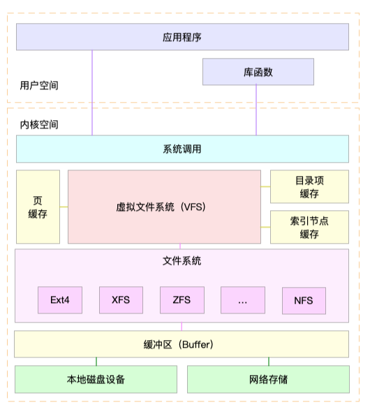

# 3.1 Linux 文件系统是怎么工作的
同 CPU、内存一样，磁盘和文件系统的管理，也是操作系统最核心的功能。
* 磁盘为系统提供了最基本的持久化存储。
* 文件系统则在磁盘的基础上，提供了一个用来管理文件的树状结构

## 3.1.1 索引节点和目录项
文件系统，本身是对存储设备上的文件，进行组织管理的机制。组织方式不同，就会形成不同的文件系统。

你要记住最重要的一点，在 Linux 中一切皆文件。不仅普通的文件和目录，就连块设备、套接字、管道等，也都要通过统一的文件系统来管理。

为了方便管理，Linux 文件系统为每个文件都分配两个数据结构，**索引节点（index node）和目录项（directory entry）**。它们主要用来记录文件的元信息和目录结构。

<u>索引节点，简称为 inode，用来记录文件的元数据，比如 inode 编号、文件大小、访问权限、修改日期、数据的位置等。索引节点和文件一一对应，它跟文件内容一样，都会被持久化存储到磁盘中。所以记住，索引节点同样占用磁盘空间。</u>

<u>目录项，简称为 dentry，用来记录文件的名字、索引节点指针以及与其他目录项的关联关系。多个关联的目录项，就构成了文件系统的目录结构。不过，不同于索引节点，目录项是由内核维护的一个内存数据结构，所以通常也被叫做目录项缓存。</u>

换句话说，索引节点是每个文件的唯一标志，而目录项维护的正是文件系统的树状结构。目录项和索引节点的关系是多对一，你可以简单理解为，一个文件可以有多个别名。

举个例子，通过硬链接为文件创建的别名，就会对应不同的目录项，不过这些目录项本质上还是链接同一个文件，所以，它们的索引节点相同。

索引节点和目录项纪录了文件的元数据，以及文件间的目录关系，那么具体来说，文件数据到底是怎么存储的呢？是不是直接写到磁盘中就好了呢？

实际上，磁盘读写的最小单位是扇区，然而扇区只有 512B 大小，如果每次都读写这么小的单位，效率一定很低。所以，文件系统又把连续的扇区组成了逻辑块，然后每次都以逻辑块为最小单元，来管理数据。常见的逻辑块大小为 4KB，也就是由连续的 8 个扇区组成。

为了帮助你理解目录项、索引节点以及文件数据的关系，我画了一张示意图。你可以对照着这张图，来回忆刚刚讲过的内容，把知识和细节串联起来。


不过，这里有两点需要你注意。

* 第一，目录项本身就是一个内存缓存，而索引节点则是存储在磁盘中的数据。在前面的 Buffer 和 Cache 原理中，我曾经提到过，为了协调慢速磁盘与快速 CPU 的性能差异，文件内容会缓存到页缓存 Cache 中。那么，你应该想到，这些索引节点自然也会缓存到内存中，加速文件的访问。

* 第二，磁盘在执行文件系统格式化时，会被分成三个存储区域，超级块、索引节点区和数据块区。其中，

    * 超级块，存储整个文件系统的状态。

    * 索引节点区，用来存储索引节点。

    * 数据块区，则用来存储文件数据。

目录项、索引节点、逻辑块以及超级块，构成了 Linux 文件系统的四大基本要素。不过，为了支持各种不同的文件系统，Linux 内核在用户进程和文件系统的中间，又引入了一个抽象层，也就是虚拟文件系统 VFS（Virtual File System）。

VFS 定义了一组所有文件系统都支持的数据结构和标准接口。这样，用户进程和内核中的其他子系统，只需要跟 VFS 提供的统一接口进行交互就可以了，而不需要再关心底层各种文件系统的实现细节。

这里，我画了一张 Linux 文件系统的架构图，帮你更好地理解系统调用、VFS、缓存、文件系统以及块存储之间的关系。



通过这张图，你可以看到，在 VFS 的下方，Linux 支持各种各样的文件系统，如 Ext4、XFS、NFS 等等。按照存储位置的不同，这些文件系统可以分为三类。

* 第一类是基于磁盘的文件系统，也就是把数据直接存储在计算机本地挂载的磁盘中。常见的 Ext4、XFS、OverlayFS 等，都是这类文件系统。

* 第二类是基于内存的文件系统，也就是我们常说的虚拟文件系统。这类文件系统，不需要任何磁盘分配存储空间，但会占用内存。我们经常用到的 /proc 文件系统，其实就是一种最常见的虚拟文件系统。此外，/sys 文件系统也属于这一类，主要向用户空间导出层次化的内核对象。

* 第三类是网络文件系统，也就是用来访问其他计算机数据的文件系统，比如 NFS、SMB、iSCSI 等。

这些文件系统，要先挂载到 VFS 目录树中的某个子目录（称为挂载点），然后才能访问其中的文件。拿第一类，也就是基于磁盘的文件系统为例，在安装系统时，要先挂载一个根目录（/），在根目录下再把其他文件系统（比如其他的磁盘分区、/proc 文件系统、/sys 文件系统、NFS 等）挂载进来。


## 3.1.2 文件系统 I/O
把文件系统挂载到挂载点后，你就能通过挂载点，再去访问它管理的文件了。VFS 提供了一组标准的文件访问接口。这些接口以系统调用的方式，提供给应用程序使用。

就拿 cat 命令来说，它首先调用 open() ，打开一个文件；然后调用 read() ，读取文件的内容；最后再调用 write()  ，把文件内容输出到控制台的标准输出中：
``` 
int open(const char *pathname, int flags, mode_t mode); 
ssize_t read(int fd, void *buf, size_t count); 
ssize_t write(int fd, const void *buf, size_t count); 
```

文件读写方式的各种差异，导致 I/O 的分类多种多样。最常见的有，缓冲与非缓冲 I/O、直接与非直接 I/O、阻塞与非阻塞 I/O、同步与异步 I/O 等。 接下来，我们就详细看这四种分类。

* 第一种，根据是否利用标准库缓存，可以把文件 I/O 分为缓冲 I/O 与非缓冲 I/O。

    * 缓冲 I/O，是指利用标准库缓存来加速文件的访问，而标准库内部再通过系统调度访问文件。

    * 非缓冲 I/O，是指直接通过系统调用来访问文件，不再经过标准库缓存。

注意，这里所说的“缓冲”，是指标准库内部实现的缓存。比方说，你可能见到过，很多程序遇到换行时才真正输出，而换行前的内容，其实就是被标准库暂时缓存了起来。无论缓冲 I/O 还是非缓冲 I/O，它们最终还是要经过系统调用来访问文件。而根据上一节内容，我们知道，系统调用后，还会通过页缓存，来减少磁盘的 I/O 操作。

* 第二，根据是否利用操作系统的页缓存，可以把文件 I/O 分为直接 I/O 与非直接 I/O。

    * 直接 I/O，是指跳过操作系统的页缓存，直接跟文件系统交互来访问文件。
    * 非直接 I/O 正好相反，文件读写时，先要经过系统的页缓存，然后再由内核或额外的系统调用，真正写入磁盘。

想要实现直接 I/O，需要你在系统调用中，指定 O_DIRECT 标志。如果没有设置过，默认的是非直接 I/O。

不过要注意，直接 I/O、非直接 I/O，本质上还是和文件系统交互。如果是在数据库等场景中，你还会看到，跳过文件系统读写磁盘的情况，也就是我们通常所说的裸 I/O。

* 第三，根据应用程序是否阻塞自身运行，可以把文件 I/O 分为阻塞 I/O 和非阻塞 I/O：

    * 所谓阻塞 I/O，是指应用程序执行 I/O 操作后，如果没有获得响应，就会阻塞当前线程，自然就不能执行其他任务。

    * 所谓非阻塞 I/O，是指应用程序执行 I/O 操作后，不会阻塞当前的线程，可以继续执行其他的任务，随后再通过轮询或者事件通知的形式，获取调用的结果。

比方说，访问管道或者网络套接字时，设置 O_NONBLOCK 标志，就表示用非阻塞方式访问；而如果不做任何设置，默认的就是阻塞访问。


* 第四，根据是否等待响应结果，可以把文件 I/O 分为同步和异步 I/O：

    * 所谓同步 I/O，是指应用程序执行 I/O 操作后，要一直等到整个 I/O 完成后，才能获得 I/O 响应。

    * 所谓异步 I/O，是指应用程序执行 I/O 操作后，不用等待完成和完成后的响应，而是继续执行就可以。等到这次 I/O 完成后，响应会用事件通知的方式，告诉应用程序。

举个例子，在操作文件时，如果你设置了 O_SYNC 或者 O_DSYNC 标志，就代表同步 I/O。如果设置了 O_DSYNC，就要等文件数据写入磁盘后，才能返回；而 O_SYNC，则是在 O_DSYNC 基础上，要求文件元数据也要写入磁盘后，才能返回。

再比如，在访问管道或者网络套接字时，设置了 O_ASYNC 选项后，相应的 I/O 就是异步 I/O。这样，内核会再通过 SIGIO 或者 SIGPOLL，来通知进程文件是否可读写。

你可能发现了，这里的好多概念也经常出现在网络编程中。比如非阻塞 I/O，通常会跟 select/poll 配合，用在网络套接字的 I/O 中。

你也应该可以理解，“Linux 一切皆文件”的深刻含义。无论是普通文件和块设备、还是网络套接字和管道等，它们都通过统一的 VFS 接口来访问。

## 3.1.3 性能观测
学了这么多文件系统的原理，你估计也是迫不及待想上手，观察一下文件系统的性能情况了。

接下来，打开一个终端，SSH 登录到服务器上，然后跟我一起来探索，如何观测文件系统的性能。

### 容量
对文件系统来说，最常见的一个问题就是空间不足。当然，你可能本身就知道，用 df 命令，就能查看文件系统的磁盘空间使用情况。比如：
```
$ df /dev/sda1 
Filesystem     1K-blocks    Used Available Use% Mounted on 
/dev/sda1       30308240 3167020  27124836  11% / 
```

你可以看到，我的根文件系统只使用了 11% 的空间。这里还要注意，总空间用 1K-blocks 的数量来表示，你可以给 df 加上 -h 选项，以获得更好的可读性：
```
$ df -h /dev/sda1 
Filesystem      Size  Used Avail Use% Mounted on 
/dev/sda1        29G  3.1G   26G  11% / 
```

不过有时候，明明你碰到了空间不足的问题，可是用 df 查看磁盘空间后，却发现剩余空间还有很多。这是怎么回事呢？

不知道你还记不记得，刚才我强调的一个细节。除了文件数据，索引节点也占用磁盘空间。你可以给 df 命令加上 -i 参数，查看索引节点的使用情况，如下所示：
```
$ df -i /dev/sda1 
Filesystem      Inodes  IUsed   IFree IUse% Mounted on 
/dev/sda1      3870720 157460 3713260    5% / 
```

<u>索引节点的容量，（也就是 Inode 个数）是在格式化磁盘时设定好的，一般由格式化工具自动生成。当你发现索引节点空间不足，但磁盘空间充足时，很可能就是过多小文件导致的。</u>

所以，一般来说，删除这些小文件，或者把它们移动到索引节点充足的其他磁盘中，就可以解决这个问题。


### 缓存
在前面 Cache 案例中，我已经介绍过，可以用 free 或 vmstat，来观察页缓存的大小。复习一下，free 输出的 Cache，是页缓存和可回收 Slab 缓存的和，你可以从 /proc/meminfo ，直接得到它们的大小：
```
$ cat /proc/meminfo | grep -E "SReclaimable|Cached" 
Cached:           748316 kB 
SwapCached:            0 kB 
SReclaimable:     179508 kB 
```
话说回来，文件系统中的目录项和索引节点缓存，又该如何观察呢？

实际上，内核使用 Slab 机制，管理目录项和索引节点的缓存。/proc/meminfo 只给出了 Slab 的整体大小，具体到每一种 Slab 缓存，还要查看 /proc/slabinfo 这个文件。

比如，运行下面的命令，你就可以得到，所有目录项和各种文件系统索引节点的缓存情况：
```
$ cat /proc/slabinfo | grep -E '^#|dentry|inode' 
# name            <active_objs> <num_objs> <objsize> <objperslab> <pagesperslab> : tunables <limit> <batchcount> <sharedfactor> : slabdata <active_slabs> <num_slabs> <sharedavail> 
xfs_inode              0      0    960   17    4 : tunables    0    0    0 : slabdata      0      0      0 
... 
ext4_inode_cache   32104  34590   1088   15    4 : tunables    0    0    0 : slabdata   2306   2306      0hugetlbfs_inode_cache     13     13    624   13    2 : tunables    0    0    0 : slabdata      1      1      0 
sock_inode_cache    1190   1242    704   23    4 : tunables    0    0    0 : slabdata     54     54      0 
shmem_inode_cache   1622   2139    712   23    4 : tunables    0    0    0 : slabdata     93     93      0 
proc_inode_cache    3560   4080    680   12    2 : tunables    0    0    0 : slabdata    340    340      0 
inode_cache        25172  25818    608   13    2 : tunables    0    0    0 : slabdata   1986   1986      0 
dentry             76050 121296    192   21    1 : tunables    0    0    0 : slabdata   5776   5776      0 
```

在实际性能分析中，我们更常使用 slabtop  ，来找到占用内存最多的缓存类型。

比如，下面就是我运行 slabtop 得到的结果：
```
# 按下c按照缓存大小排序，按下a按照活跃对象数排序 
$ slabtop 
Active / Total Objects (% used)    : 277970 / 358914 (77.4%) 
Active / Total Slabs (% used)      : 12414 / 12414 (100.0%) 
Active / Total Caches (% used)     : 83 / 135 (61.5%) 
Active / Total Size (% used)       : 57816.88K / 73307.70K (78.9%) 
Minimum / Average / Maximum Object : 0.01K / 0.20K / 22.88K 

  OBJS ACTIVE  USE OBJ SIZE  SLABS OBJ/SLAB CACHE SIZE NAME 
69804  23094   0%    0.19K   3324       21     13296K dentry 
16380  15854   0%    0.59K   1260       13     10080K inode_cache 
58260  55397   0%    0.13K   1942       30      7768K kernfs_node_cache 
   485    413   0%    5.69K     97        5      3104K task_struct 
  1472   1397   0%    2.00K     92       16      2944K kmalloc-2048 
```
从这个结果你可以看到，在我的系统中，目录项和索引节点占用了最多的 Slab 缓存。不过它们占用的内存其实并不大，加起来也只有 23MB 左右。

## 小结
今天，我带你梳理了 Linux 文件系统的工作原理。

文件系统，是对存储设备上的文件，进行组织管理的一种机制。为了支持各类不同的文件系统，Linux 在各种文件系统实现上，抽象了一层虚拟文件系统（VFS）。

VFS 定义了一组所有文件系统都支持的数据结构和标准接口。这样，用户进程和内核中的其他子系统，就只需要跟 VFS 提供的统一接口进行交互。

为了降低慢速磁盘对性能的影响，文件系统又通过页缓存、目录项缓存以及索引节点缓存，缓和磁盘延迟对应用程序的影响。

在性能观测方面，今天主要讲了容量和缓存的指标。下一节，我们将会学习 Linux 磁盘 I/O 的工作原理，并掌握磁盘 I/O 的性能观测方法。

# 3.2 Linux 磁盘I/O是怎么工作的（上）
简单回顾一下，文件系统是对存储设备上的文件，进行组织管理的一种机制。而 Linux 在各种文件系统实现上，又抽象了一层虚拟文件系统 VFS，它定义了一组，所有文件系统都支持的，数据结构和标准接口。

这样，对应用程序来说，只需要跟 VFS 提供的统一接口交互，而不需要关注文件系统的具体实现；对具体的文件系统来说，只需要按照 VFS 的标准，就可以无缝支持各种应用程序。

VFS 内部又通过目录项、索引节点、逻辑块以及超级块等数据结构，来管理文件。

* 目录项，记录了文件的名字，以及文件与其他目录项之间的目录关系。

* 索引节点，记录了文件的元数据。

* 逻辑块，是由连续磁盘扇区构成的最小读写单元，用来存储文件数据。

* 超级块，用来记录文件系统整体的状态，如索引节点和逻辑块的使用情况等。


其中，目录项是一个内存缓存；而超级块、索引节点和逻辑块，都是存储在磁盘中的持久化数据。

接下来，我就带你一起看看， Linux 磁盘 I/O 的工作原理。

## 3.2.1 磁盘
磁盘是可以持久化存储的设备，根据存储介质的不同，常见磁盘可以分为两类：机械磁盘和固态磁盘。

第一类，机械磁盘，也称为硬盘驱动器（Hard Disk Driver），通常缩写为 HDD。机械磁盘主要由盘片和读写磁头组成，数据就存储在盘片的环状磁道中。在读写数据前，需要移动读写磁头，定位到数据所在的磁道，然后才能访问数据。

显然，如果 I/O 请求刚好连续，那就不需要磁道寻址，自然可以获得最佳性能。这其实就是我们熟悉的，连续 I/O 的工作原理。与之相对应的，当然就是随机 I/O，它需要不停地移动磁头，来定位数据位置，所以读写速度就会比较慢。

第二类，固态磁盘（Solid State Disk），通常缩写为 SSD，由固态电子元器件组成。固态磁盘不需要磁道寻址，所以，不管是连续 I/O，还是随机 I/O 的性能，都比机械磁盘要好得多。

其实，无论机械磁盘，还是固态磁盘，相同磁盘的随机 I/O 都要比连续 I/O 慢很多，原因也很明显。

* 对机械磁盘来说，我们刚刚提到过的，由于随机 I/O 需要更多的磁头寻道和盘片旋转，它的性能自然要比连续 I/O 慢。

* 而对固态磁盘来说，虽然它的随机性能比机械硬盘好很多，但同样存在“先擦除再写入”的限制。随机读写会导致大量的垃圾回收，所以相对应的，随机 I/O 的性能比起连续 I/O 来，也还是差了很多。

* 此外，连续 I/O 还可以通过预读的方式，来减少 I/O 请求的次数，这也是其性能优异的一个原因。很多性能优化的方案，也都会从这个角度出发，来优化 I/O 性能。

此外，机械磁盘和固态磁盘还分别有一个最小的读写单位。

* 机械磁盘的最小读写单位是扇区，一般大小为 512 字节。

* 而固态磁盘的最小读写单位是页，通常大小是 4KB、8KB 等。

在上一节中，我也提到过，如果每次都读写 512 字节这么小的单位的话，效率很低。所以，文件系统会把连续的扇区或页，组成逻辑块，然后以逻辑块作为最小单元来管理数据。常见的逻辑块的大小是 4KB，也就是说，连续 8 个扇区，或者单独的一个页，都可以组成一个逻辑块。

其实在 Linux 中，磁盘实际上是作为一个块设备来管理的，也就是以块为单位读写数据，并且支持随机读写。每个块设备都会被赋予两个设备号，分别是主、次设备号。主设备号用在驱动程序中，用来区分设备类型；而次设备号则是用来给多个同类设备编号。

## 3.2.2 通用块层
跟我们上一节讲到的虚拟文件系统 VFS 类似，为了减小不同块设备的差异带来的影响，Linux 通过一个统一的通用块层，来管理各种不同的块设备。

通用块层，其实是处在文件系统和磁盘驱动中间的一个块设备抽象层。它主要有两个功能 。

第一个功能跟虚拟文件系统的功能类似。向上，为文件系统和应用程序，提供访问块设备的标准接口；向下，把各种异构的磁盘设备抽象为统一的块设备，并提供统一框架来管理这些设备的驱动程序。

第二个功能，通用块层还会给文件系统和应用程序发来的 I/O 请求排队，并通过重新排序、请求合并等方式，提高磁盘读写的效率。

其中，对 I/O 请求排序的过程，也就是我们熟悉的 I/O 调度。事实上，Linux 内核支持四种 I/O 调度算法，分别是 NONE、NOOP、CFQ 以及 DeadLine。这里我也分别介绍一下。

* 第一种 NONE，更确切来说，并不能算 I/O 调度算法。因为它完全不使用任何 I/O 调度器，对文件系统和应用程序的 I/O 其实不做任何处理，常用在虚拟机中（此时磁盘 I/O 调度完全由物理机负责）。

* 第二种 NOOP，是最简单的一种 I/O 调度算法。它实际上是一个先入先出的队列，只做一些最基本的请求合并，常用于 SSD 磁盘。

* 第三种 CFQ（Completely Fair Scheduler），也被称为完全公平调度器，是现在很多发行版的默认 I/O 调度器，它为每个进程维护了一个 I/O 调度队列，并按照时间片来均匀分布每个进程的 I/O 请求。

类似于进程 CPU 调度，CFQ 还支持进程 I/O 的优先级调度，所以它适用于运行大量进程的系统，像是桌面环境、多媒体应用等。

* 最后一种 DeadLine 调度算法，分别为读、写请求创建了不同的 I/O 队列，可以提高机械磁盘的吞吐量，并确保达到最终期限（deadline）的请求被优先处理。DeadLine 调度算法，多用在 I/O 压力比较重的场景，比如数据库等。

## 3.2.3 I/O 栈
清楚了磁盘和通用块层的工作原理，再结合上一期我们讲过的文件系统原理，我们就可以整体来看 Linux 存储系统的 I/O 原理了。

我们可以把 Linux 存储系统的 I/O 栈，由上到下分为三个层次，分别是文件系统层、通用块层和设备层。这三个 I/O 层的关系如下图所示，这其实也是 Linux 存储系统的 I/O 栈全景图。


根据这张 I/O 栈的全景图，我们可以更清楚地理解，存储系统 I/O 的工作原理。

* 文件系统层，包括虚拟文件系统和其他各种文件系统的具体实现。它为上层的应用程序，提供标准的文件访问接口；对下会通过通用块层，来存储和管理磁盘数据。

* 通用块层，包括块设备 I/O 队列和 I/O 调度器。它会对文件系统的 I/O 请求进行排队，再通过重新排序和请求合并，然后才要发送给下一级的设备层。

* 设备层，包括存储设备和相应的驱动程序，负责最终物理设备的 I/O 操作。

存储系统的 I/O ，通常是整个系统中最慢的一环。所以， Linux 通过多种缓存机制来优化 I/O 效率。

比方说，为了优化文件访问的性能，会使用页缓存、索引节点缓存、目录项缓存等多种缓存机制，以减少对下层块设备的直接调用。

同样，为了优化块设备的访问效率，会使用缓冲区，来缓存块设备的数据。

## 小结
在今天的文章中，我们梳理了 Linux 磁盘 I/O 的工作原理，并了解了由文件系统层、通用块层和设备层构成的 Linux 存储系统 I/O 栈。

其中，通用块层是 Linux 磁盘 I/O 的核心。向上，它为文件系统和应用程序，提供访问了块设备的标准接口；向下，把各种异构的磁盘设备，抽象为统一的块设备，并会对文件系统和应用程序发来的 I/O 请求进行重新排序、请求合并等，提高了磁盘访问的效率。

# 3.3 Linux 磁盘I/O是怎么工作的（下）
## 3.3.1 磁盘性能指标
说到磁盘性能的衡量标准，必须要提到五个常见指标，也就是我们经常用到的，使用率、饱和度、IOPS、吞吐量以及响应时间等。这五个指标，是衡量磁盘性能的基本指标。

* 使用率，是指磁盘处理 I/O 的时间百分比。过高的使用率（比如超过 80%），通常意味着磁盘 I/O 存在性能瓶颈。

* 饱和度，是指磁盘处理 I/O 的繁忙程度。过高的饱和度，意味着磁盘存在严重的性能瓶颈。当饱和度为 100% 时，磁盘无法接受新的 I/O 请求。

* IOPS（Input/Output Per Second），是指每秒的 I/O 请求数。

* 吞吐量，是指每秒的 I/O 请求大小。

* 响应时间，是指 I/O 请求从发出到收到响应的间隔时间。

这里要注意的是，使用率只考虑有没有 I/O，而不考虑 I/O 的大小。换句话说，当使用率是 100% 的时候，磁盘依然有可能接受新的 I/O 请求。

这些指标，很可能是你经常挂在嘴边的，一讨论磁盘性能必定提起的对象。不过我还是要强调一点，不要孤立地去比较某一指标，而要结合读写比例、I/O 类型（随机还是连续）以及 I/O 的大小，综合来分析。

举个例子，在数据库、大量小文件等这类随机读写比较多的场景中，IOPS 更能反映系统的整体性能；而在多媒体等顺序读写较多的场景中，吞吐量才更能反映系统的整体性能。

一般来说，我们在为应用程序的服务器选型时，要先对磁盘的 I/O 性能进行基准测试，以便可以准确评估，磁盘性能是否可以满足应用程序的需求。

## 3.3.2 磁盘 I/O 观测
第一个要观测的，是每块磁盘的使用情况。

iostat 是最常用的磁盘 I/O 性能观测工具，它提供了每个磁盘的使用率、IOPS、吞吐量等各种常见的性能指标，当然，这些指标实际上来自  /proc/diskstats。
第一个要观测的，是每块磁盘的使用情况。

iostat 的输出界面如下。
```
# -d -x表示显示所有磁盘I/O的指标
$ iostat -d -x 1 
Device            r/s     w/s     rkB/s     wkB/s   rrqm/s   wrqm/s  %rrqm  %wrqm r_await w_await aqu-sz rareq-sz wareq-sz  svctm  %util 
loop0            0.00    0.00      0.00      0.00     0.00     0.00   0.00   0.00    0.00    0.00   0.00     0.00     0.00   0.00   0.00 
loop1            0.00    0.00      0.00      0.00     0.00     0.00   0.00   0.00    0.00    0.00   0.00     0.00     0.00   0.00   0.00 
sda              0.00    0.00      0.00      0.00     0.00     0.00   0.00   0.00    0.00    0.00   0.00     0.00     0.00   0.00   0.00 
sdb              0.00    0.00      0.00      0.00     0.00     0.00   0.00   0.00    0.00    0.00   0.00     0.00     0.00   0.00   0.00 
```
从这里你可以看到，iostat 提供了非常丰富的性能指标。第一列的 Device 表示磁盘设备的名字，其他各列指标，虽然数量较多，但是每个指标的含义都很重要。为了方便你理解，我把它们总结成了一个表格。


这些指标中，你要注意：

* %util  ，就是我们前面提到的磁盘 I/O 使用率；

* r/s+  w/s  ，就是 IOPS；

* rkB/s+wkB/s ，就是吞吐量；

* r_await+w_await ，就是响应时间。

在观测指标时，也别忘了结合请求的大小（ rareq-sz 和 wareq-sz）一起分析。

你可能注意到，从 iostat 并不能直接得到磁盘饱和度。事实上，饱和度通常也没有其他简单的观测方法，不过，你可以把观测到的，平均请求队列长度或者读写请求完成的等待时间，跟基准测试的结果（比如通过 fio）进行对比，综合评估磁盘的饱和情况。


## 3.3.3 进程 I/O 观测
除了每块磁盘的 I/O 情况，每个进程的 I/O 情况也是我们需要关注的重点。

上面提到的 iostat 只提供磁盘整体的 I/O 性能数据，缺点在于，并不能知道具体是哪些进程在进行磁盘读写。要观察进程的 I/O 情况，你还可以使用 pidstat 和 iotop 这两个工具。

pidstat 是我们的老朋友了，这里我就不再啰嗦它的功能了。给它加上 -d 参数，你就可以看到进程的 I/O 情况，如下所示：
```
$ pidstat -d 1 
13:39:51      UID       PID   kB_rd/s   kB_wr/s kB_ccwr/s iodelay  Command 
13:39:52      102       916      0.00      4.00      0.00       0  rsyslogd

```

从 pidstat 的输出你能看到，它可以实时查看每个进程的 I/O 情况，包括下面这些内容。
* 用户 ID（UID）和进程 ID（PID）  。
* 每秒读取的数据大小（kB_rd/s） ，单位是 KB。
* 每秒发出的写请求数据大小（kB_wr/s） ，单位是 KB。
* 每秒取消的写请求数据大小（kB_ccwr/s） ，单位是 KB。
* 块 I/O 延迟（iodelay），包括等待同步块 I/O 和换入块 I/O 结束的时间，单位是时钟周期。

除了可以用 pidstat 实时查看，根据 I/O 大小对进程排序，也是性能分析中一个常用的方法。这一点，我推荐另一个工具， iotop。它是一个类似于 top 的工具，你可以按照 I/O 大小对进程排序，然后找到 I/O 较大的那些进程。

iotop 的输出如下所示：
```
$ iotop
Total DISK READ :       0.00 B/s | Total DISK WRITE :       7.85 K/s 
Actual DISK READ:       0.00 B/s | Actual DISK WRITE:       0.00 B/s 
  TID  PRIO  USER     DISK READ  DISK WRITE  SWAPIN     IO>    COMMAND 
15055 be/3 root        0.00 B/s    7.85 K/s  0.00 %  0.00 % systemd-journald 
```

从这个输出，你可以看到，前两行分别表示，进程的磁盘读写大小总数和磁盘真实的读写大小总数。因为缓存、缓冲区、I/O 合并等因素的影响，它们可能并不相等。

剩下的部分，则是从各个角度来分别表示进程的 I/O 情况，包括线程 ID、I/O 优先级、每秒读磁盘的大小、每秒写磁盘的大小、换入和等待 I/O 的时钟百分比等。

这两个工具，是我们分析磁盘 I/O 性能时最常用到的。你先了解它们的功能和指标含义，具体的使用方法，接下来的案例实战中我们一起学习。

## 3.3.4 小结
今天，我们梳理了 Linux 磁盘 I/O 的性能指标和性能工具。我们通常用 IOPS、吞吐量、使用率、饱和度以及响应时间等几个指标，来评估磁盘的 I/O 性能。

你可以用 iostat 获得磁盘的 I/O 情况，也可以用 pidstat、iotop 等观察进程的 I/O 情况。不过在分析这些性能指标时，你要注意结合读写比例、I/O 类型以及 I/O 大小等，进行综合分析。

# 3.4 案例分析
我们可以先用 top ，来观察 CPU 和内存的使用情况；然后再用 iostat ，来观察磁盘的 I/O 情况。

所以，接下来，你可以在终端中运行 top 命令，观察 CPU 和内存的使用情况：
```
# 按1切换到每个CPU的使用情况 
$ top 
top - 14:43:43 up 1 day,  1:39,  2 users,  load average: 2.48, 1.09, 0.63 
Tasks: 130 total,   2 running,  74 sleeping,   0 stopped,   0 zombie 
%Cpu0  :  0.7 us,  6.0 sy,  0.0 ni,  0.7 id, 92.7 wa,  0.0 hi,  0.0 si,  0.0 st 
%Cpu1  :  0.0 us,  0.3 sy,  0.0 ni, 92.3 id,  7.3 wa,  0.0 hi,  0.0 si,  0.0 st 
KiB Mem :  8169308 total,   747684 free,   741336 used,  6680288 buff/cache 
KiB Swap:        0 total,        0 free,        0 used.  7113124 avail Mem 

  PID USER      PR  NI    VIRT    RES    SHR S  %CPU %MEM     TIME+ COMMAND 
18940 root      20   0  656108 355740   5236 R   6.3  4.4   0:12.56 python 
1312 root      20   0  236532  24116   9648 S   0.3  0.3   9:29.80 python3 
```
观察 top 的输出，你会发现，CPU0 的使用率非常高，它的系统 CPU 使用率（sys%）为 6%，而 iowait 超过了 90%。这说明 CPU0 上，可能正在运行 I/O 密集型的进程。不过，究竟是什么原因呢？这个疑问先保留着，我们先继续看完。

接着我们来看，进程部分的 CPU 使用情况。你会发现， python 进程的 CPU 使用率已经达到了 6%，而其余进程的 CPU 使用率都比较低，不超过 0.3%。看起来 python 是个可疑进程。记下 python 进程的 PID 号 18940，我们稍后分析。

最后再看内存的使用情况，总内存 8G，剩余内存只有 730 MB，而 Buffer/Cache 占用内存高达 6GB 之多，这说明内存主要被缓存占用。虽然大部分缓存可回收，我们还是得了解下缓存的去处，确认缓存使用都是合理的。

到这一步，你基本可以判断出，CPU 使用率中的 iowait 是一个潜在瓶颈，而内存部分的缓存占比较大，那磁盘 I/O 又是怎么样的情况呢？

我们在终端中按 Ctrl+C ，停止 top 命令，再运行 iostat 命令，观察 I/O 的使用情况：
```
# -d表示显示I/O性能指标，-x表示显示扩展统计（即所有I/O指标） 
$ iostat -x -d 1 
Device            r/s     w/s     rkB/s     wkB/s   rrqm/s   wrqm/s  %rrqm  %wrqm r_await w_await aqu-sz rareq-sz wareq-sz  svctm  %util 
loop0            0.00    0.00      0.00      0.00     0.00     0.00   0.00   0.00    0.00    0.00   0.00     0.00     0.00   0.00   0.00 
sdb              0.00    0.00      0.00      0.00     0.00     0.00   0.00   0.00    0.00    0.00   0.00     0.00     0.00   0.00   0.00 
sda              0.00   64.00      0.00  32768.00     0.00     0.00   0.00   0.00    0.00 7270.44 1102.18     0.00   512.00  15.50  99.20
```
还记得这些性能指标的含义吗？先自己回忆一下，如果实在想不起来，查看上一节的内容，或者用 man iostat 查询。

观察 iostat 的最后一列，你会看到，磁盘 sda 的 I/O 使用率已经高达 99%，很可能已经接近 I/O 饱和。

再看前面的各个指标，每秒写磁盘请求数是 64 ，写大小是 32 MB，写请求的响应时间为 7 秒，而请求队列长度则达到了 1100。

超慢的响应时间和特长的请求队列长度，进一步验证了 I/O 已经饱和的猜想。此时，sda 磁盘已经遇到了严重的性能瓶颈。

到这里，也就可以理解，为什么前面看到的 iowait 高达 90% 了，这正是磁盘 sda 的 I/O 瓶颈导致的。接下来的重点就是分析 I/O 性能瓶颈的根源了。那要怎么知道，这些 I/O 请求相关的进程呢？

不知道你还记不记得，上一节我曾提到过，可以用 pidstat 或者 iotop ，观察进程的 I/O 情况。这里，我就用 pidstat 来看一下。

使用 pidstat 加上 -d 参数，就可以显示每个进程的 I/O 情况。所以，你可以在终端中运行如下命令来观察：
```
$ pidstat -d 1 

15:08:35      UID       PID   kB_rd/s   kB_wr/s kB_ccwr/s iodelay  Command 
15:08:36        0     18940      0.00  45816.00      0.00      96  python 

15:08:36      UID       PID   kB_rd/s   kB_wr/s kB_ccwr/s iodelay  Command 
15:08:37        0       354      0.00      0.00      0.00     350  jbd2/sda1-8 
15:08:37        0     18940      0.00  46000.00      0.00      96  python 
15:08:37        0     20065      0.00      0.00      0.00    1503  kworker/u4:2 
```
从 pidstat 的输出，你可以发现，只有 python 进程的写比较大，而且每秒写的数据超过 45 MB，比上面 iostat 发现的 32MB 的结果还要大。很明显，正是 python 进程导致了 I/O 瓶颈。

再往下看 iodelay 项。虽然只有 python 在大量写数据，但你应该注意到了，有两个进程 （kworker 和 jbd2 ）的延迟，居然比 python 进程还大很多。
这其中，kworker 是一个内核线程，而 jbd2 是 ext4 文件系统中，用来保证数据完整性的内核线程。他们都是保证文件系统基本功能的内核线程，所以具体细节暂时就不用管了，我们只需要明白，它们延迟的根源还是大量 I/O。

综合 pidstat 的输出来看，还是 python 进程的嫌疑最大。接下来，我们来分析 python 进程到底在写什么。

首先留意一下 python 进程的 PID 号， 18940。看到 18940 ，你有没有觉得熟悉？其实前面在使用 top 时，我们记录过的 CPU 使用率最高的进程，也正是它。不过，虽然在 top 中使用率最高，也不过是 6%，并不算高。所以，以 I/O 问题为分析方向还是正确的。

知道了进程的 PID 号，具体要怎么查看写的情况呢？

其实，我在系统调用的案例中讲过，读写文件必须通过系统调用完成。观察系统调用情况，就可以知道进程正在写的文件。想起 strace 了吗，它正是我们分析系统调用时最常用的工具。

接下来，我们在终端中运行 strace 命令，并通过 -p 18940 指定 python 进程的 PID 号：
```
$ strace -p 18940 
strace: Process 18940 attached 
...
mmap(NULL, 314576896, PROT_READ|PROT_WRITE, MAP_PRIVATE|MAP_ANONYMOUS, -1, 0) = 0x7f0f7aee9000 
mmap(NULL, 314576896, PROT_READ|PROT_WRITE, MAP_PRIVATE|MAP_ANONYMOUS, -1, 0) = 0x7f0f682e8000 
write(3, "2018-12-05 15:23:01,709 - __main"..., 314572844 
) = 314572844 
munmap(0x7f0f682e8000, 314576896)       = 0 
write(3, "\n", 1)                       = 1 
munmap(0x7f0f7aee9000, 314576896)       = 0 
close(3)                                = 0 
stat("/tmp/logtest.txt.1", {st_mode=S_IFREG|0644, st_size=943718535, ...}) = 0 
```
从 write() 系统调用上，我们可以看到，进程向文件描述符编号为 3 的文件中，写入了 300MB 的数据。看来，它应该是我们要找的文件。不过，write() 调用中只能看到文件的描述符编号，文件名和路径还是未知的。

再观察后面的 stat() 调用，你可以看到，它正在获取 /tmp/logtest.txt.1 的状态。 这种“点 + 数字格式”的文件，在日志回滚中非常常见。我们可以猜测，这是第一个日志回滚文件，而正在写的日志文件路径，则是 /tmp/logtest.txt。

当然，这只是我们的猜测，自然还需要验证。这里，我再给你介绍一个新的工具 lsof。它专门用来查看进程打开文件列表，不过，这里的“文件”不只有普通文件，还包括了目录、块设备、动态库、网络套接字等。

接下来，我们在终端中运行下面的 lsof 命令，看看进程 18940 都打开了哪些文件：
```
$ lsof -p 18940 
COMMAND   PID USER   FD   TYPE DEVICE  SIZE/OFF    NODE NAME 
python  18940 root  cwd    DIR   0,50      4096 1549389 / 
python  18940 root  rtd    DIR   0,50      4096 1549389 / 
… 
python  18940 root    2u   CHR  136,0       0t0       3 /dev/pts/0 
python  18940 root    3w   REG    8,1 117944320     303 /tmp/logtest.txt 

```
这个输出界面中，有几列我简单介绍一下，FD 表示文件描述符号，TYPE 表示文件类型，NAME 表示文件路径。这也是我们需要关注的重点。

再看最后一行，这说明，这个进程打开了文件 /tmp/logtest.txt，并且它的文件描述符是 3 号，而 3 后面的 w ，表示以写的方式打开。

这跟刚才 strace 完我们猜测的结果一致，看来这就是问题的根源：进程 18940 以每次 300MB 的速度，在“疯狂”写日志，而日志文件的路径是 /tmp/logtest.txt。

既然找出了问题根源，接下来按照惯例，就该查看源代码，然后分析为什么这个进程会狂打日志了。

# 3.5 一个SQL查询要15秒，这是怎么回事？
当数据库出现性能问题时，又该如何分析和定位它的瓶颈呢？
处理时间超过 15 秒。这么慢的响应速度让人无法忍受，到底出了什么问题呢？

既然今天用了 MySQL，你估计会猜到是慢查询的问题。
我们还是得观察一下系统的资源使用情况，比如 CPU、内存和磁盘 I/O 等的情况。

首先，我们在终端一执行 top 命令，分析系统的 CPU 使用情况：
```
$ top
top - 12:02:15 up 6 days,  8:05,  1 user,  load average: 0.66, 0.72, 0.59
Tasks: 137 total,   1 running,  81 sleeping,   0 stopped,   0 zombie
%Cpu0  :  0.7 us,  1.3 sy,  0.0 ni, 35.9 id, 62.1 wa,  0.0 hi,  0.0 si,  0.0 st
%Cpu1  :  0.3 us,  0.7 sy,  0.0 ni, 84.7 id, 14.3 wa,  0.0 hi,  0.0 si,  0.0 st
KiB Mem :  8169300 total,  7238472 free,   546132 used,   384696 buff/cache
KiB Swap:        0 total,        0 free,        0 used.  7316952 avail Mem

  PID USER      PR  NI    VIRT    RES    SHR S  %CPU %MEM     TIME+ COMMAND
27458 999       20   0  833852  57968  13176 S   1.7  0.7   0:12.40 mysqld
27617 root      20   0   24348   9216   4692 S   1.0  0.1   0:04.40 python
 1549 root      20   0  236716  24568   9864 S   0.3  0.3  51:46.57 python3
22421 root      20   0       0      0      0 I   0.3  0.0   0:01.16 kworker/u

```

观察 top 的输出，我们发现，两个 CPU 的 iowait 都比较高，特别是 CPU0，iowait 已经超过 60%。而具体到各个进程， CPU 使用率并不高，最高的也只有 1.7%。

既然 CPU 的嫌疑不大，那问题应该还是出在了 I/O 上。我们仍然在第一个终端，按下 Ctrl+C，停止 top 命令；然后，执行下面的 iostat 命令，看看有没有 I/O 性能问题：
```
$ iostat -d -x 1
Device            r/s     w/s     rkB/s     wkB/s   rrqm/s   wrqm/s  %rrqm  %wrqm r_await w_await aqu-sz rareq-sz wareq-sz  svctm  %util
...
sda            273.00    0.00  32568.00      0.00     0.00     0.00   0.00   0.00    7.90    0.00   1.16   119.30     0.00   3.56  97.20
```

iostat 的输出你应该非常熟悉。观察这个界面，我们发现，磁盘 sda 每秒的读数据为 32 MB， 而 I/O 使用率高达 97% ，接近饱和，这说明，磁盘 sda 的读取确实碰到了性能瓶颈。

那要怎么知道，这些 I/O 请求到底是哪些进程导致的呢？当然可以找我们的老朋友， pidstat。接下来，在终端一中，按下 Ctrl+C 停止 iostat 命令，然后运行下面的 pidstat 命令，观察进程的 I/O 情况：
```
# -d选项表示展示进程的I/O情况
$ pidstat -d 1
12:04:11      UID       PID   kB_rd/s   kB_wr/s kB_ccwr/s iodelay  Command
12:04:12      999     27458  32640.00      0.00      0.00       0  mysqld
12:04:12        0     27617      4.00      4.00      0.00       3  python
12:04:12        0     27864      0.00      4.00      0.00       0  systemd-journal
```

从 pidstat 的输出可以看到，PID 为 27458 的 mysqld 进程正在进行大量的读，而且读取速度是 32 MB/s，跟刚才 iostat 的发现一致。两个结果一对比，我们自然就找到了磁盘 I/O 瓶颈的根源，即 mysqld 进程。

不过，这事儿还没完。我们自然要怀疑一下，为什么 mysqld 会去读取大量的磁盘数据呢？按照前面猜测，我们提到过，这有可能是个慢查询问题。

可是，回想一下，慢查询的现象大多是 CPU 使用率高（比如 100% ），但这里看到的却是 I/O 问题。看来，这并不是一个单纯的慢查询问题，我们有必要分析一下 MySQL 读取的数据。

要分析进程的数据读取，当然还要靠上一节用到过的 strace+ lsof 组合。
接下来，还是在终端一中，执行 strace 命令，并且指定 mysqld 的进程号 27458。我们知道，MySQL 是一个多线程的数据库应用，为了不漏掉这些线程的数据读取情况，你要记得在执行 stace 命令时，加上 -f 参数：
```
$ strace -f -p 27458
[pid 28014] read(38, "934EiwT363aak7VtqF1mHGa4LL4Dhbks"..., 131072) = 131072
[pid 28014] read(38, "hSs7KBDepBqA6m4ce6i6iUfFTeG9Ot9z"..., 20480) = 20480
[pid 28014] read(38, "NRhRjCSsLLBjTfdqiBRLvN9K6FRfqqLm"..., 131072) = 131072
[pid 28014] read(38, "AKgsik4BilLb7y6OkwQUjjqGeCTQTaRl"..., 24576) = 24576
[pid 28014] read(38, "hFMHx7FzUSqfFI22fQxWCpSnDmRjamaW"..., 131072) = 131072
[pid 28014] read(38, "ajUzLmKqivcDJSkiw7QWf2ETLgvQIpfC"..., 20480) = 20480
```
观察一会，你会发现，线程 28014 正在读取大量数据，且读取文件的描述符编号为 38。

继续执行 lsof 命令：
```
$ lsof -p 27458
COMMAND  PID USER   FD   TYPE DEVICE SIZE/OFF NODE NAME
...
​mysqld  27458      999   38u   REG    8,1 512440000 2601895 /var/lib/mysql/test/products.MYD
```

这次我们得到了 lsof 的输出。从输出中可以看到， mysqld 进程确实打开了大量文件，而根据文件描述符（FD）的编号，我们知道，描述符为 38 的是一个路径为 /var/lib/mysql/test/products.MYD 的文件。这里注意， 38 后面的 u 表示， mysqld 以读写的方式访问文件。

看到这个文件，熟悉 MySQL 的你可能笑了：
* MYD 文件，是 MyISAM 引擎用来存储表数据的文件；
* 文件名就是数据表的名字；
* 而这个文件的父目录，也就是数据库的名字。

换句话说，这个文件告诉我们，mysqld 在读取数据库 test 中的 products 表。

那就是在 MySQL 命令行界面中，执行 show processlist 命令，来查看当前正在执行的 SQL 语句。

不过，为了保证 SQL 语句不截断，这里我们可以执行 show full processlist 命令。如果一切正常，你应该可以看到如下输出：
```
mysql> show full processlist;
+----+------+-----------------+------+---------+------+--------------+-----------------------------------------------------+
| Id | User | Host            | db   | Command | Time | State        | Info                                                |
+----+------+-----------------+------+---------+------+--------------+-----------------------------------------------------+
| 27 | root | localhost       | test | Query   |    0 | init         | show full processlist                               |
| 28 | root | 127.0.0.1:42262 | test | Query   |    1 | Sending data | select * from products where productName='geektime' |
+----+------+-----------------+------+---------+------+--------------+-----------------------------------------------------+
2 rows in set (0.00 sec)

```
输出中，
* db 表示数据库的名字；
* Command 表示 SQL 类型；
* Time 表示执行时间；
* State 表示状态；
* 而 Info 则包含了完整的 SQL 语句。

多执行几次 show full processlist 命令，你可看到 select * from products where productName=‘geektime’ 这条 SQL 语句的执行时间比较长。

接下来，我们就可以给 productName 建立索引了。

## 小结
今天我们分析了一个商品搜索的应用程序。我们先是通过 top、iostat 分析了系统的 CPU 和磁盘使用情况，发现了磁盘的 I/O 瓶颈。


接着，我们借助 pidstat ，发现瓶颈是 mysqld 导致的。紧接着，我们又通过 strace、lsof，找出了 mysqld 正在读的文件。同时，根据文件的名字和路径，我们找出了 mysqld 正在操作的数据库和数据表。综合这些信息，我们判断，这是一个没有利用索引导致的慢查询问题。


于是，我们登录到 MySQL 命令行终端，用数据库分析工具进行验证，发现 MySQL 查询语句访问的字段，果然没有索引。所以，增加索引，就可以解决案例的性能问题了。


# 3.6 Redis响应严重延迟，如何解决？
MySQL 的 MyISAM 引擎，主要依赖系统缓存加速磁盘 I/O 的访问。可如果系统中还有其他应用同时运行， MyISAM 引擎很难充分利用系统缓存。缓存可能会被其他应用程序占用，甚至被清理掉。

所以，一般我并不建议，把应用程序的性能优化完全建立在系统缓存上。最好能在应用程序的内部分配内存，构建完全自主控制的缓存；或者使用第三方的缓存应用，比如 Memcached、Redis 等。

Redis 是最常用的键值存储系统之一，常用作数据库、高速缓存和消息队列代理等。Redis 基于内存来存储数据，不过，为了保证在服务器异常时数据不丢失，很多情况下，我们要为它配置持久化，而这就可能会引发磁盘 I/O 的性能问题。

最近几个案例的现象都是响应很慢，这种情况下，我们自然先会怀疑，是不是系统资源出现了瓶颈。所以，先观察 CPU、内存和磁盘 I/O 等的使用情况肯定不会错。

我们先在终端一中执行 top 命令，分析系统的 CPU 使用情况：
```
$ top
top - 12:46:18 up 11 days,  8:49,  1 user,  load average: 1.36, 1.36, 1.04
Tasks: 137 total,   1 running,  79 sleeping,   0 stopped,   0 zombie
%Cpu0  :  6.0 us,  2.7 sy,  0.0 ni,  5.7 id, 84.7 wa,  0.0 hi,  1.0 si,  0.0 st
%Cpu1  :  1.0 us,  3.0 sy,  0.0 ni, 94.7 id,  0.0 wa,  0.0 hi,  1.3 si,  0.0 st
KiB Mem :  8169300 total,  7342244 free,   432912 used,   394144 buff/cache
KiB Swap:        0 total,        0 free,        0 used.  7478748 avail Mem

  PID USER      PR  NI    VIRT    RES    SHR S  %CPU %MEM     TIME+ COMMAND
 9181 root      20   0  193004  27304   8716 S   8.6  0.3   0:07.15 python
 9085 systemd+  20   0   28352   9760   1860 D   5.0  0.1   0:04.34 redis-server
  368 root      20   0       0      0      0 D   1.0  0.0   0:33.88 jbd2/sda1-8
  149 root       0 -20       0      0      0 I   0.3  0.0   0:10.63 kworker/0:1H
 1549 root      20   0  236716  24576   9864 S   0.3  0.3  91:37.30 python3
```


观察 top 的输出可以发现，CPU0 的 iowait 比较高，已经达到了 84%；而各个进程的 CPU 使用率都不太高，最高的 python 和 redis-server ，也分别只有 8% 和 5%。再看内存，总内存 8GB，剩余内存还有 7GB 多，显然内存也没啥问题。

综合 top 的信息，最有嫌疑的就是 iowait。所以，接下来还是要继续分析，是不是 I/O 问题。

还在第一个终端中，先按下 Ctrl+C，停止 top 命令；然后，执行下面的 iostat 命令，查看有没有 I/O 性能问题：
```
$ iostat -d -x 1
Device            r/s     w/s     rkB/s     wkB/s   rrqm/s   wrqm/s  %rrqm  %wrqm r_await w_await aqu-sz rareq-sz wareq-sz  svctm  %util
...
sda              0.00  492.00      0.00   2672.00     0.00   176.00   0.00  26.35    0.00    1.76   0.00     0.00     5.43   0.00   0.00
```

观察 iostat 的输出，我们发现，磁盘 sda 每秒的写数据（wkB/s）为 2.5MB，I/O 使用率（%util）是 0。看来，虽然有些 I/O 操作，但并没导致磁盘的 I/O 瓶颈。

排查一圈儿下来，CPU 和内存使用没问题，I/O 也没有瓶颈，接下来好像就没啥分析方向了？

碰到这种情况，还是那句话，反思一下，是不是又漏掉什么有用线索了。你可以先自己思考一下，从分析对象（案例应用）、系统原理和性能工具这三个方向下功夫，回忆它们的特性，查找现象的异常，再继续往下走。

回想一下，今天的案例问题是从 Redis 缓存中查询数据慢。对查询来说，对应的 I/O 应该是磁盘的读操作，但刚才我们用 iostat 看到的却是写操作。虽说 I/O 本身并没有性能瓶颈，但这里的磁盘写也是比较奇怪的。为什么会有磁盘写呢？那我们就得知道，到底是哪个进程在写磁盘。

要知道 I/O 请求来自哪些进程，还是要靠我们的老朋友 pidstat。在终端一中运行下面的 pidstat 命令，观察进程的 I/O 情况：
```
$ pidstat -d 1
12:49:35      UID       PID   kB_rd/s   kB_wr/s kB_ccwr/s iodelay  Command
12:49:36        0       368      0.00     16.00      0.00      86  jbd2/sda1-8
12:49:36      100      9085      0.00    636.00      0.00       1  redis-server
```

从 pidstat 的输出，我们看到，I/O 最多的进程是 PID 为 9085 的 redis-server，并且它也刚好是在写磁盘。这说明，确实是 redis-server 在进行磁盘写。

当然，光找到读写磁盘的进程还不够，我们还要再用 strace+lsof 组合，看看 redis-server 到底在写什么。

接下来，还是在终端一中，执行 strace 命令，并且指定 redis-server 的进程号 9085：
```
# -f表示跟踪子进程和子线程，-T表示显示系统调用的时长，-tt表示显示跟踪时间
$ strace -f -T -tt -p 9085
[pid  9085] 14:20:16.826131 epoll_pwait(5, [{EPOLLIN, {u32=8, u64=8}}], 10128, 65, NULL, 8) = 1 <0.000055>
[pid  9085] 14:20:16.826301 read(8, "*2\r\n$3\r\nGET\r\n$41\r\nuuid:5b2e76cc-"..., 16384) = 61 <0.000071>
[pid  9085] 14:20:16.826477 read(3, 0x7fff366a5747, 1) = -1 EAGAIN (Resource temporarily unavailable) <0.000063>
[pid  9085] 14:20:16.826645 write(8, "$3\r\nbad\r\n", 9) = 9 <0.000173>
[pid  9085] 14:20:16.826907 epoll_pwait(5, [{EPOLLIN, {u32=8, u64=8}}], 10128, 65, NULL, 8) = 1 <0.000032>
[pid  9085] 14:20:16.827030 read(8, "*2\r\n$3\r\nGET\r\n$41\r\nuuid:55862ada-"..., 16384) = 61 <0.000044>
[pid  9085] 14:20:16.827149 read(3, 0x7fff366a5747, 1) = -1 EAGAIN (Resource temporarily unavailable) <0.000043>
[pid  9085] 14:20:16.827285 write(8, "$3\r\nbad\r\n", 9) = 9 <0.000141>
[pid  9085] 14:20:16.827514 epoll_pwait(5, [{EPOLLIN, {u32=8, u64=8}}], 10128, 64, NULL, 8) = 1 <0.000049>
[pid  9085] 14:20:16.827641 read(8, "*2\r\n$3\r\nGET\r\n$41\r\nuuid:53522908-"..., 16384) = 61 <0.000043>
[pid  9085] 14:20:16.827784 read(3, 0x7fff366a5747, 1) = -1 EAGAIN (Resource temporarily unavailable) <0.000034>
[pid  9085] 14:20:16.827945 write(8, "$4\r\ngood\r\n", 10) = 10 <0.000288>
[pid  9085] 14:20:16.828339 epoll_pwait(5, [{EPOLLIN, {u32=8, u64=8}}], 10128, 63, NULL, 8) = 1 <0.000057>
[pid  9085] 14:20:16.828486 read(8, "*3\r\n$4\r\nSADD\r\n$4\r\ngood\r\n$36\r\n535"..., 16384) = 67 <0.000040>
[pid  9085] 14:20:16.828623 read(3, 0x7fff366a5747, 1) = -1 EAGAIN (Resource temporarily unavailable) <0.000052>
[pid  9085] 14:20:16.828760 write(7, "*3\r\n$4\r\nSADD\r\n$4\r\ngood\r\n$36\r\n535"..., 67) = 67 <0.000060>
[pid  9085] 14:20:16.828970 fdatasync(7) = 0 <0.005415>
[pid  9085] 14:20:16.834493 write(8, ":1\r\n", 4) = 4 <0.000250>
```
观察一会儿，有没有发现什么有趣的现象呢？

事实上，从系统调用来看， epoll_pwait、read、write、fdatasync 这些系统调用都比较频繁。那么，刚才观察到的写磁盘，应该就是 write 或者 fdatasync 导致的了。

接着再来运行 lsof 命令，找出这些系统调用的操作对象：
```
$ lsof -p 9085
redis-ser 9085 systemd-network    3r     FIFO   0,12      0t0 15447970 pipe
redis-ser 9085 systemd-network    4w     FIFO   0,12      0t0 15447970 pipe
redis-ser 9085 systemd-network    5u  a_inode   0,13        0    10179 [eventpoll]
redis-ser 9085 systemd-network    6u     sock    0,9      0t0 15447972 protocol: TCP
redis-ser 9085 systemd-network    7w      REG    8,1  8830146  2838532 /data/appendonly.aof
redis-ser 9085 systemd-network    8u     sock    0,9      0t0 15448709 protocol: TCP
```

现在你会发现，描述符编号为 3 的是一个 pipe 管道，5 号是 eventpoll，7 号是一个普通文件，而 8 号是一个 TCP socket。

结合磁盘写的现象，我们知道，只有 7 号普通文件才会产生磁盘写，而它操作的文件路径是 /data/appendonly.aof，相应的系统调用包括 write 和 fdatasync。

如果你对 Redis 的持久化配置比较熟，看到这个文件路径以及 fdatasync 的系统调用，你应该能想到，这对应着正是 Redis 持久化配置中的 appendonly 和 appendfsync 选项。很可能是因为它们的配置不合理，导致磁盘写比较多。

接下来就验证一下这个猜测，我们可以通过 Redis 的命令行工具，查询这两个选项的配置。

继续在终端一中，运行下面的命令，查询 appendonly 和 appendfsync 的配置：
```
$ docker exec -it redis redis-cli config get 'append*'
1) "appendfsync"
2) "always"
3) "appendonly"
4) "yes"
```

从这个结果你可以发现，appendfsync 配置的是 always，而 appendonly 配置的是 yes。这两个选项的详细含义，你可以从 Redis Persistence 的文档中查到，这里我做一下简单介绍。

Redis 提供了两种数据持久化的方式，分别是快照和追加文件。

快照方式，会按照指定的时间间隔，生成数据的快照，并且保存到磁盘文件中。为了避免阻塞主进程，Redis 还会 fork 出一个子进程，来负责快照的保存。这种方式的性能好，无论是备份还是恢复，都比追加文件好很多。

不过，它的缺点也很明显。在数据量大时，fork 子进程需要用到比较大的内存，保存数据也很耗时。所以，你需要设置一个比较长的时间间隔来应对，比如至少 5 分钟。这样，如果发生故障，你丢失的就是几分钟的数据。

追加文件，则是用在文件末尾追加记录的方式，对 Redis 写入的数据，依次进行持久化，所以它的持久化也更安全。

此外，它还提供了一个用 appendfsync 选项设置 fsync 的策略，确保写入的数据都落到磁盘中，具体选项包括 always、everysec、no 等。

always 表示，每个操作都会执行一次 fsync，是最为安全的方式；

everysec 表示，每秒钟调用一次 fsync ，这样可以保证即使是最坏情况下，也只丢失 1 秒的数据；

而 no 表示交给操作系统来处理。

回忆一下我们刚刚看到的配置，appendfsync 配置的是 always，意味着每次写数据时，都会调用一次 fsync，从而造成比较大的磁盘 I/O 压力。

当然，你还可以用 strace ，观察这个系统调用的执行情况。比如通过 -e 选项指定 fdatasync 后，你就会得到下面的结果：
```
$ strace -f -p 9085 -T -tt -e fdatasync
strace: Process 9085 attached with 4 threads
[pid  9085] 14:22:52.013547 fdatasync(7) = 0 <0.007112>
[pid  9085] 14:22:52.022467 fdatasync(7) = 0 <0.008572>
[pid  9085] 14:22:52.032223 fdatasync(7) = 0 <0.006769>
...
[pid  9085] 14:22:52.139629 fdatasync(7) = 0 <0.008183>
```

从这里你可以看到，每隔 10ms 左右，就会有一次 fdatasync 调用，并且每次调用本身也要消耗 7~8ms。


不管哪种方式，都可以验证我们的猜想，配置确实不合理。这样，我们就找出了 Redis 正在进行写入的文件，也知道了产生大量 I/O 的原因。

不过，回到最初的疑问，为什么查询时会有磁盘写呢？按理来说不应该只有数据的读取吗？这就需要我们再来审查一下 strace -f -T -tt -p 9085 的结果。
```
read(8, "*2\r\n$3\r\nGET\r\n$41\r\nuuid:53522908-"..., 16384)
write(8, "$4\r\ngood\r\n", 10)
read(8, "*3\r\n$4\r\nSADD\r\n$4\r\ngood\r\n$36\r\n535"..., 16384)
write(7, "*3\r\n$4\r\nSADD\r\n$4\r\ngood\r\n$36\r\n535"..., 67)
write(8, ":1\r\n", 4)
```

细心的你应该记得，根据 lsof 的分析，文件描述符编号为 7 的是一个普通文件 /data/appendonly.aof，而编号为 8 的是 TCP socket。而观察上面的内容，8 号对应的 TCP 读写，是一个标准的“请求 - 响应”格式，即：


从 socket 读取 GET uuid:53522908-… 后，响应 good；

再从 socket 读取 SADD good 535… 后，响应 1。

对 Redis 来说，SADD 是一个写操作，所以 Redis 还会把它保存到用于持久化的 appendonly.aof 文件中。

观察更多的 strace 结果，你会发现，每当 GET 返回 good 时，随后都会有一个 SADD 操作，这也就导致了，明明是查询接口，Redis 却有大量的磁盘写。


到这里，我们就找出了 Redis 写磁盘的原因。不过，在下最终结论前，我们还是要确认一下，8 号 TCP socket 对应的 Redis 客户端，到底是不是我们的案例应用。

# 3.7 如何迅速分析出系统I/O的瓶颈在哪里？
## 3.7.1 文件系统 I/O 性能指标
我们先来看文件系统的情况。

首先，最容易想到的是存储空间的使用情况，包括容量、使用量以及剩余空间等。我们通常也称这些为磁盘空间的使用量，因为文件系统的数据最终还是存储在磁盘上。

不过要注意，这些只是文件系统向外展示的空间使用，而非在磁盘空间的真实用量，因为文件系统的元数据也会占用磁盘空间。

而且，如果你配置了 RAID，从文件系统看到的使用量跟实际磁盘的占用空间，也会因为 RAID 级别的不同而不一样。比方说，配置 RAID10 后，你从文件系统最多也只能看到所有磁盘容量的一半。

除了数据本身的存储空间，还有一个容易忽略的是索引节点的使用情况，它也包括容量、使用量以及剩余量等三个指标。如果文件系统中存储过多的小文件，就可能碰到索引节点容量已满的问题。

其次，你应该想到的是前面多次提到过的缓存使用情况，包括页缓存、目录项缓存、索引节点缓存以及各个具体文件系统（如 ext4、XFS 等）的缓存。这些缓存会使用速度更快的内存，用来临时存储文件数据或者文件系统的元数据，从而可以减少访问慢速磁盘的次数。

除了以上这两点，文件 I/O 也是很重要的性能指标，包括 IOPS（包括 r/s 和 w/s）、响应时间（延迟）以及吞吐量（B/s）等。在考察这类指标时，通常还要考虑实际文件的读写情况。比如，结合文件大小、文件数量、I/O 类型等，综合分析文件 I/O 的性能。

诚然，这些性能指标非常重要，但不幸的是，Linux 文件系统并没提供，直接查看这些指标的方法。我们只能通过系统调用、动态跟踪或者基准测试等方法，间接进行观察、评估。

不过，实际上，这些指标在我们考察磁盘性能时更容易见到，因为 Linux 为磁盘性能提供了更详细的数据。

磁盘 I/O 原理的文章中，我曾提到过四个核心的磁盘 I/O 指标。

* 使用率，是指磁盘忙处理 I/O 请求的百分比。过高的使用率（比如超过 60%）通常意味着磁盘 I/O 存在性能瓶颈。

* IOPS（Input/Output Per Second），是指每秒的 I/O 请求数。

* 吞吐量，是指每秒的 I/O 请求大小。

* 响应时间，是指从发出 I/O 请求到收到响应的间隔时间。

考察这些指标时，一定要注意综合 I/O 的具体场景来分析，比如读写类型（顺序还是随机）、读写比例、读写大小、存储类型（有无 RAID 以及 RAID 级别、本地存储还是网络存储）等。

不过，这里有个大忌，就是把不同场景的 I/O 性能指标，直接进行分析对比。这是很常见的一个误区，你一定要避免。

除了这些指标外，在前面 Cache 和 Buffer 原理的文章中，我曾多次提到，缓冲区（Buffer）也是要重点掌握的指标，它经常出现在内存和磁盘问题的分析中。

文件系统和磁盘 I/O 的这些指标都很有用，需要我们熟练掌握，所以我总结成了一张图，帮你分类和记忆。你可以保存并打印出来，方便随时查看复习，也可以把它当成 I/O 性能分析的“指标筛选”清单使用。


## 3.7.2 性能工具
掌握文件系统和磁盘 I/O 的性能指标后，我们还要知道，怎样去获取这些指标，也就是搞明白工具的使用问题。

你还记得前面的基础篇和案例篇中，都分别用了哪些工具吗？我们一起回顾下这些内容。

第一，在文件系统的原理中，我介绍了查看文件系统容量的工具 df。它既可以查看文件系统数据的空间容量，也可以查看索引节点的容量。至于文件系统缓存，我们通过 /proc/meminfo、/proc/slabinfo 以及 slabtop 等各种来源，观察页缓存、目录项缓存、索引节点缓存以及具体文件系统的缓存情况。

第二，在磁盘 I/O 的原理中，我们分别用 iostat 和 pidstat 观察了磁盘和进程的 I/O 情况。它们都是最常用的 I/O 性能分析工具。通过 iostat ，我们可以得到磁盘的 I/O 使用率、吞吐量、响应时间以及 IOPS 等性能指标；而通过 pidstat ，则可以观察到进程的 I/O 吞吐量以及块设备 I/O 的延迟等。

第三，在狂打日志的案例中，我们先用 top 查看系统的 CPU 使用情况，发现 iowait 比较高；然后，又用 iostat 发现了磁盘的 I/O 使用率瓶颈，并用 pidstat 找出了大量 I/O 的进程；最后，通过 strace 和 lsof，我们找出了问题进程正在读写的文件，并最终锁定性能问题的来源——原来是进程在狂打日志。

第四，在磁盘 I/O 延迟的单词热度案例中，我们同样先用 top、iostat ，发现磁盘有 I/O 瓶颈，并用 pidstat 找出了大量 I/O 的进程。可接下来，想要照搬上次操作的我们失败了。在随后的 strace 命令中，我们居然没看到 write 系统调用。于是，我们换了一个思路，用新工具 filetop 和 opensnoop ，从内核中跟踪系统调用，最终找出瓶颈的来源。

最后，在 MySQL 和 Redis 的案例中，同样的思路，我们先用 top、iostat 以及 pidstat ，确定并找出 I/O 性能问题的瓶颈来源，它们正是 mysqld 和 redis-server。随后，我们又用 strace+lsof 找出了它们正在读写的文件。

关于 MySQL 案例，根据 mysqld 正在读写的文件路径，再结合 MySQL 数据库引擎的原理，我们不仅找出了数据库和数据表的名称，还进一步发现了慢查询的问题，最终通过优化索引解决了性能瓶颈。

至于 Redis 案例，根据 redis-server 读写的文件，以及正在进行网络通信的 TCP Socket，再结合 Redis 的工作原理，我们发现 Redis 持久化选项配置有问题；从 TCP Socket 通信的数据中，我们还发现了客户端的不合理行为。于是，我们修改 Redis 配置选项，并优化了客户端使用 Redis 的方式，从而减少网络通信次数，解决性能问题。

一下子复习了这么多，你是不是觉得头昏脑胀，再次想感叹性能工具的繁杂呀！其实，只要把相应的系统工作原理捋明白，工具使用并不难.

## 3.7.3 性能指标和工具的联系
同前面 CPU 和内存板块的学习一样，我建议从指标和工具两个不同维度出发，整理记忆。

从 I/O 指标出发，你更容易把性能工具同系统工作原理关联起来，对性能问题有宏观的认识和把握。

而从性能工具出发，可以让你更快上手使用工具，迅速找出我们想观察的性能指标。特别是在工具有限的情况下，我们更要充分利用好手头的每一个工具，少量工具也要尽力挖掘出大量信息。

第一个维度，从文件系统和磁盘 I/O 的性能指标出发。换句话说，当你想查看某个性能指标时，要清楚知道，哪些工具可以做到。

根据不同的性能指标，对提供指标的性能工具进行分类和理解。这样，在实际排查性能问题时，你就可以清楚知道，什么工具可以提供你想要的指标，而不是毫无根据地挨个尝试，撞运气。

虽然你不需要把所有相关的工具背下来，但如果能记清楚每个指标对应的工具特性，实际操作起来，一定能更高效、灵活。

这里，我把提供 I/O 性能指标的工具做成了一个表格，方便你梳理关系和理解记忆。你可以把它保存并打印出来，随时记忆。当然，你也可以把它当成一个“指标工具”指南来使用。


第二个维度，从工具出发。也就是当你已经安装了某个工具后，要知道这个工具能提供哪些指标。

这在实际环境中，特别是生产环境中也是非常重要的。因为很多情况下，你并没有权限安装新的工具包，只能最大化地利用好系统已有的工具，而这就需要你对它们有足够的了解。

具体到每个工具的使用方法，一般都支持丰富的配置选项。不过不用担心，这些配置选项并不用背下来。你只要知道有哪些工具，以及这些工具的基本功能是什么就够了。真正要用到的时候， 通过 man 命令，查它们的使用手册就可以了。

同样的，我也将这些常用工具汇总成了一个表格，方便你区分和理解。自然，你也可以当成一个“工具指标”指南使用，需要时查表即可。


## 3.7.4 如何迅速分析 I/O 的性能瓶颈
到这里，相信你对内存的性能指标已经非常熟悉，也清楚每种性能指标分别能用什么工具来获取。

你应该发现了，比起前两个板块，虽然文件系统和磁盘的 I/O 性能指标仍比较多，但核心的性能工具，其实就是那么几个。熟练掌握它们，再根据实际系统的现象，并配合系统和应用程序的原理， I/O 性能分析就很清晰了。

不过，不管怎么说，如果每次一碰到 I/O 的性能问题，就把上面提到的所有工具跑一遍，肯定是不现实的。

在实际生产环境中，我们希望的是，尽可能快地定位系统的瓶颈，然后尽可能快地优化性能，也就是要又快又准地解决性能问题。

那有没有什么方法，可以又快又准地找出系统的 I/O 瓶颈呢？答案是肯定的。

还是那句话，找关联。多种性能指标间都有一定的关联性，不要完全孤立的看待他们。想弄清楚性能指标的关联性，就要通晓每种性能指标的工作原理。这也是为什么我在介绍每个性能指标时，都要穿插讲解相关的系统原理，再次希望你能记住这一点。

以我们前面几期的案例为例，如果你仔细对比前面的几个案例，从 I/O 延迟的案例到 MySQL 和 Redis 的案例，就会发现，虽然这些问题千差万别，但从 I/O 角度来分析，最开始的分析思路基本上类似，都是：

先用 iostat 发现磁盘 I/O 性能瓶颈；

再借助 pidstat ，定位出导致瓶颈的进程；

随后分析进程的 I/O 行为；

最后，结合应用程序的原理，分析这些 I/O 的来源。

所以，为了缩小排查范围，我通常会先运行那几个支持指标较多的工具，如 iostat、vmstat、pidstat 等。然后再根据观察到的现象，结合系统和应用程序的原理，寻找下一步的分析方向。我把这个过程画成了一张图，你可以保存下来参考使用。


# 3.8 io优化的思路
## 3.8.1 I/O 基准测试
按照我的习惯，优化之前，我会先问自己， I/O 性能优化的目标是什么？换句话说，我们观察的这些 I/O 性能指标（比如 IOPS、吞吐量、延迟等），要达到多少才合适呢？

事实上，I/O 性能指标的具体标准，每个人估计会有不同的答案，因为我们每个人的应用场景、使用的文件系统和物理磁盘等，都有可能不一样。

为了更客观合理地评估优化效果，我们首先应该对磁盘和文件系统进行基准测试，得到文件系统或者磁盘 I/O 的极限性能。

fio（Flexible I/O Tester）正是最常用的文件系统和磁盘 I/O 性能基准测试工具。它提供了大量的可定制化选项，可以用来测试，裸盘或者文件系统在各种场景下的 I/O 性能，包括了不同块大小、不同 I/O 引擎以及是否使用缓存等场景。

fio 的安装比较简单，你可以执行下面的命令来安装它：
```
# Ubuntu
apt-get install -y fio

# CentOS
yum install -y fio 
```
安装完成后，就可以执行 man fio 查询它的使用方法


fio 的选项非常多， 我会通过几个常见场景的测试方法，介绍一些最常用的选项。这些常见场景包括随机读、随机写、顺序读以及顺序写等，你可以执行下面这些命令来测试：
```
# 随机读
fio -name=randread -direct=1 -iodepth=64 -rw=randread -ioengine=libaio -bs=4k -size=1G -numjobs=1 -runtime=1000 -group_reporting -filename=/dev/sdb

# 随机写
fio -name=randwrite -direct=1 -iodepth=64 -rw=randwrite -ioengine=libaio -bs=4k -size=1G -numjobs=1 -runtime=1000 -group_reporting -filename=/dev/sdb

# 顺序读
fio -name=read -direct=1 -iodepth=64 -rw=read -ioengine=libaio -bs=4k -size=1G -numjobs=1 -runtime=1000 -group_reporting -filename=/dev/sdb

# 顺序写
fio -name=write -direct=1 -iodepth=64 -rw=write -ioengine=libaio -bs=4k -size=1G -numjobs=1 -runtime=1000 -group_reporting -filename=/dev/sdb 
```

在这其中，有几个参数需要你重点关注一下。

* direct，表示是否跳过系统缓存。上面示例中，我设置的 1 ，就表示跳过系统缓存。

* iodepth，表示使用异步 I/O（asynchronous I/O，简称 AIO）时，同时发出的 I/O 请求上限。在上面的示例中，我设置的是 64。

* rw，表示 I/O 模式。我的示例中， read/write 分别表示顺序读 / 写，而 randread/randwrite 则分别表示随机读 / 写。

* ioengine，表示 I/O 引擎，它支持同步（sync）、异步（libaio）、内存映射（mmap）、网络（net）等各种 I/O 引擎。上面示例中，我设置的 libaio 表示使用异步 I/O。

* bs，表示 I/O 的大小。示例中，我设置成了 4K（这也是默认值）。

* filename，表示文件路径，当然，它可以是磁盘路径（测试磁盘性能），也可以是文件路径（测试文件系统性能）。示例中，我把它设置成了磁盘 /dev/sdb。不过注意，用磁盘路径测试写，会破坏这个磁盘中的文件系统，所以在使用前，你一定要事先做好数据备份。
```
read: (g=0): rw=read, bs=(R) 4096B-4096B, (W) 4096B-4096B, (T) 4096B-4096B, ioengine=libaio, iodepth=64
fio-3.1
Starting 1 process
Jobs: 1 (f=1): [R(1)][100.0%][r=16.7MiB/s,w=0KiB/s][r=4280,w=0 IOPS][eta 00m:00s]
read: (groupid=0, jobs=1): err= 0: pid=17966: Sun Dec 30 08:31:48 2018
   read: IOPS=4257, BW=16.6MiB/s (17.4MB/s)(1024MiB/61568msec)
    slat (usec): min=2, max=2566, avg= 4.29, stdev=21.76
    clat (usec): min=228, max=407360, avg=15024.30, stdev=20524.39
     lat (usec): min=243, max=407363, avg=15029.12, stdev=20524.26
    clat percentiles (usec):
     |  1.00th=[   498],  5.00th=[  1020], 10.00th=[  1319], 20.00th=[  1713],
     | 30.00th=[  1991], 40.00th=[  2212], 50.00th=[  2540], 60.00th=[  2933],
     | 70.00th=[  5407], 80.00th=[ 44303], 90.00th=[ 45351], 95.00th=[ 45876],
     | 99.00th=[ 46924], 99.50th=[ 46924], 99.90th=[ 48497], 99.95th=[ 49021],
     | 99.99th=[404751]
   bw (  KiB/s): min= 8208, max=18832, per=99.85%, avg=17005.35, stdev=998.94, samples=123
   iops        : min= 2052, max= 4708, avg=4251.30, stdev=249.74, samples=123
  lat (usec)   : 250=0.01%, 500=1.03%, 750=1.69%, 1000=2.07%
  lat (msec)   : 2=25.64%, 4=37.58%, 10=2.08%, 20=0.02%, 50=29.86%
  lat (msec)   : 100=0.01%, 500=0.02%
  cpu          : usr=1.02%, sys=2.97%, ctx=33312, majf=0, minf=75
  IO depths    : 1=0.1%, 2=0.1%, 4=0.1%, 8=0.1%, 16=0.1%, 32=0.1%, >=64=100.0%
     submit    : 0=0.0%, 4=100.0%, 8=0.0%, 16=0.0%, 32=0.0%, 64=0.0%, >=64=0.0%
     complete  : 0=0.0%, 4=100.0%, 8=0.0%, 16=0.0%, 32=0.0%, 64=0.1%, >=64=0.0%
     issued rwt: total=262144,0,0, short=0,0,0, dropped=0,0,0
     latency   : target=0, window=0, percentile=100.00%, depth=64

Run status group 0 (all jobs):
   READ: bw=16.6MiB/s (17.4MB/s), 16.6MiB/s-16.6MiB/s (17.4MB/s-17.4MB/s), io=1024MiB (1074MB), run=61568-61568msec

Disk stats (read/write):
  sdb: ios=261897/0, merge=0/0, ticks=3912108/0, in_queue=3474336, util=90.09% 

```

这个报告中，需要我们重点关注的是， slat、clat、lat ，以及 bw 和 iops 这几行。


先来看刚刚提到的前三个参数。事实上，slat、clat、lat 都是指 I/O 延迟（latency）。不同之处在于：

* slat ，是指从 I/O 提交到实际执行 I/O 的时长（Submission latency）；

* clat ，是指从 I/O 提交到 I/O 完成的时长（Completion latency）；

* 而 lat ，指的是从 fio 创建 I/O 到 I/O 完成的总时长。

这里需要注意的是，对同步 I/O 来说，由于 I/O 提交和 I/O 完成是一个动作，所以 slat 实际上就是 I/O 完成的时间，而 clat 是 0。而从示例可以看到，使用异步 I/O（libaio）时，lat 近似等于 slat + clat 之和。

再来看 bw ，它代表吞吐量。在我上面的示例中，你可以看到，平均吞吐量大约是 16 MB（17005 KiB/1024）。

最后的 iops ，其实就是每秒 I/O 的次数，上面示例中的平均 IOPS 为 4250。


## 3.8.2 I/O 性能优化
得到 I/O 基准测试报告后，再用上我们上一节总结的性能分析套路，找出 I/O 的性能瓶颈并优化，就是水到渠成的事情了。当然，  想要优化 I/O 性能，肯定离不开 Linux 系统的 I/O 栈图的思路辅助。你可以结合下面的 I/O 栈图再回顾一下。

### 1 应用程序优化
首先，我们来看一下，从应用程序的角度有哪些优化 I/O 的思路。

应用程序处于整个 I/O 栈的最上端，它可以通过系统调用，来调整 I/O 模式（如顺序还是随机、同步还是异步）， 同时，它也是 I/O 数据的最终来源。在我看来，可以有这么几种方式来优化应用程序的 I/O 性能。

* 第一，可以用追加写代替随机写，减少寻址开销，加快 I/O 写的速度。

* 第二，可以借助缓存 I/O ，充分利用系统缓存，降低实际 I/O 的次数。

* 第三，可以在应用程序内部构建自己的缓存，或者用 Redis 这类外部缓存系统。这样，一方面，能在应用程序内部，控制缓存的数据和生命周期；另一方面，也能降低其他应用程序使用缓存对自身的影响。

比如，在前面的 MySQL 案例中，我们已经见识过，只是因为一个干扰应用清理了系统缓存，就会导致 MySQL 查询有数百倍的性能差距（0.1s vs 15s）。

再如， C 标准库提供的 fopen、fread 等库函数，都会利用标准库的缓存，减少磁盘的操作。而你直接使用 open、read 等系统调用时，就只能利用操作系统提供的页缓存和缓冲区等，而没有库函数的缓存可用。

* 第四，在需要频繁读写同一块磁盘空间时，可以用 mmap 代替 read/write，减少内存的拷贝次数。

* 第五，在需要同步写的场景中，尽量将写请求合并，而不是让每个请求都同步写入磁盘，即可以用 fsync() 取代 O_SYNC。

* 第六，在多个应用程序共享相同磁盘时，为了保证 I/O 不被某个应用完全占用，推荐你使用 cgroups 的 I/O 子系统，来限制进程 / 进程组的 IOPS 以及吞吐量。

* 最后，在使用 CFQ 调度器时，可以用 ionice 来调整进程的 I/O 调度优先级，特别是提高核心应用的 I/O 优先级。ionice 支持三个优先级类：Idle、Best-effort 和 Realtime。其中， Best-effort 和 Realtime 还分别支持 0-7 的级别，数值越小，则表示优先级别越高。

### 2 文件系统优化
应用程序访问普通文件时，实际是由文件系统间接负责，文件在磁盘中的读写。所以，跟文件系统中相关的也有很多优化 I/O 性能的方式。

* 第一，你可以根据实际负载场景的不同，选择最适合的文件系统。比如 Ubuntu 默认使用 ext4 文件系统，而 CentOS 7 默认使用 xfs 文件系统。
相比于 ext4 ，xfs 支持更大的磁盘分区和更大的文件数量，如 xfs 支持大于 16TB 的磁盘。但是 xfs 文件系统的缺点在于无法收缩，而 ext4 则可以。


* 第二，在选好文件系统后，还可以进一步优化文件系统的配置选项，包括文件系统的特性（如 ext_attr、dir_index）、日志模式（如 journal、ordered、writeback）、挂载选项（如 noatime）等等。

比如，  使用 tune2fs 这个工具，可以调整文件系统的特性（tune2fs 也常用来查看文件系统超级块的内容）。 而通过 /etc/fstab ，或者 mount 命令行参数，我们可以调整文件系统的日志模式和挂载选项等。

第三，可以优化文件系统的缓存。

比如，你可以优化 pdflush 脏页的刷新频率（比如设置 dirty_expire_centisecs 和 dirty_writeback_centisecs）以及脏页的限额（比如调整 dirty_background_ratio 和 dirty_ratio 等）。

再如，你还可以优化内核回收目录项缓存和索引节点缓存的倾向，即调整 vfs_cache_pressure（/proc/sys/vm/vfs_cache_pressure，默认值 100），数值越大，就表示越容易回收。

最后，在不需要持久化时，你还可以用内存文件系统  tmpfs，以获得更好的 I/O 性能 。tmpfs 把数据直接保存在内存中，而不是磁盘中。比如 /dev/shm/ ，就是大多数 Linux 默认配置的一个内存文件系统，它的大小默认为总内存的一半。

### 3 磁盘优化
数据的持久化存储，最终还是要落到具体的物理磁盘中，同时，磁盘也是整个 I/O 栈的最底层。从磁盘角度出发，自然也有很多有效的性能优化方法。

第一，最简单有效的优化方法，就是换用性能更好的磁盘，比如用 SSD 替代 HDD。

第二，我们可以使用 RAID ，把多块磁盘组合成一个逻辑磁盘，构成冗余独立磁盘阵列。这样做既可以提高数据的可靠性，又可以提升数据的访问性能。

第三，针对磁盘和应用程序 I/O 模式的特征，我们可以选择最适合的 I/O 调度算法。比方说，SSD 和虚拟机中的磁盘，通常用的是 noop 调度算法。而数据库应用，我更推荐使用 deadline 算法。

第四，我们可以对应用程序的数据，进行磁盘级别的隔离。比如，我们可以为日志、数据库等 I/O 压力比较重的应用，配置单独的磁盘。

第五，在顺序读比较多的场景中，我们可以增大磁盘的预读数据，比如，你可以通过下面两种方法，调整 /dev/sdb 的预读大小。

调整内核选项 /sys/block/sdb/queue/read_ahead_kb，默认大小是 128 KB，单位为 KB。

使用 blockdev 工具设置，比如 blockdev --setra 8192 /dev/sdb，注意这里的单位是 512B（0.5KB），所以它的数值总是 read_ahead_kb 的两倍。


第六，我们可以优化内核块设备 I/O 的选项。比如，可以调整磁盘队列的长度 /sys/block/sdb/queue/nr_requests，适当增大队列长度，可以提升磁盘的吞吐量（当然也会导致 I/O 延迟增大）。

最后，要注意，磁盘本身出现硬件错误，也会导致 I/O 性能急剧下降，所以发现磁盘性能急剧下降时，你还需要确认，磁盘本身是不是出现了硬件错误。

比如，你可以查看 dmesg 中是否有硬件 I/O 故障的日志。  还可以使用 badblocks、smartctl 等工具，检测磁盘的硬件问题，或用 e2fsck 等来检测文件系统的错误。如果发现问题，你可以使用 fsck 等工具来修复。

## 小结
今天，我们一起梳理了常见的文件系统和磁盘 I/O 的性能优化思路和方法。发现 I/O 性能问题后，不要急于动手优化，而要先找出最重要的、可以最大程度提升性能的问题，然后再从 I/O 栈的不同层入手，考虑具体的优化方法。

记住，磁盘和文件系统的 I/O ，通常是整个系统中最慢的一个模块。所以，在优化 I/O 问题时，除了可以优化 I/O 的执行流程，还可以借助更快的内存、网络、CPU 等，减少 I/O 调用。

比如，你可以充分利用系统提供的 Buffer、Cache ，或是应用程序内部缓存， 再或者 Redis 这类的外部缓存系统。

