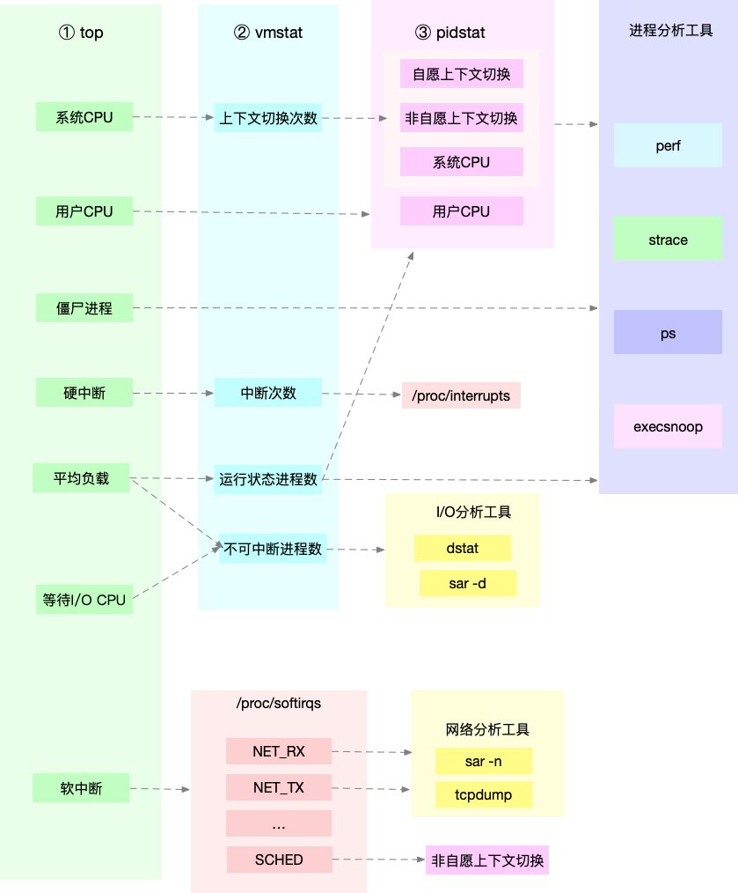

LINUX 性能优化

# 第一章 cpu性能篇
## 1.1 如何理解平均负载

### 查看负载
每次发现系统变慢时，我们通常做的第一件事，就是执行 top 或者 uptime 命令，来了解系统的负载情况。比如像下面这样，我在命令行里输入了 uptime 命令，系统也随即给出了结果。
```shell
$ uptime
02:34:03 up 2 days, 20:14,  1 user,  load average: 0.63, 0.83, 0.88
```

但我想问的是，你真的知道这里每列输出的含义吗？
我相信你对前面的几列比较熟悉，它们分别是当前时间、系统运行时间以及正在登录用户数。
```
02:34:03              //当前时间
up 2 days, 20:14      //系统运行时间
1 user                //正在登录用户数

```
而最后三个数字呢，依次则是过去 1 分钟、5 分钟、15 分钟的 **平均负载（Load Average)**

**平均负载**是指单位时间内，系统处于可运行状态和不可中断状态的平均进程数，也就是平均活跃进程数。  

**可运行状态**：是指正在使用 CPU 或者正在等待 CPU 的进程，也就是我们常用 ps 命令看到的，处于 R 状态（Running 或 Runnable）的进程。  

**不可中断状态**：不可中断状态的进程则是正处于内核态关键流程中的进程，并且这些流程是不可打断的，比如最常见的是等待硬件设备的 I/O 响应，也就是我们在 ps 命令中看到的 D 状态（Uninterruptible Sleep，也称为 Disk Sleep）的进程。比如，当一个进程向磁盘读写数据时，为了保证数据的一致性，在得到磁盘回复前，它是不能被其他进程或者中断打断的，这个时候的进程就处于不可中断状态。如果此时的进程被打断了，就容易出现磁盘数据与进程数据不一致的问题。所以，不可中断状态实际上是系统对进程和硬件设备的一种保护机制。


既然平均的是活跃进程数，那么最理想的，就是每个 CPU 上都刚好运行着一个进程，这样每个 CPU 都得到了充分利用。比如当平均负载为 2 时，意味着什么呢？

* 在只有 2 个 CPU 的系统上，意味着所有的 CPU 都刚好被完全占用。
* 在 4 个 CPU 的系统上，意味着 CPU 有 50% 的空闲。
* 而在只有 1 个 CPU 的系统中，则意味着有一半的进程竞争不到 CPU。

**如何查询cpu个数？**  
```
grep "model name" /proc/cpuinfo | wc -l
```

在例子中可以看到，平均负载有三个数值，到底该参考哪一个呢？  
实际上，都要看。三个不同时间间隔的平均值，其实给我们提供了，分析系统负载趋势的数据来源，让我们能更全面、更立体地理解目前的负载状况。

* 如果 1 分钟、5 分钟、15 分钟的三个值基本相同，或者相差不大，那就说明系统负载很平稳。
* 但如果 1 分钟的值远小于 15 分钟的值，就说明系统最近 1 分钟的负载在减少，而过去 15 分钟内却有很大的负载。
* 反过来，如果 1 分钟的值远大于 15 分钟的值，就说明最近 1 分钟的负载在增加，这种增加有可能只是临时性的，也有可能还会持续增加下去，所以就需要持续观察。一旦 1 分钟的平均负载接近或超过了 CPU 的个数，就意味着系统正在发生过载的问题，这时就得分析调查是哪里导致的问题，并要想办法优化了。

**那么，在实际生产环境中，平均负载多高时，需要我们重点关注呢？**  

在我看来，当平均负载高于 CPU 数量 70% 的时候，你就应该分析排查负载高的问题了。一旦负载过高，就可能导致进程响应变慢，进而影响服务的正常功能。


**平均负载与CPU使用率**
平均负载是指单位时间内，处于可运行状态和不可中断状态的进程数。所以，它不仅包括了正在使用 CPU 的进程，还包括等待 CPU 和等待 I/O 的进程。
而 CPU 使用率，是单位时间内 CPU 繁忙情况的统计，跟平均负载并不一定完全对应。比如：

* CPU 密集型进程，使用大量 CPU 会导致平均负载升高，此时这两者是一致的；

* I/O 密集型进程，等待 I/O 也会导致平均负载升高，但 CPU 使用率不一定很高；

* 大量等待 CPU 的进程调度也会导致平均负载升高，此时的 CPU 使用率也会比较高。

**平均负载案例分析**  

下面，我们以三个示例分别来看这三种情况，并用 iostat、mpstat、pidstat 等工具，找出平均负载升高的根源。
因为案例分析都是基于机器上的操作，所以不要只是听听、看看就够了，最好还是跟着我实际操作一下。

下面的案例都是基于 Ubuntu 18.04，当然，同样适用于其他 Linux 系统。我使用的案例环境如下所示。

机器配置：2 CPU，8GB 内存。

预先安装 stress 和 sysstat 包，如 apt install stress sysstat。

在这里，我先简单介绍一下 stress 和 sysstat。

stress 是一个 Linux 系统压力测试工具，这里我们用作异常进程模拟平均负载升高的场景。

而 sysstat 包含了常用的 Linux 性能工具，用来监控和分析系统的性能。我们的案例会用到这个包的两个命令 mpstat 和 pidstat。

* mpstat 是一个常用的多核 CPU 性能分析工具，用来实时查看每个 CPU 的性能指标，以及所有 CPU 的平均指标。
* pidstat 是一个常用的进程性能分析工具，用来实时查看进程的 CPU、内存、I/O 以及上下文切换等性能指标。

此外，每个场景都需要你开三个终端，登录到同一台 Linux 机器中。

场景一：CPU  密集型进程  
首先，我们在第一个终端运行  stress  命令，模拟一个  CPU  使用率 100% 的场景：
```
$ stress --cpu 1 --timeout 600
```


接着，在第二个终端运行 uptime 查看平均负载的变化情况：
```
# -d 参数表示高亮显示变化的区域
$ watch -d uptime
...,  load average: 1.00, 0.75, 0.39
```

最后，在第三个终端运行 mpstat 查看  CPU  使用率的变化情况：
```
# -P ALL 表示监控所有CPU，后面数字5表示间隔5秒后输出一组数据
$ mpstat -P ALL 5
Linux 4.15.0 (ubuntu) 09/22/18 _x86_64_ (2 CPU)
13:30:06     CPU    %usr   %nice    %sys %iowait    %irq   %soft  %steal  %guest  %gnice   %idle
13:30:11     all   50.05    0.00    0.00    0.00    0.00    0.00    0.00    0.00    0.00   49.95
13:30:11       0    0.00    0.00    0.00    0.00    0.00    0.00    0.00    0.00    0.00  100.00
13:30:11       1  100.00    0.00    0.00    0.00    0.00    0.00    0.00    0.00    0.00    0.00
```


从终端二中可以看到，1 分钟的平均负载会慢慢增加到 1.00，而从终端三中还可以看到，正好有一个 CPU 的使用率为 100%，但它的 iowait 只有 0。这说明，平均负载的升高正是由于 CPU 使用率为 100% 。

那么到底是哪个进程，导致 iowait 这么高呢？我们还是用 pidstat 来查询：

```
# 间隔5秒后输出一组数据，-u表示CPU指标
$ pidstat -u 5 1
Linux 4.15.0 (ubuntu)     09/22/18     _x86_64_    (2 CPU)
13:42:08      UID       PID    %usr %system  %guest   %wait    %CPU   CPU  Command
13:42:13        0       104    0.00    3.39    0.00    0.00    3.39     1  kworker/1:1H
13:42:13        0       109    0.00    0.40    0.00    0.00    0.40     0  kworker/0:1H
13:42:13        0      2997    2.00   35.53    0.00    3.99   37.52     1  stress
13:42:13        0      3057    0.00    0.40    0.00    0.00    0.40     0  pidstat
```

可以发现，还是  stress  进程导致的。

场景三：大量进程的场景
当系统中运行进程超出 CPU 运行能力时，就会出现等待 CPU 的进程。
比如，我们还是使用 stress，但这次模拟的是 8 个进程：
```
$ stress -c 8 --timeout 600
```
由于系统只有 2 个 CPU，明显比 8 个进程要少得多，因而，系统的 CPU 处于严重过载状态，平均负载高达 7.97：
```
$ uptime
...,  load average: 7.97, 5.93, 3.02
```

接着再运行 pidstat 来看一下进程的情况：

```
# 间隔5秒后输出一组数据
$ pidstat -u 5 1
14:23:25      UID       PID    %usr %system  %guest   %wait    %CPU   CPU  Command
14:23:30        0      3190   25.00    0.00    0.00   74.80   25.00     0  stress
14:23:30        0      3191   25.00    0.00    0.00   75.20   25.00     0  stress
14:23:30        0      3192   25.00    0.00    0.00   74.80   25.00     1  stress
14:23:30        0      3193   25.00    0.00    0.00   75.00   25.00     1  stress
14:23:30        0      3194   24.80    0.00    0.00   74.60   24.80     0  stress
14:23:30        0      3195   24.80    0.00    0.00   75.00   24.80     0  stress
14:23:30        0      3196   24.80    0.00    0.00   74.60   24.80     1  stress
14:23:30        0      3197   24.80    0.00    0.00   74.80   24.80     1  stress
14:23:30        0      3200    0.00    0.20    0.00    0.20    0.20     0  pidstat
```

可以看出，8个进程在争抢 2 个 CPU，每个进程等待 CPU 的时间（也就是代码块中的 %wait 列）高达 75%。这些超出 CPU 计算能力的进程，最终导致 CPU 过载。

**小结**  
分析完这三个案例，我再来归纳一下平均负载的理解。

平均负载提供了一个快速查看系统整体性能的手段，反映了整体的负载情况。但只看平均负载本身，我们并不能直接发现，到底是哪里出现了瓶颈。所以，在理解平均负载时，也要注意：

* 平均负载高有可能是 CPU 密集型进程导致的；
* 平均负载高并不一定代表 CPU 使用率高，还有可能是 I/O 更繁忙了；
* 当发现负载高的时候，你可以使用 mpstat、pidstat 等工具，辅助分析负载的来源。

## 1.2 CPU上下文切换
我想你一定很好奇，进程在竞争 CPU 的时候并没有真正运行，为什么还会导致系统的负载升高呢？看到今天的主题，你应该已经猜到了，CPU 上下文切换就是罪魁祸首。

我们都知道，Linux 是一个多任务操作系统，它支持远大于 CPU 数量的任务同时运行。当然，这些任务实际上并不是真的在同时运行，而是因为系统在很短的时间内，将 CPU 轮流分配给它们，造成多任务同时运行的错觉。

而在每个任务运行前，CPU 都需要知道任务从哪里加载、又从哪里开始运行，也就是说，需要系统事先帮它设置好 CPU 寄存器和程序计数器（Program Counter，PC）。

CPU 寄存器，是 CPU 内置的容量小、但速度极快的内存。而程序计数器，则是用来存储 CPU 正在执行的指令位置、或者即将执行的下一条指令位置。它们都是 CPU 在运行任何任务前，必须的依赖环境，因此也被叫做**CPU上下文**。


知道了什么是 CPU 上下文，我想你也很容易理解 CPU 上下文切换。CPU 上下文切换，就是先把前一个任务的 CPU 上下文（也就是 CPU 寄存器和程序计数器）保存起来，然后加载新任务的上下文到这些寄存器和程序计数器，最后再跳转到程序计数器所指的新位置，运行新任务。
而这些保存下来的上下文，会存储在系统内核中，并在任务重新调度执行时再次加载进来。这样就能保证任务原来的状态不受影响，让任务看起来还是连续运行。


所以，根据任务的不同，CPU 的上下文切换就可以分为几个不同的场景，也就是：
* 进程上下文切换
* 线程上下文切换
* 中断上下文切换。


这节课我就带你来看看，怎么理解这几个不同的上下文切换，以及它们为什么会引发 CPU 性能相关问题。

#### 进程上下文切换
Linux 按照特权等级，把进程的运行空间分为内核空间和用户空间，分别对应着下图中， CPU 特权等级的 Ring 0 和 Ring 3。

* 内核空间（Ring 0）具有最高权限，可以直接访问所有资源；

* 用户空间（Ring 3）只能访问受限资源，不能直接访问内存等硬件设备，必须通过系统调用陷入到内核中，才能访问这些特权资源。

**用户态与内核态**：

换个角度看，也就是说，进程既可以在用户空间运行，又可以在内核空间中运行。进程在用户空间运行时，被称为进程的用户态，而陷入内核空间的时候，被称为进程的内核态。

从用户态到内核态的转变，需要通过系统调用来完成。比如，当我们查看文件内容时，就需要多次系统调用来完成：首先调用 open() 打开文件，然后调用 read() 读取文件内容，并调用 write() 将内容写到标准输出，最后再调用 close() 关闭文件。

那么，系统调用的过程有没有发生 CPU 上下文的切换呢？答案自然是肯定的。

CPU 寄存器里原来用户态的指令位置，需要先保存起来。接着，为了执行内核态代码，CPU 寄存器需要更新为内核态指令的新位置。最后才是跳转到内核态运行内核任务。而系统调用结束后，CPU 寄存器需要恢复原来保存的用户态，然后再切换到用户空间，继续运行进程。所以，一次系统调用的过程，其实是发生了两次 CPU 上下文切换。


不过，需要注意的是，系统调用过程中，并不会涉及到虚拟内存等进程用户态的资源，也不会切换进程。这跟我们通常所说的进程上下文切换是不一样的：


进程上下文切换，是指从一个进程切换到另一个进程运行。

而系统调用过程中一直是同一个进程在运行。

所以，系统调用过程通常称为**特权模式切换**，而不是上下文切换。但实际上，系统调用过程中，CPU 的上下文切换还是无法避免的。

那么，进程上下文切换跟系统调用又有什么区别呢？

首先，你需要知道，进程是由内核来管理和调度的，进程的切换只能发生在内核态。所以，进程的上下文不仅包括了**虚拟内存、栈、全局变量**等用户空间的资源，还包括了内核堆栈、寄存器等内核空间的状态。

因此，进程的上下文切换就比系统调用时多了一步：在保存当前进程的内核状态和 CPU 寄存器之前，需要先把该进程的虚拟内存、栈等保存下来；而加载了下一进程的内核态后，还需要刷新进程的虚拟内存和用户栈。

如下图所示，保存上下文和恢复上下文的过程并不是“免费”的，需要内核在 CPU 上运行才能完成。

根据 Tsuna 的测试报告，每次上下文切换都需要几十纳秒到数微秒的 CPU 时间。这个时间还是相当可观的，特别是<u>在进程上下文切换次数较多的情况下，很容易导致 CPU 将大量时间耗费在寄存器、内核栈以及虚拟内存等资源的保存和恢复上，进而大大缩短了真正运行进程的时间。这也正是上一节中我们所讲的，导致平均负载升高的一个重要因素</u>。


另外，我们知道， Linux 通过 TLB（Translation Lookaside Buffer）来管理虚拟内存到物理内存的映射关系。TLB就是页表的Cache.当虚拟内存更新后，TLB 也需要刷新，内存的访问也会随之变慢。特别是在多处理器系统上，缓存是被多个处理器共享的，刷新缓存不仅会影响当前处理器的进程，还会影响共享缓存的其他处理器的进程。

知道了进程上下文切换潜在的性能问题后，我们再来看，究竟什么时候会切换进程上下文。

显然，进程切换时才需要切换上下文，换句话说，只有在进程调度的时候，才需要切换上下文。Linux 为每个 CPU 都维护了一个就绪队列，将活跃进程（即正在运行和正在等待 CPU 的进程）按照优先级和等待 CPU 的时间排序，然后选择最需要 CPU 的进程，也就是优先级最高和等待 CPU 时间最长的进程来运行。


那么，进程在什么时候才会被调度到 CPU 上运行呢？


最容易想到的一个时机，就是进程执行完终止了，它之前使用的 CPU 会释放出来，这个时候再从就绪队列里，拿一个新的进程过来运行。其实还有很多其他场景，也会触发进程调度，在这里我给你逐个梳理下。

其一，为了保证所有进程可以得到公平调度，CPU 时间被划分为一段段的时间片，这些时间片再被轮流分配给各个进程。这样，当某个进程的时间片耗尽了，就会被系统挂起，切换到其它正在等待 CPU 的进程运行。

其二，进程在系统资源不足（比如内存不足）时，要等到资源满足后才可以运行，这个时候进程也会被挂起，并由系统调度其他进程运行。

其三，当进程通过睡眠函数  sleep 这样的方法将自己主动挂起时，自然也会重新调度。

其四，当有优先级更高的进程运行时，为了保证高优先级进程的运行，当前进程会被挂起，由高优先级进程来运行。

最后一个，发生硬件中断时，CPU 上的进程会被中断挂起，转而执行内核中的中断服务程序。

了解这几个场景是非常有必要的，因为一旦出现上下文切换的性能问题，它们就是幕后凶手。

<u>线程上下文切换</u>  
说完了进程的上下文切换，我们再来看看线程相关的问题。

线程与进程最大的区别在于，线程是调度的基本单位，而进程则是资源拥有的基本单位。说白了，所谓内核中的任务调度，实际上的调度对象是线程；而进程只是给线程提供了虚拟内存、全局变量等资源。所以，对于线程和进程，我们可以这么理解：

当进程只有一个线程时，可以认为进程就等于线程。

当进程拥有多个线程时，这些线程会共享相同的虚拟内存和全局变量等资源。这些资源在上下文切换时是不需要修改的。

另外，线程也有自己的私有数据，比如栈和寄存器等，这些在上下文切换时也是需要保存的。

这么一来，线程的上下文切换其实就可以分为两种情况：

第一种， 前后两个线程属于不同进程。此时，因为资源不共享，所以切换过程就跟进程上下文切换是一样。

第二种，前后两个线程属于同一个进程。此时，因为虚拟内存是共享的，所以在切换时，虚拟内存这些资源就保持不动，只需要切换线程的私有数据、寄存器等不共享的数据。


到这里你应该也发现了，虽然同为上下文切换，但同进程内的线程切换，要比多进程间的切换消耗更少的资源，而这，也正是多线程代替多进程的一个优势。

**中断上下文切换**  
除了前面两种上下文切换，还有一个场景也会切换 CPU 上下文，那就是中断。

为了快速响应硬件的事件，中断处理会打断进程的正常调度和执行，转而调用中断处理程序，响应设备事件。而在打断其他进程时，就需要将进程当前的状态保存下来，这样在中断结束后，进程仍然可以从原来的状态恢复运行。

跟进程上下文不同，中断上下文切换并不涉及到进程的用户态。所以，即便中断过程打断了一个正处在用户态的进程，也不需要保存和恢复这个进程的虚拟内存、全局变量等用户态资源。中断上下文，其实只包括内核态中断服务程序执行所必需的状态，包括 CPU 寄存器、内核堆栈、硬件中断参数等。

对同一个 CPU 来说，中断处理比进程拥有更高的优先级，所以中断上下文切换并不会与进程上下文切换同时发生。同样道理，由于中断会打断正常进程的调度和执行，所以大部分中断处理程序都短小精悍，以便尽可能快的执行结束。

另外，跟进程上下文切换一样，中断上下文切换也需要消耗 CPU，切换次数过多也会耗费大量的 CPU，甚至严重降低系统的整体性能。所以，当你发现中断次数过多时，就需要注意去排查它是否会给你的系统带来严重的性能问题。

**小结**
总结一下，不管是哪种场景导致的上下文切换，你都应该知道：


CPU 上下文切换，是保证 Linux 系统正常工作的核心功能之一，一般情况下不需要我们特别关注。

但过多的上下文切换，会把 CPU 时间消耗在寄存器、内核栈以及虚拟内存等数据的保存和恢复上，从而缩短进程真正运行的时间，导致系统的整体性能大幅下降。


## 1.3 CPU上下文切换下

### 1.3.1 怎么查看系统的上下文切换情况

vmstat 是一个常用的系统性能分析工具，主要用来分析系统的内存使用情况，也常用来分析 CPU 上下文切换和中断的次数。

```
# 每隔5秒输出1组数据
$ vmstat 5
procs -----------memory---------- ---swap-- -----io---- -system-- ------cpu-----
 r  b   swpd   free   buff  cache   si   so    bi    bo   in   cs us sy id wa st
 0  0      0 7005360  91564 818900    0    0     0     0   25   33  0  0 100  0  0

```
* cs（context switch）是每秒上下文切换的次数。
* in（interrupt）则是每秒中断的次数。
* r（Running or Runnable）是就绪队列的长度，也就是正在运行和等待 CPU 的进程数。
* b（Blocked）则是处于不可中断睡眠状态的进程数。

可以看到，这个例子中的上下文切换次数 cs 是 33 次，而系统中断次数 in 则是 25 次，而就绪队列长度 r 和不可中断状态进程数 b 都是 0。

vmstat 只给出了系统总体的上下文切换情况，要想查看每个进程的详细情况，就需要使用我们前面提到过的 pidstat  了。给它加上 -w 选项，你就可以查看每个进程上下文切换的情况了。

```
# 每隔5秒输出1组数据
$ pidstat -w 5
Linux 4.15.0 (ubuntu)  09/23/18  _x86_64_  (2 CPU)

08:18:26      UID       PID   cswch/s nvcswch/s  Command
08:18:31        0         1      0.20      0.00  systemd
08:18:31        0         8      5.40      0.00  rcu_sched
...

```
这个结果中有两列内容是我们的重点关注对象。一个是  cswch  ，表示每秒自愿上下文切换（voluntary context switches）的次数，另一个则是  nvcswch  ，表示每秒非自愿上下文切换（non voluntary context switches）的次数。

* 所谓**自愿上下文切换**，是指进程无法获取所需资源，导致的上下文切换。比如说， I/O、内存等系统资源不足时，就会发生自愿上下文切换。

* 而**非自愿上下文切换**，则是指进程由于时间片已到等原因，被系统强制调度，进而发生的上下文切换。比如说，大量进程都在争抢 CPU 时，就容易发生非自愿上下文切换。


### 1.3.2 案例分析
知道了怎么查看这些指标，另一个问题又来了，上下文切换频率是多少次才算正常呢？别急着要答案，同样的，我们先来看一个上下文切换的案例。  
今天的案例，我们将使用 sysbench 来模拟系统多线程调度切换的情况。

sysbench 是一个多线程的基准测试工具，一般用来评估不同系统参数下的数据库负载情况。当然，在这次案例中，我们只把它当成一个异常进程来看，作用是模拟上下文切换过多的问题。
另外注意，下面所有命令，都默认以 root 用户运行。所以，如果你是用普通用户登陆的系统，记住先运行 sudo su root 命令切换到 root 用户。

#### 操作和分析
首先，在第一个终端里运行 sysbench  ，模拟系统多线程调度的瓶颈：
```
# 以10个线程运行5分钟的基准测试，模拟多线程切换的问题
$ sysbench --threads=10 --max-time=300 threads run

```
接着，在第二个终端运行 vmstat  ，观察上下文切换情况：
```
# 每隔1秒输出1组数据（需要Ctrl+C才结束）
$ vmstat 1
procs -----------memory---------- ---swap-- -----io---- -system-- ------cpu-----
 r  b   swpd   free   buff  cache   si   so    bi    bo   in   cs us sy id wa st
 6  0      0 6487428 118240 1292772    0    0     0     0 9019 1398830 16 84  0  0  0
 8  0      0 6487428 118240 1292772    0    0     0     0 10191 1392312 16 84  0  0  0
```
你应该可以发现，cs 列的上下文切换次数从之前的 35 骤然上升到了 139 万。同时，注意观察其他几个指标：

* r 列：就绪队列的长度已经到了 8，远远超过了系统 CPU 的个数 2，所以肯定会有大量的 CPU 竞争。

* us（user）和 sy（system）列：这两列的 CPU 使用率加起来上升到了 100%，其中系统 CPU 使用率，也就是 sy 列高达 84%，说明 CPU 主要是被内核占用了。

* in  列：中断次数也上升到了 1 万左右，说明中断处理也是个潜在的问题。

**综合这几个指标，我们可以知道，系统的就绪队列过长，也就是正在运行和等待 CPU 的进程数过多，导致了大量的上下文切换，而上下文切换又导致了系统 CPU 的占用率升高。**

那么到底是什么进程导致了这些问题呢？

我们继续分析，在第三个终端再用 pidstat 来看一下， CPU 和进程上下文切换的情况：
```
# 每隔1秒输出1组数据（需要 Ctrl+C 才结束）
# -w参数表示输出进程切换指标，而-u参数则表示输出CPU使用指标
$ pidstat -w -u 1
08:06:33      UID       PID    %usr %system  %guest   %wait    %CPU   CPU  Command
08:06:34        0     10488   30.00  100.00    0.00    0.00  100.00     0  sysbench
08:06:34        0     26326    0.00    1.00    0.00    0.00    1.00     0  kworker/u4:2

08:06:33      UID       PID   cswch/s nvcswch/s  Command
08:06:34        0         8     11.00      0.00  rcu_sched
08:06:34        0        16      1.00      0.00  ksoftirqd/1
08:06:34        0       471      1.00      0.00  hv_balloon
08:06:34        0      1230      1.00      0.00  iscsid
08:06:34        0      4089      1.00      0.00  kworker/1:5
08:06:34        0      4333      1.00      0.00  kworker/0:3
08:06:34        0     10499      1.00    224.00  pidstat
08:06:34        0     26326    236.00      0.00  kworker/u4:2
08:06:34     1000     26784    223.00      0.00  sshd

```
从 pidstat 的输出你可以发现，CPU 使用率的升高果然是 sysbench 导致的，它的 CPU 使用率已经达到了 100%。但上下文切换则是来自其他进程，包括非自愿上下文切换频率最高的 pidstat  ，以及自愿上下文切换频率最高的内核线程 kworker 和 sshd。

过，细心的你肯定也发现了一个怪异的事儿：pidstat 输出的上下文切换次数，加起来也就几百，比 vmstat 的 139 万明显小了太多。这是怎么回事呢？难道是工具本身出了错吗？

别着急，在怀疑工具之前，我们再来回想一下，前面讲到的几种上下文切换场景。其中有一点提到， Linux 调度的基本单位实际上是线程，而我们的场景 sysbench 模拟的也是线程的调度问题，那么，是不是 pidstat 忽略了线程的数据呢？

通过运行 man pidstat  ，你会发现，pidstat 默认显示进程的指标数据，加上 -t 参数后，才会输出线程的指标。

所以，我们可以在第三个终端里，  Ctrl+C 停止刚才的 pidstat 命令，再加上 -t 参数，重试一下看看：
```
# 每隔1秒输出一组数据（需要 Ctrl+C 才结束）
# -wt 参数表示输出线程的上下文切换指标
$ pidstat -wt 1
08:14:05      UID      TGID       TID   cswch/s nvcswch/s  Command
...
08:14:05        0     10551         -      6.00      0.00  sysbench
08:14:05        0         -     10551      6.00      0.00  |__sysbench
08:14:05        0         -     10552  18911.00 103740.00  |__sysbench
08:14:05        0         -     10553  18915.00 100955.00  |__sysbench
08:14:05        0         -     10554  18827.00 103954.00  |__sysbench
...
```

现在你就能看到了，虽然 sysbench 进程（也就是主线程）的上下文切换次数看起来并不多，但它的子线程的上下文切换次数却有很多。看来，上下文切换罪魁祸首，还是过多的 sysbench 线程。

我们已经找到了上下文切换次数增多的根源，那是不是到这儿就可以结束了呢？

当然不是。不知道你还记不记得，前面在观察系统指标时，除了上下文切换频率骤然升高，还有一个指标也有很大的变化。是的，正是中断次数。中断次数也上升到了 1 万，但到底是什么类型的中断上升了，现在还不清楚。我们接下来继续抽丝剥茧找源头。


既然是中断，我们都知道，它只发生在内核态，而 pidstat 只是一个进程的性能分析工具，并不提供任何关于中断的详细信息，怎样才能知道中断发生的类型呢？

没错，**那就是从 /proc/interrupts 这个只读文件中读取。/proc 实际上是 Linux 的一个虚拟文件系统，用于内核空间与用户空间之间的通信。/proc/interrupts 就是这种通信机制的一部分，提供了一个只读的中断使用情况**。

```
# -d 参数表示高亮显示变化的区域
$ watch -d cat /proc/interrupts
           CPU0       CPU1
...
RES:    2450431    5279697   Rescheduling interrupts
...

```

观察一段时间，你可以发现，变化速度最快的是**重调度中断（RES）**，这个中断类型表示，唤醒空闲状态的 CPU 来调度新的任务运行。这是多处理器系统（SMP）中，调度器用来分散任务到不同 CPU 的机制，通常也被称为**处理器间中断（Inter-Processor Interrupts，IPI）**。

现在再回到最初的问题，每秒上下文切换多少次才算正常呢？


这个数值其实取决于系统本身的 CPU 性能。<u>在我看来，如果系统的上下文切换次数比较稳定，那么从数百到一万以内，都应该算是正常的。但当上下文切换次数超过一万次，或者切换次数出现数量级的增长时，就很可能已经出现了性能问题。</u>


这时，你还需要根据上下文切换的类型，再做具体分析。比方说：

* 自愿上下文切换变多了，说明进程都在等待资源，有可能发生了 I/O 等其他问题；

* 非自愿上下文切换变多了，说明进程都在被强制调度，也就是都在争抢 CPU，说明 CPU 的确成了瓶颈；

* 中断次数变多了，说明 CPU 被中断处理程序占用，还需要通过查看 /proc/interrupts 文件来分析具体的中断类型。

## 1.3.4 某个应用的CPU使用率居然达到100%，我该怎么办？
### CPU 使用率
在上一期我曾提到，Linux 作为一个多任务操作系统，将每个 CPU 的时间划分为很短的时间片，再通过调度器轮流分配给各个任务使用，因此造成多任务同时运行的错觉。

为了维护 CPU 时间，Linux 通过事先定义的节拍率（内核中表示为 HZ），触发时间中断，并使用全局变量 Jiffies 记录了开机以来的节拍数。每发生一次时间中断，Jiffies 的值就加 1。

节拍率 HZ 是内核的可配选项，可以设置为 100、250、1000 等。不同的系统可能设置不同数值，你可以通过查询 /boot/config 内核选项来查看它的配置值。比如在我的系统中，节拍率设置成了 250，也就是每秒钟触发 250 次时间中断。
```
$ grep 'CONFIG_HZ=' /boot/config-$(uname -r)
CONFIG_HZ=250
```

同时，正因为节拍率 HZ 是内核选项，所以用户空间程序并不能直接访问。为了方便用户空间程序，内核还提供了一个用户空间节拍率 USER_HZ，它总是固定为 100，也就是 1/100 秒。这样，用户空间程序并不需要关心内核中 HZ 被设置成了多少，因为它看到的总是固定值 USER_HZ。

Linux 通过 /proc 虚拟文件系统，向用户空间提供了系统内部状态的信息，而 /proc/stat 提供的就是系统的 CPU 和任务统计信息。比方说，如果你只关注 CPU 的话，可以执行下面的命令：
```
# 只保留各个CPU的数据
$ cat /proc/stat | grep ^cpu
cpu  280580 7407 286084 172900810 83602 0 583 0 0 0
cpu0 144745 4181 176701 86423902 52076 0 301 0 0 0
cpu1 135834 3226 109383 86476907 31525 0 282 0 0 0
```
这里的输出结果是一个表格。其中，第一列表示的是 CPU 编号，如 cpu0、cpu1 ，而第一行没有编号的 cpu  ，表示的是所有 CPU 的累加。其他列则表示不同场景下 CPU 的累加节拍数，它的单位是 USER_HZ，也就是 10 ms（1/100 秒），所以这其实就是不同场景下的 CPU 时间。

当然，这里每一列的顺序并不需要你背下来。你只要记住，有需要的时候，查询  man proc  就可以。不过，你要清楚 man proc 文档里每一列的涵义，它们都是 CPU 使用率相关的重要指标，你还会在很多其他的性能工具中看到它们。下面，我来依次解读一下。

* user（通常缩写为 us），代表用户态 CPU 时间。注意，它不包括下面的 nice 时间，但包括了 guest 时间。

* nice（通常缩写为 ni），代表低优先级用户态 CPU 时间，也就是进程的 nice 值被调整为 1-19 之间时的 CPU 时间。这里注意，nice 可取值范围是 -20 到 19，数值越大，优先级反而越低。

* system（通常缩写为 sys），代表内核态 CPU 时间。

* idle（通常缩写为 id），代表空闲时间。注意，它不包括等待 I/O 的时间（iowait）。

* iowait（通常缩写为 wa），代表等待 I/O 的 CPU 时间。

* irq（通常缩写为 hi），代表处理硬中断的 CPU 时间。

* softirq（通常缩写为 si），代表处理软中断的 CPU 时间。

* steal（通常缩写为 st），代表当系统运行在虚拟机中的时候，被其他虚拟机占用的 CPU 时间。

* guest（通常缩写为 guest），代表通过虚拟化运行其他操作系统的时间，也就是运行虚拟机的 CPU 时间。

* guest_nice（通常缩写为 gnice），代表以低优先级运行虚拟机的时间。

而我们通常所说的**CPU 使用率**，就是除了空闲时间外的其他时间占总 CPU 时间的百分比，用公式来表示就是：
1 - idle / total

根据这个公式，我们就可以从 /proc/stat 中的数据，很容易地计算出 CPU 使用率。当然，也可以用每一个场景的 CPU 时间，除以总的 CPU 时间，计算出每个场景的 CPU 使用率。

不过先不要着急计算，你能说出，直接用 /proc/stat 的数据，算的是什么时间段的 CPU 使用率吗？

看到这里，你应该想起来了，<u>这是开机以来的节拍数累加值，所以直接算出来的，是开机以来的平均 CPU 使用率，一般没啥参考价值</u>  
事实上，为了计算 CPU 使用率，性能工具一般都会取间隔一段时间（比如 3 秒）的两次值，作差后，再计算出这段时间内的平均 CPU 使用率，即:  

* 1- (空闲时间new - 空闲时间old)/(总cpu时间new - 总cpu时间old)

这个公式，就是我们用各种性能工具所看到的 CPU 使用率的实际计算方法。

现在，我们知道了系统 CPU 使用率的计算方法，那进程的呢？跟系统的指标类似，Linux 也给每个进程提供了运行情况的统计信息，也就是 /proc/[pid]/stat。不过，这个文件包含的数据就比较丰富了，总共有 52 列的数据。

回过头来看，是不是说要查看 CPU 使用率，就必须先读取 /proc/stat 和 /proc/[pid]/stat 这两个文件，然后再按照上面的公式计算出来呢？

当然不是，各种各样的性能分析工具已经帮我们计算好了。不过要注意的是，性能分析工具给出的都是间隔一段时间的平均 CPU 使用率，所以要注意间隔时间的设置，特别是用多个工具对比分析时，你一定要保证它们用的是相同的间隔时间。

比如，对比一下 top 和 ps 这两个工具报告的 CPU 使用率，默认的结果很可能不一样，因为 top 默认使用 3 秒时间间隔，而 ps 使用的却是进程的整个生命周期。

### 怎么查看 CPU 使用率
*** 
知道了 CPU 使用率的含义后，我们再来看看要怎么查看 CPU 使用率。说到查看 CPU 使用率的工具，我猜你第一反应肯定是  top 和 ps。的确，top 和 ps 是最常用的性能分析工具：

top 显示了系统总体的 CPU 和内存使用情况，以及各个进程的资源使用情况。

ps 则只显示了每个进程的资源使用情况。

比如，top 的输出格式为：
```
# 默认每3秒刷新一次
$ top
top - 11:58:59 up 9 days, 22:47,  1 user,  load average: 0.03, 0.02, 0.00
Tasks: 123 total,   1 running,  72 sleeping,   0 stopped,   0 zombie
%Cpu(s):  0.3 us,  0.3 sy,  0.0 ni, 99.3 id,  0.0 wa,  0.0 hi,  0.0 si,  0.0 st
KiB Mem :  8169348 total,  5606884 free,   334640 used,  2227824 buff/cache
KiB Swap:        0 total,        0 free,        0 used.  7497908 avail Mem

  PID USER      PR  NI    VIRT    RES    SHR S  %CPU %MEM     TIME+ COMMAND
    1 root      20   0   78088   9288   6696 S   0.0  0.1   0:16.83 systemd
    2 root      20   0       0      0      0 S   0.0  0.0   0:00.05 kthreadd
    4 root       0 -20       0      0      0 I   0.0  0.0   0:00.00 kworker/0:0H
...
```

这个输出结果中，第三行 %Cpu 就是系统的 CPU 使用率，具体每一列的含义上一节都讲过，只是把 CPU 时间变换成了 CPU 使用率，我就不再重复讲了。不过需要注意，**top 默认显示的是所有 CPU 的平均值，这个时候你只需要按下数字 1 ，就可以切换到每个 CPU 的使用率了**。

继续往下看，空白行之后是进程的实时信息，每个进程都有一个 %CPU 列，表示进程的 CPU 使用率。它是用户态和内核态 CPU 使用率的总和，包括进程用户空间使用的 CPU、通过系统调用执行的内核空间 CPU 、以及在就绪队列等待运行的 CPU。在虚拟化环境中，它还包括了运行虚拟机占用的 CPU。

所以，到这里我们可以发现， top 并没有细分进程的用户态 CPU 和内核态 CPU。那要怎么查看每个进程的详细情况呢？<u>你应该还记得上一节用到的  pidstat  吧，它正是一个专门分析每个进程 CPU 使用情况的工具。</u>


比如，下面的 pidstat 命令，就间隔 1 秒展示了进程的 5 组 CPU 使用率，包括：
* 用户态 CPU 使用率 （%usr）；
* 内核态 CPU 使用率（%system）；
* 运行虚拟机 CPU 使用率（%guest）；
* 等待 CPU 使用率（%wait）；
* 以及总的 CPU 使用率（%CPU）。
最后的 Average 部分，还计算了 5 组数据的平均值。
```
# 每隔1秒输出一组数据，共输出5组
$ pidstat 1 5
15:56:02      UID       PID    %usr %system  %guest   %wait    %CPU   CPU  Command
15:56:03        0     15006    0.00    0.99    0.00    0.00    0.99     1  dockerd

...

Average:      UID       PID    %usr %system  %guest   %wait    %CPU   CPU  Command
Average:        0     15006    0.00    0.99    0.00    0.00    0.99     -  dockerd

```
##1.4  CPU 使用率过高怎么办？
***
通过 top、ps、pidstat 等工具，你能够轻松找到 CPU 使用率较高（比如 100% ）的进程。接下来，你可能又想知道，占用 CPU 的到底是代码里的哪个函数呢？找到它，你才能更高效、更针对性地进行优化。

我猜你第一个想到的，应该是 GDB（The GNU Project Debugger）， 这个功能强大的程序调试利器。的确，GDB 在调试程序错误方面很强大。但是，我又要来“挑刺”了。请你记住，GDB 并不适合在性能分析的早期应用。

为什么呢？<u>因为 GDB 调试程序的过程会中断程序运行，这在线上环境往往是不允许的。所以，GDB 只适合用在性能分析的后期，当你找到了出问题的大致函数后，线下再借助它来进一步调试函数内部的问题</u>。

那么哪种工具适合在第一时间分析进程的 CPU 问题呢？我的推荐是 perf。perf 是 Linux 2.6.31 以后内置的性能分析工具。它以性能事件采样为基础，不仅可以分析系统的各种事件和内核性能，还可以用来分析指定应用程序的性能问题。

使用 perf 分析 CPU 性能问题，我来说两种最常见、也是我最喜欢的用法。

第一种常见用法是 perf top，类似于 top，它能够实时显示占用 CPU 时钟最多的函数或者指令，因此可以用来查找热点函数，使用界面如下所示：
```
$ perf top
Samples: 833  of event 'cpu-clock', Event count (approx.): 97742399
Overhead  Shared Object       Symbol
   7.28%  perf                [.] 0x00000000001f78a4
   4.72%  [kernel]            [k] vsnprintf
   4.32%  [kernel]            [k] module_get_kallsym
   3.65%  [kernel]            [k] _raw_spin_unlock_irqrestore
...
```

输出结果中，第一行包含三个数据，分别是采样数（Samples）、事件类型（event）和事件总数量（Event count）。比如这个例子中，perf 总共采集了 833 个 CPU 时钟事件，而总事件数则为 97742399。

另外，采样数需要我们特别注意。如果采样数过少（比如只有十几个），那下面的排序和百分比就没什么实际参考价值了。

再往下看是一个表格式样的数据，每一行包含四列，分别是：
* 第一列 Overhead ，是该符号的性能事件在所有采样中的比例，用百分比来表示。
* 第二列 Shared ，是该函数或指令所在的动态共享对象（Dynamic Shared Object），如内核、进程名、动态链接库名、内核模块名等。
* 第三列 Object ，是动态共享对象的类型。比如 [.] 表示用户空间的可执行程序、或者动态链接库，而 [k] 则表示内核空间。
* 最后一列 Symbol 是符号名，也就是函数名。当函数名未知时，用十六进制的地址来表示。
还是以上面的输出为例，我们可以看到，占用 CPU 时钟最多的是 perf 工具自身，不过它的比例也只有 7.28%，说明系统并没有 CPU 性能问题。 perf top 的使用你应该很清楚了吧。

接着再来看第二种常见用法，也就是 perf record 和 perf report。 perf top 虽然实时展示了系统的性能信息，但它的缺点是并不保存数据，也就无法用于离线或者后续的分析。而 perf record 则提供了保存数据的功能，保存后的数据，需要你用 perf report 解析展示。
```
$ perf record # 按Ctrl+C终止采样
[ perf record: Woken up 1 times to write data ]
[ perf record: Captured and wrote 0.452 MB perf.data (6093 samples) ]

$ perf report # 展示类似于perf top的报告
```

在实际使用中，我们还经常为 perf top 和 perf record 加上 -g 参数，开启调用关系的采样，方便我们根据调用链来分析性能问题。
```
# -g开启调用关系分析，-p指定php-fpm的进程号21515
$ perf top -g -p 21515
```

### 小结
***
CPU 使用率是最直观和最常用的系统性能指标，更是我们在排查性能问题时，通常会关注的第一个指标。所以我们更要熟悉它的含义，尤其要弄清楚用户（%user）、Nice（%nice）、系统（%system） 、等待 I/O（%iowait） 、中断（%irq）以及软中断（%softirq）这几种不同 CPU 的使用率。比如说：

* 用户 CPU 和 Nice CPU 高，说明用户态进程占用了较多的 CPU，所以应该着重排查进程的性能问题。

* 系统 CPU 高，说明内核态占用了较多的 CPU，所以应该着重排查内核线程或者系统调用的性能问题。

* I/O 等待 CPU 高，说明等待 I/O 的时间比较长，所以应该着重排查系统存储是不是出现了 I/O 问题。

* 软中断和硬中断高，说明软中断或硬中断的处理程序占用了较多的 CPU，所以应该着重排查内核中的中断服务程序。

碰到 CPU 使用率升高的问题，你可以借助 top、pidstat 等工具，确认引发 CPU 性能问题的来源；再使用 perf 等工具，排查出引起性能问题的具体函数。


### execsnoop
***
在这个案例中，我们使用了 top、pidstat、pstree 等工具分析了系统 CPU 使用率高的问题，并发现 CPU 升高是短时进程 stress 导致的，但是整个分析过程还是比较复杂的。对于这类问题，有没有更好的方法监控呢？

execsnoop 就是一个专为短时进程设计的工具。它通过 ftrace 实时监控进程的 exec() 行为，并输出短时进程的基本信息，包括进程 PID、父进程 PID、命令行参数以及执行的结果。

比如，用 execsnoop 监控上述案例，就可以直接得到 stress 进程的父进程 PID 以及它的命令行参数，并可以发现大量的 stress 进程在不停启动：

碰到常规问题无法解释的 CPU 使用率情况时，首先要想到有可能是短时应用导致的问题，比如有可能是下面这两种情况。

* 第一，应用里直接调用了其他二进制程序，这些程序通常运行时间比较短，通过 top 等工具也不容易发现。

* 第二，应用本身在不停地崩溃重启，而启动过程的资源初始化，很可能会占用相当多的 CPU。

对于这类进程，我们可以用 pstree 或者 execsnoop 找到它们的父进程，再从父进程所在的应用入手，排查问题的根源。


## 1.5 系统中出现大量的不可中断进程或者僵尸进程怎么办
我们还讲到 CPU 使用率的类型。除了上一节提到的用户 CPU 之外，它还包括系统 CPU（比如上下文切换）、等待 I/O 的 CPU（比如等待磁盘的响应）以及中断 CPU（包括软中断和硬中断）等。

我们已经在上下文切换的文章中，一起分析了系统 CPU 使用率高的问题，剩下的等待 I/O 的 CPU 使用率（以下简称为 iowait）升高，也是最常见的一个服务器性能问题。

### 1.5.1 进程状态
<u>当 iowait 升高时，进程很可能因为得不到硬件的响应，而长时间处于不可中断状态。从 ps 或者 top 命令的输出中，你可以发现它们都处于 D 状态，也就是不可中断状态（Uninterruptible Sleep）</u>。

top 和 ps 是最常用的查看进程状态的工具，我们就从 top 的输出开始。下面是一个 top 命令输出的示例，S 列（也就是 Status  列）表示进程的状态。从这个示例里，你可以看到 R、D、Z、S、I 等几个状态，它们分别是什么意思呢？
```
$ top
  PID USER      PR  NI    VIRT    RES    SHR S  %CPU %MEM     TIME+ COMMAND
28961 root      20   0   43816   3148   4040 R   3.2  0.0   0:00.01 top
  620 root      20   0   37280  33676    908 D   0.3  0.4   0:00.01 app
    1 root      20   0  160072   9416   6752 S   0.0  0.1   0:37.64 systemd
 1896 root      20   0       0      0      0 Z   0.0  0.0   0:00.00 devapp
    2 root      20   0       0      0      0 S   0.0  0.0   0:00.10 kthreadd
    4 root       0 -20       0      0      0 I   0.0  0.0   0:00.00 kworker/0:0H
    6 root       0 -20       0      0      0 I   0.0  0.0   0:00.00 mm_percpu_wq
    7 root      20   0       0      0      0 S   0.0  0.0   0:06.37 ksoftirqd/0
```
我们挨个来看一下：
* R 是 Running 或 Runnable 的缩写，表示进程在 CPU 的就绪队列中，正在运行或者正在等待运行。

* D 是 Disk Sleep 的缩写，也就是不可中断状态睡眠（Uninterruptible Sleep），一般表示进程正在跟硬件交互，并且交互过程不允许被其他进程或中断打断。

* Z 是 Zombie 的缩写，如果你玩过“植物大战僵尸”这款游戏，应该知道它的意思。它表示僵尸进程，也就是进程实际上已经结束了，但是父进程还没有回收它的资源（比如进程的描述符、PID 等）。

* S 是 Interruptible Sleep 的缩写，也就是可中断状态睡眠，表示进程因为等待某个事件而被系统挂起。当进程等待的事件发生时，它会被唤醒并进入 R 状态。

* I 是 Idle 的缩写，也就是空闲状态，用在不可中断睡眠的内核线程上。前面说了，硬件交互导致的不可中断进程用 D 表示，但对某些内核线程来说，它们有可能实际上并没有任何负载，用 Idle 正是为了区分这种情况。要注意，D 状态的进程会导致平均负载升高， I 状态的进程却不会。

当然了，上面的示例并没有包括进程的所有状态。除了以上 5 个状态，进程还包括下面这 2 个状态。

第一个是 T 或者 t，也就是 Stopped 或 Traced 的缩写，表示进程处于暂停或者跟踪状态。

向一个进程发送 SIGSTOP 信号，它就会因响应这个信号变成暂停状态（Stopped）；再向它发送 SIGCONT 信号，进程又会恢复运行（如果进程是终端里直接启动的，则需要你用 fg 命令，恢复到前台运行）。

而当你用调试器（如 gdb）调试一个进程时，在使用断点中断进程后，进程就会变成跟踪状态，这其实也是一种特殊的暂停状态，只不过你可以用调试器来跟踪并按需要控制进程的运行。

另一个是 X，也就是 Dead 的缩写，表示进程已经消亡，所以你不会在 top 或者 ps 命令中看到它。

了解了这些，我们再回到今天的主题。先看不可中断状态，这其实是为了保证进程数据与硬件状态一致，并且正常情况下，不可中断状态在很短时间内就会结束。所以，短时的不可中断状态进程，我们一般可以忽略。

但如果系统或硬件发生了故障，进程可能会在不可中断状态保持很久，甚至导致系统中出现大量不可中断进程。这时，你就得注意下，系统是不是出现了 I/O 等性能问题。

再看**僵尸进程**，这是多进程应用很容易碰到的问题。正常情况下，当一个进程创建了子进程后，它应该通过系统调用 wait() 或者 waitpid() 等待子进程结束，回收子进程的资源；而子进程在结束时，会向它的父进程发送 SIGCHLD 信号，所以，父进程还可以注册 SIGCHLD 信号的处理函数，异步回收资源。

如果父进程没这么做，或是子进程执行太快，父进程还没来得及处理子进程状态，子进程就已经提前退出，那这时的子进程就会变成僵尸进程。换句话说，父亲应该一直对儿子负责，善始善终，如果不作为或者跟不上，都会导致“问题少年”的出现。

通常，僵尸进程持续的时间都比较短，在父进程回收它的资源后就会消亡；或者在父进程退出后，由 init 进程回收后也会消亡。

一旦父进程没有处理子进程的终止，还一直保持运行状态，那么子进程就会一直处于僵尸状态。大量的僵尸进程会用尽 PID 进程号，导致新进程不能创建，所以这种情况一定要避免。

## 1.5.2 案例分析
***
**dstat** 是一个新的性能工具，它吸收了 vmstat、iostat、ifstat 等几种工具的优点，可以同时观察系统的 CPU、磁盘 I/O、网络以及内存使用情况。

ps 命令，确认案例应用已正常启动。如果一切正常，你应该可以看到如下所示的输出：
```
$ ps aux | grep /app
root      4009  0.0  0.0   4376  1008 pts/0    Ss+  05:51   0:00 /app
root      4287  0.6  0.4  37280 33660 pts/0    D+   05:54   0:00 /app
root      4288  0.6  0.4  37280 33668 pts/0    D+   05:54   0:00 /app
```

从这个界面，我们可以发现多个 app 进程已经启动，并且它们的状态分别是 Ss+ 和 D+。其中，S 表示可中断睡眠状态，D 表示不可中断睡眠状态，我们在前面刚学过，那后面的 s 和 + 是什么意思呢？不知道也没关系，查一下 man ps 就可以。现在记住，s 表示这个进程是一个会话的领导进程，而 + 表示前台进程组。

这里又出现了两个新概念，进程组和会话。它们用来管理一组相互关联的进程，意思其实很好理解。

* 进程组表示一组相互关联的进程，比如每个子进程都是父进程所在组的成员；

* 而会话是指共享同一个控制终端的一个或多个进程组。

比如，我们通过 SSH 登录服务器，就会打开一个控制终端（TTY），这个控制终端就对应一个会话。而我们在终端中运行的命令以及它们的子进程，就构成了一个个的进程组，其中，在后台运行的命令，构成后台进程组；在前台运行的命令，构成前台进程组。

明白了这些，我们再用top看一下系统的资源使用情况：
```
# 按下数字 1 切换到所有 CPU 的使用情况，观察一会儿按 Ctrl+C 结束
$ top
top - 05:56:23 up 17 days, 16:45,  2 users,  load average: 2.00, 1.68, 1.39
Tasks: 247 total,   1 running,  79 sleeping,   0 stopped, 115 zombie
%Cpu0  :  0.0 us,  0.7 sy,  0.0 ni, 38.9 id, 60.5 wa,  0.0 hi,  0.0 si,  0.0 st
%Cpu1  :  0.0 us,  0.7 sy,  0.0 ni,  4.7 id, 94.6 wa,  0.0 hi,  0.0 si,  0.0 st
...

  PID USER      PR  NI    VIRT    RES    SHR S  %CPU %MEM     TIME+ COMMAND
 4340 root      20   0   44676   4048   3432 R   0.3  0.0   0:00.05 top
 4345 root      20   0   37280  33624    860 D   0.3  0.0   0:00.01 app
 4344 root      20   0   37280  33624    860 D   0.3  0.4   0:00.01 app
    1 root      20   0  160072   9416   6752 S   0.0  0.1   0:38.59 systemd
...
```

从这里你能看出什么问题吗？细心一点，逐行观察，别放过任何一个地方。忘了哪行参数意思的话，也要及时返回去复习。
好的，如果你已经有了答案，那就继续往下走，看看跟我找的问题是否一样。这里，我发现了四个可疑的地方。

* 先看第一行的平均负载（ Load Average），过去 1 分钟、5 分钟和 15 分钟内的平均负载在依次减小，说明平均负载正在升高；而 1 分钟内的平均负载已经达到系统的 CPU 个数，说明系统很可能已经有了性能瓶颈。
* 再看第二行的 Tasks，有 1 个正在运行的进程，但僵尸进程比较多，而且还在不停增加，说明有子进程在退出时没被清理。
* 接下来看两个 CPU 的使用率情况，用户 CPU 和系统 CPU 都不高，但 iowait 分别是 60.5% 和 94.6%，好像有点儿不正常。
* 最后再看每个进程的情况， CPU 使用率最高的进程只有 0.3%，看起来并不高；但有两个进程处于 D 状态，它们可能在等待 I/O，但光凭这里并不能确定是它们导致了 iowait 升高。

我们把这四个问题再汇总一下，就可以得到很明确的两点：
* 第一点，iowait 太高了，导致系统的平均负载升高，甚至达到了系统 CPU 的个数。
* 第二点，僵尸进程在不断增多，说明有程序没能正确清理子进程的资源。

其中，不可中断状态和僵尸状态，是我们今天学习的重点。

* 不可中断状态，表示进程正在跟硬件交互，为了保护进程数据和硬件的一致性，系统不允许其他进程或中断打断这个进程。进程长时间处于不可中断状态，通常表示系统有 I/O 性能问题。

* 僵尸进程表示进程已经退出，但它的父进程还没有回收子进程占用的资源。短暂的僵尸状态我们通常不必理会，但进程长时间处于僵尸状态，就应该注意了，可能有应用程序没有正常处理子进程的退出。

## 1.5.3 iowait 分析
我们先来看一下 iowait 升高的问题。

我相信，一提到 iowait 升高，你首先会想要查询系统的 I/O 情况。我一般也是这种思路，那么什么工具可以查询系统的 I/O 情况呢？

这里，我推荐的正是上节课要求安装的 dstat ，它的好处是，可以同时查看 CPU 和 I/O 这两种资源的使用情况，便于对比分析。

那么，我们在终端中运行 dstat 命令，观察 CPU 和 I/O 的使用情况：

```
# 间隔1秒输出10组数据
$ dstat 1 10
You did not select any stats, using -cdngy by default.
--total-cpu-usage-- -dsk/total- -net/total- ---paging-- ---system--
usr sys idl wai stl| read  writ| recv  send|  in   out | int   csw
  0   0  96   4   0|1219k  408k|   0     0 |   0     0 |  42   885
  0   0   2  98   0|  34M    0 | 198B  790B|   0     0 |  42   138
  0   0   0 100   0|  34M    0 |  66B  342B|   0     0 |  42   135
  0   0  84  16   0|5633k    0 |  66B  342B|   0     0 |  52   177
  0   3  39  58   0|  22M    0 |  66B  342B|   0     0 |  43   144
  0   0   0 100   0|  34M    0 | 200B  450B|   0     0 |  46   147
  0   0   2  98   0|  34M    0 |  66B  342B|   0     0 |  45   134
  0   0   0 100   0|  34M    0 |  66B  342B|   0     0 |  39   131
  0   0  83  17   0|5633k    0 |  66B  342B|   0     0 |  46   168
  0   3  39  59   0|  22M    0 |  66B  342B|   0     0 |  37   134
```

从 dstat 的输出，我们可以看到，每当 iowait 升高（wai）时，磁盘的读请求（read）都会很大。这说明 iowait 的升高跟磁盘的读请求有关，很可能就是磁盘读导致的。

那到底是哪个进程在读磁盘呢？不知道你还记不记得，上节在  top  里看到的不可中断状态进程，我觉得它就很可疑，我们试着来分析下。

我们继续在刚才的终端中，运行 top 命令，观察 D 状态的进程：
```
# 观察一会儿按 Ctrl+C 结束
$ top
...
  PID USER      PR  NI    VIRT    RES    SHR S  %CPU %MEM     TIME+ COMMAND
 4340 root      20   0   44676   4048   3432 R   0.3  0.0   0:00.05 top
 4345 root      20   0   37280  33624    860 D   0.3  0.0   0:00.01 app
 4344 root      20   0   37280  33624    860 D   0.3  0.4   0:00.01 app
...
```
我们从 top 的输出找到 D 状态进程的 PID，你可以发现，这个界面里有两个 D 状态的进程，PID 分别是 4344 和 4345。

接着，我们查看这些进程的磁盘读写情况。对了，别忘了工具是什么。一般要查看某一个进程的资源使用情况，都可以用我们的老朋友 pidstat，不过这次记得加上 -d 参数，以便输出 I/O 使用情况。

比如，以 4344 为例，我们在终端里运行下面的 pidstat 命令，并用 -p 4344 参数指定进程号：
```
# -d 展示 I/O 统计数据，-p 指定进程号，间隔 1 秒输出 3 组数据
$ pidstat -d -p 4344 1 3
06:38:50      UID       PID   kB_rd/s   kB_wr/s kB_ccwr/s iodelay  Command
06:38:51        0      4344      0.00      0.00      0.00       0  app
06:38:52        0      4344      0.00      0.00      0.00       0  app
06:38:53        0      4344      0.00      0.00      0.00       0  app
```
在这个输出中，  kB_rd 表示每秒读的 KB 数， kB_wr 表示每秒写的 KB 数，iodelay 表示 I/O 的延迟（单位是时钟周期）。它们都是 0，那就表示此时没有任何的读写，说明问题不是 4344 进程导致的。

可是，用同样的方法分析进程 4345，你会发现，它也没有任何磁盘读写。

那要怎么知道，到底是哪个进程在进行磁盘读写呢？我们继续使用 pidstat，但这次去掉进程号，干脆就来观察所有进程的 I/O 使用情况。

在终端中运行下面的  pidstat 命令：
```
# 间隔 1 秒输出多组数据 (这里是 20 组)
$ pidstat -d 1 20
...
06:48:46      UID       PID   kB_rd/s   kB_wr/s kB_ccwr/s iodelay  Command
06:48:47        0      4615      0.00      0.00      0.00       1  kworker/u4:1
06:48:47        0      6080  32768.00      0.00      0.00     170  app
06:48:47        0      6081  32768.00      0.00      0.00     184  app

06:48:47      UID       PID   kB_rd/s   kB_wr/s kB_ccwr/s iodelay  Command
06:48:48        0      6080      0.00      0.00      0.00     110  app

06:48:48      UID       PID   kB_rd/s   kB_wr/s kB_ccwr/s iodelay  Command
06:48:49        0      6081      0.00      0.00      0.00     191  app

06:48:49      UID       PID   kB_rd/s   kB_wr/s kB_ccwr/s iodelay  Command

06:48:50      UID       PID   kB_rd/s   kB_wr/s kB_ccwr/s iodelay  Command
06:48:51        0      6082  32768.00      0.00      0.00       0  app
06:48:51        0      6083  32768.00      0.00      0.00       0  app

06:48:51      UID       PID   kB_rd/s   kB_wr/s kB_ccwr/s iodelay  Command
06:48:52        0      6082  32768.00      0.00      0.00     184  app
06:48:52        0      6083  32768.00      0.00      0.00     175  app

06:48:52      UID       PID   kB_rd/s   kB_wr/s kB_ccwr/s iodelay  Command
06:48:53        0      6083      0.00      0.00      0.00     105  app
...
```

观察一会儿可以发现，的确是 app 进程在进行磁盘读，并且每秒读的数据有 32 MB，看来就是 app 的问题。不过，app 进程到底在执行啥 I/O 操作呢？

这里，我们需要回顾一下进程用户态和内核态的区别。进程想要访问磁盘，就必须使用系统调用，所以接下来，重点就是找出  app 进程的系统调用了。

strace  正是最常用的跟踪进程系统调用的工具。所以，我们从 pidstat 的输出中拿到进程的 PID 号，比如 6082，然后在终端中运行 strace 命令，并用 -p 参数指定 PID 号：

```
$ strace -p 6082
strace: attach: ptrace(PTRACE_SEIZE, 6082): Operation not permitted
```

这儿出现了一个奇怪的错误，strace 命令居然失败了，并且命令报出的错误是没有权限。按理来说，我们所有操作都已经是以 root 用户运行了，为什么还会没有权限呢？你也可以先想一下，碰到这种情况，你会怎么处理呢？

一般遇到这种问题时，我会先检查一下进程的状态是否正常。比如，继续在终端中运行 ps 命令，并使用 grep 找出刚才的 6082 号进程：

```
$ ps aux | grep 6082
root      6082  0.0  0.0      0     0 pts/0    Z+   13:43   0:00 [app] <defunct>
```

果然，进程 6082 已经变成了 Z 状态，也就是僵尸进程。僵尸进程都是已经退出的进程，所以就没法儿继续分析它的系统调用。关于僵尸进程的处理方法，我们一会儿再说，现在还是继续分析 iowait 的问题。

到这一步，你应该注意到了，系统 iowait 的问题还在继续，但是  top、pidstat  这类工具已经不能给出更多的信息了。这时，我们就应该求助那些基于事件记录的动态追踪工具了。

你可以用  perf top 看看有没有新发现。再或者，可以像我一样，在终端中运行 perf record，持续一会儿（例如 15 秒），然后按 Ctrl+C 退出，再运行 perf report 查看报告：

$ perf record -g
$ perf report

接着，找到我们关注的 app 进程，按回车键展开调用栈，你就会得到下面这张调用关系图：


这个图里的 swapper 是内核中的调度进程，你可以先忽略掉。


我们来看其他信息，你可以发现， app 的确在通过系统调用 sys_read() 读取数据。并且从 new_sync_read 和 blkdev_direct_IO  能看出，进程正在对磁盘进行直接读，也就是绕过了系统缓存，每个读请求都会从磁盘直接读，这就可以解释我们观察到的 iowait 升高了。

看来，罪魁祸首是 app 内部进行了磁盘的直接 I/O 啊！

下面的问题就容易解决了。我们接下来应该从代码层面分析，究竟是哪里出现了直接读请求。查看源码文件 app.c，你会发现它果然使用了 O_DIRECT 选项打开磁盘，于是绕过了系统缓存，直接对磁盘进行读写。
```
open(disk, O_RDONLY|O_DIRECT|O_LARGEFILE, 0755)
```
直接读写磁盘，对 I/O 敏感型应用（比如数据库系统）是很友好的，因为你可以在应用中，直接控制磁盘的读写。但在大部分情况下，我们最好还是通过系统缓存来优化磁盘 I/O，换句话说，删除 O_DIRECT 这个选项就是了。

app-fix1.c 就是修改后的文件，我也打包成了一个镜像文件，运行下面的命令，你就可以启动它了：
```
# 首先删除原来的应用
$ docker rm -f app
# 运行新的应用
$ docker run --privileged --name=app -itd feisky/app:iowait-fix1
```

最后，再用 top 检查一下：
```
$ top
top - 14:59:32 up 19 min,  1 user,  load average: 0.15, 0.07, 0.05
Tasks: 137 total,   1 running,  72 sleeping,   0 stopped,  12 zombie
%Cpu0  :  0.0 us,  1.7 sy,  0.0 ni, 98.0 id,  0.3 wa,  0.0 hi,  0.0 si,  0.0 st
%Cpu1  :  0.0 us,  1.3 sy,  0.0 ni, 98.7 id,  0.0 wa,  0.0 hi,  0.0 si,  0.0 st
...

  PID USER      PR  NI    VIRT    RES    SHR S  %CPU %MEM     TIME+ COMMAND
 3084 root      20   0       0      0      0 Z   1.3  0.0   0:00.04 app
 3085 root      20   0       0      0      0 Z   1.3  0.0   0:00.04 app
    1 root      20   0  159848   9120   6724 S   0.0  0.1   0:09.03 systemd
    2 root      20   0       0      0      0 S   0.0  0.0   0:00.00 kthreadd
    3 root      20   0       0      0      0 I   0.0  0.0   0:00.40 kworker/0:0
...
```

你会发现， iowait 已经非常低了，只有 0.3%，说明刚才的改动已经成功修复了 iowait 高的问题，大功告成！不过，别忘了，僵尸进程还在等着你。仔细观察僵尸进程的数量，你会郁闷地发现，僵尸进程还在不断的增长中。

### 1.5.4 僵尸进程
接下来，我们就来处理僵尸进程的问题。既然僵尸进程是因为父进程没有回收子进程的资源而出现的，那么，要解决掉它们，就要找到它们的根儿，也就是找出父进程，然后在父进程里解决。

父进程的找法我们前面讲过，最简单的就是运行  pstree 命令：

```
# -a 表示输出命令行选项
# p表PID
# s表示指定进程的父进程
$ pstree -aps 3084
systemd,1
  └─dockerd,15006 -H fd://
      └─docker-containe,15024 --config /var/run/docker/containerd/containerd.toml
          └─docker-containe,3991 -namespace moby -workdir...
              └─app,4009
                  └─(app,3084)
```

运行完，你会发现 3084 号进程的父进程是 4009，也就是 app 应用。


所以，我们接着查看 app 应用程序的代码，看看子进程结束的处理是否正确，比如有没有调用 wait() 或 waitpid() ，抑或是，有没有注册 SIGCHLD 信号的处理函数。

现在我们查看修复 iowait 后的源码文件 app-fix1.c ，找到子进程的创建和清理的地方：
```
int status = 0;
  for (;;) {
    for (int i = 0; i < 2; i++) {
      if(fork()== 0) {
        sub_process();
      }
    }
    sleep(5);
  }

  while(wait(&status)>0);

```

循环语句本来就容易出错，你能找到这里的问题吗？这段代码虽然看起来调用了 wait() 函数等待子进程结束，但却错误地把 wait() 放到了 for 死循环的外面，也就是说，wait() 函数实际上并没被调用到，我们把它挪到 for 循环的里面就可以了。
修改后的文件我放到了 app-fix2.c 中，也打包成了一个 Docker 镜像，运行下面的命令，你就可以启动它：
```
# 先停止产生僵尸进程的 app
$ docker rm -f app
# 然后启动新的 app
$ docker run --privileged --name=app -itd feisky/app:iowait-fix2
```


启动后，再用 top 最后来检查一遍：
```
$ top
top - 15:00:44 up 20 min,  1 user,  load average: 0.05, 0.05, 0.04
Tasks: 125 total,   1 running,  72 sleeping,   0 stopped,   0 zombie
%Cpu0  :  0.0 us,  1.7 sy,  0.0 ni, 98.3 id,  0.0 wa,  0.0 hi,  0.0 si,  0.0 st
%Cpu1  :  0.0 us,  1.3 sy,  0.0 ni, 98.7 id,  0.0 wa,  0.0 hi,  0.0 si,  0.0 st
...

  PID USER      PR  NI    VIRT    RES    SHR S  %CPU %MEM     TIME+ COMMAND
 3198 root      20   0    4376    840    780 S   0.3  0.0   0:00.01 app
    2 root      20   0       0      0      0 S   0.0  0.0   0:00.00 kthreadd
    3 root      20   0       0      0      0 I   0.0  0.0   0:00.41 kworker/0:0
...
```

好了，僵尸进程（Z 状态）没有了， iowait  也是 0，问题终于全部解决了。

小结
今天我用一个多进程的案例，带你分析系统等待 I/O 的 CPU 使用率（也就是 iowait%）升高的情况。


虽然这个案例是磁盘 I/O 导致了 iowait 升高，不过， iowait 高不一定代表 I/O 有性能瓶颈。当系统中只有 I/O 类型的进程在运行时，iowait 也会很高，但实际上，磁盘的读写远没有达到性能瓶颈的程度。

因此，碰到 iowait 升高时，需要先用 dstat、pidstat 等工具，确认是不是磁盘 I/O 的问题，然后再找是哪些进程导致了 I/O。


等待 I/O 的进程一般是不可中断状态，所以用 ps 命令找到的 D 状态（即不可中断状态）的进程，多为可疑进程。但这个案例中，在 I/O 操作后，进程又变成了僵尸进程，所以不能用 strace 直接分析这个进程的系统调用。

这种情况下，我们用了 perf 工具，来分析系统的 CPU 时钟事件，最终发现是直接 I/O 导致的问题。这时，再检查源码中对应位置的问题，就很轻松了。


而僵尸进程的问题相对容易排查，使用 pstree 找出父进程后，去查看父进程的代码，检查 wait() / waitpid() 的调用，或是 SIGCHLD 信号处理函数的注册就行了。


## 1.6 如何理解Linux软中断
***

**中断其实是一种异步的事件处理机制，可以提高系统的并发处理能力。**

由于中断处理程序会打断其他进程的运行，所以，为了减少对正常进程运行调度的影响，中断处理程序就需要尽可能快地运行。如果中断本身要做的事情不多，那么处理起来也不会有太大问题；但如果中断要处理的事情很多，中断服务程序就有可能要运行很长时间。

特别是，<u>中断处理程序在响应中断时，还会临时关闭中断。这就会导致上一次中断处理完成之前，其他中断都不能响应，也就是说中断有可能会丢失。</u>

### 1.6.1 软中断
为了解决中断处理程序执行过长和中断丢失的问题，Linux 将中断处理过程分成了两个阶段，也就是上半部和下半部：
* 上半部用来快速处理中断，它在中断禁止模式下运行，主要处理跟硬件紧密相关的或时间敏感的工作。

* 下半部用来延迟处理上半部未完成的工作，通常以内核线程的方式运行。

**举例：**
再举个最常见的网卡接收数据包的例子，让你更好地理解。
网卡接收到数据包后，会通过硬件中断的方式，通知内核有新的数据到了。这时，内核就应该调用中断处理程序来响应它。你可以自己先想一下，这种情况下的上半部和下半部分别负责什么工作呢？

对上半部来说，既然是快速处理，其实就是要把网卡的数据读到内存中，然后更新一下硬件寄存器的状态（表示数据已经读好了），最后再发送一个软中断信号，通知下半部做进一步的处理。

而下半部被软中断信号唤醒后，<u>需要从内存中找到网络数据，再按照网络协议栈，对数据进行逐层解析和处理，直到把它送给应用程序。</u>

所以，这两个阶段你也可以这样理解：
* 上半部直接处理硬件请求，也就是我们常说的硬中断，特点是快速执行；
* 而下半部则是由内核触发，也就是我们常说的软中断，特点是延迟执行。

实际上，上半部会打断 CPU 正在执行的任务，然后立即执行中断处理程序。而**下半部以内核线程**的方式执行，并且<u>每个 CPU 都对应一个软中断内核线程</u>，名字为 “ksoftirqd/CPU 编号”，比如说， 0 号 CPU 对应的软中断内核线程的名字就是 ksoftirqd/0。

<u>软中断不只包括了刚刚所讲的硬件设备中断处理程序的下半部，一些内核自定义的事件也属于软中断，比如内核调度和 RCU 锁（Read-Copy Update 的缩写，RCU 是 Linux 内核中最常用的锁之一）等。</u>

### 1.6.2 查看软中断和内核线程
前面提到过的 proc 文件系统。它是一种内核空间和用户空间进行通信的机制，可以用来查看内核的数据结构，或者用来动态修改内核的配置。其中：
* /proc/softirqs 提供了软中断的运行情况；
* /proc/interrupts 提供了硬中断的运行情况。

运行下面的命令，查看 /proc/softirqs 文件的内容，你就可以看到各种类型软中断在不同 CPU 上的累积运行次数：
```
$ cat /proc/softirqs
                    CPU0       CPU1
          HI:          0          0
       TIMER:     811613    1972736
      NET_TX:         49          7
      NET_RX:    1136736    1506885
       BLOCK:          0          0
    IRQ_POLL:          0          0
     TASKLET:     304787       3691
       SCHED:     689718    1897539
     HRTIMER:          0          0
         RCU:    1330771    1354737
```
不过你可能发现，TASKLET  在不同 CPU 上的分布并不均匀。TASKLET 是最常用的软中断实现机制，每个 TASKLET 只运行一次就会结束 ，并且只在调用它的函数所在的 CPU 上运行。

因此，使用 TASKLET 特别简便，当然也会存在一些问题，比如说由于只在一个 CPU 上运行导致的调度不均衡，再比如因为不能在多个 CPU 上并行运行带来了性能限制。

另外，刚刚提到过，软中断实际上是以内核线程的方式运行的，每个 CPU 都对应一个软中断内核线程，这个软中断内核线程就叫做  ksoftirqd/CPU 编号。那要怎么查看这些线程的运行状况呢？

其实用 ps 命令就可以做到，比如执行下面的指令：
```
$ ps aux | grep softirq
root         7  0.0  0.0      0     0 ?        S    Oct10   0:01 [ksoftirqd/0]
root        16  0.0  0.0      0     0 ?        S    Oct10   0:01 [ksoftirqd/1]

```
**一般来说，ps  的输出中，名字括在中括号里的，一般都是内核线程。**

小结
Linux 中的中断处理程序分为上半部和下半部：

* 上半部对应硬件中断，用来快速处理中断。

* 下半部对应软中断，用来异步处理上半部未完成的工作。

Linux 中的软中断包括网络收发、定时、调度、RCU 锁等各种类型，可以通过查看 /proc/softirqs 来观察软中断的运行情况。

## 1.7 如何迅速分析CPU的性能瓶颈
***
 CPU 的性能指标那么多，CPU 性能分析工具也是一抓一大把，如果离开专栏，换成实际的工作场景，我又该观察什么指标、选择哪个性能工具呢？

### 1.7.1 CPU 性能指标
#### 1. cpu使用率

首先，最容易想到的应该是 CPU 使用率，这也是实际环境中最常见的一个性能指标。

CPU 使用率描述了非空闲时间占总 CPU 时间的百分比，根据 CPU 上运行任务的不同，又被分为用户 CPU、系统 CPU、等待 I/O CPU、软中断和硬中断等。

* 用户 CPU 使用率，包括用户态 CPU 使用率（user）和低优先级用户态 CPU 使用率（nice），表示 CPU 在用户态运行的时间百分比。用户 CPU 使用率高，通常说明有应用程序比较繁忙。

* 系统 CPU 使用率，表示 CPU 在内核态运行的时间百分比（不包括中断）。系统 CPU 使用率高，说明内核比较繁忙。

* 等待 I/O 的 CPU 使用率，通常也称为 iowait，表示等待 I/O 的时间百分比。iowait 高，通常说明系统与硬件设备的 I/O 交互时间比较长。

* 软中断和硬中断的 CPU 使用率，分别表示内核调用软中断处理程序、硬中断处理程序的时间百分比。它们的使用率高，通常说明系统发生了大量的中断。

* 除了上面这些，还有在虚拟化环境中会用到的窃取 CPU 使用率（steal）和客户 CPU 使用率（guest），分别表示被其他虚拟机占用的 CPU 时间百分比，和运行客户虚拟机的 CPU 时间百分比。

#### 2. 平均负载
第二个比较容易想到的，应该是平均负载（Load Average），也就是系统的平均活跃进程数。它反应了系统的整体负载情况，主要包括三个数值，分别指过去 1 分钟、过去 5 分钟和过去 15 分钟的平均负载。

理想情况下，平均负载等于逻辑 CPU 个数，这表示每个 CPU 都恰好被充分利用。如果平均负载大于逻辑 CPU 个数，就表示负载比较重了。

#### 3. 进程上下文切换
第三个，也是在专栏学习前你估计不太会注意到的，进程上下文切换，包括：

* 无法获取资源而导致的自愿上下文切换；

* 被系统强制调度导致的非自愿上下文切换。

上下文切换，本身是保证 Linux 正常运行的一项核心功能。但过多的上下文切换，会将原本运行进程的 CPU 时间，消耗在寄存器、内核栈以及虚拟内存等数据的保存和恢复上，缩短进程真正运行的时间，成为性能瓶颈。

#### 4. CPU缓存的命中率
除了上面几种，还有一个指标，CPU 缓存的命中率。由于 CPU 发展的速度远快于内存的发展，CPU 的处理速度就比内存的访问速度快得多。这样，CPU 在访问内存的时候，免不了要等待内存的响应。为了协调这两者巨大的性能差距，CPU 缓存（通常是多级缓存）就出现了。


就像上面这张图显示的，CPU 缓存的速度介于 CPU 和内存之间，缓存的是热点的内存数据。根据不断增长的热点数据，这些缓存按照大小不同分为 L1、L2、L3 等三级缓存，其中 L1 和 L2 常用在单核中， L3 则用在多核中。

从 L1 到 L3，三级缓存的大小依次增大，相应的，性能依次降低（当然比内存还是好得多）。而它们的命中率，衡量的是 CPU 缓存的复用情况，命中率越高，则表示性能越好。

些指标都很有用，需要我们熟练掌握，所以我总结成了一张图，帮你分类和记忆。你可以保存打印下来，随时查看复习，也可以当成 CPU 性能分析的“指标筛选”清单。


### 1.7.2 CPU性能分析工具

首先，平均负载的案例。我们先用 uptime， 查看了系统的平均负载；而在平均负载升高后，又用 mpstat 和 pidstat  ，分别观察了每个 CPU 和每个进程 CPU 的使用情况，进而找出了导致平均负载升高的进程，也就是我们的压测工具 stress。

第二个，上下文切换的案例。我们先用 vmstat  ，查看了系统的上下文切换次数和中断次数；然后通过 pidstat ，观察了进程的自愿上下文切换和非自愿上下文切换情况；最后通过 pidstat ，观察了线程的上下文切换情况，找出了上下文切换次数增多的根源，也就是我们的基准测试工具 sysbench。

第三个，进程 CPU 使用率升高的案例。我们先用 top  ，查看了系统和进程的 CPU 使用情况，发现 CPU 使用率升高的进程是 php-fpm；再用 perf top  ，观察 php-fpm 的调用链，最终找出 CPU 升高的根源，也就是库函数 sqrt() 。

第四个，系统的 CPU 使用率升高的案例。我们先用  top 观察到了系统 CPU 升高，但通过 top 和 pidstat  ，却找不出高 CPU 使用率的进程。于是，我们重新审视 top 的输出，又从 CPU 使用率不高但处于 Running 状态的进程入手，找出了可疑之处，最终通过  perf record 和 perf report ，发现原来是短时进程在捣鬼。

另外，对于短时进程，我还介绍了一个专门的工具 execsnoop，它可以实时监控进程调用的外部命令。

第五个，不可中断进程和僵尸进程的案例。我们先用 top 观察到了 iowait 升高的问题，并发现了大量的不可中断进程和僵尸进程；接着我们用 dstat 发现是这是由磁盘读导致的，于是又通过 pidstat 找出了相关的进程。但我们用 strace 查看进程系统调用却失败了，最终还是用  perf 分析进程调用链，才发现根源在于磁盘直接 I/O 。

最后一个，软中断的案例。我们通过 top 观察到，系统的软中断 CPU 使用率升高；接着查看 /proc/softirqs， 找到了几种变化速率较快的软中断；然后通过 sar 命令，发现是网络小包的问题，最后再用  tcpdump  ，找出网络帧的类型和来源，确定是一个 SYN FLOOD 攻击导致的。

### 1.7.3 活学活用，把性能指标和性能工具联系起来

第一个维度，从 CPU 的性能指标出发。也就是说，当你要查看某个性能指标时，要清楚知道哪些工具可以做到。


第二个维度，从工具出发。也就是当你已经安装了某个工具后，要知道这个工具能提供哪些指标。


### 1.7.4 如何迅速分析 CPU 的性能瓶颈
虽然 CPU 的性能指标比较多，但要知道，既然都是描述系统的 CPU 性能，它们就不会是完全孤立的，很多指标间都有一定的关联。想弄清楚性能指标的关联性，就要通晓每种性能指标的工作原理。这也是为什么我在介绍每个性能指标时，都要穿插讲解相关的系统原理，希望你能记住这一点。

举个例子，用户 CPU 使用率高，我们应该去排查进程的用户态而不是内核态。因为用户 CPU 使用率反映的就是用户态的 CPU 使用情况，而内核态的 CPU 使用情况只会反映到系统 CPU 使用率上。

你看，有这样的基本认识，我们就可以缩小排查的范围，省时省力。

所以，为了缩小排查范围，我通常会先运行几个支持指标较多的工具，如 top、vmstat 和 pidstat 。为什么是这三个工具呢？仔细看看下面这张图，你就清楚了。



* 从 top 的输出可以得到各种 CPU 使用率以及僵尸进程和平均负载等信息。

* 从 vmstat 的输出可以得到上下文切换次数、中断次数、运行状态和不可中断状态的进程数。

* 从 pidstat 的输出可以得到进程的用户 CPU 使用率、系统 CPU 使用率、以及自愿上下文切换和非自愿上下文切换情况。

另外，这三个工具输出的很多指标是相互关联的，所以，我也用虚线表示了它们的关联关系，举几个例子你可能会更容易理解。

第一个例子，pidstat 输出的进程用户 CPU 使用率升高，会导致 top 输出的用户 CPU 使用率升高。所以，当发现 top 输出的用户 CPU 使用率有问题时，可以跟 pidstat 的输出做对比，观察是否是某个进程导致的问题。

而找出导致性能问题的进程后，就要用进程分析工具来分析进程的行为，比如使用 strace 分析系统调用情况，以及使用 perf 分析调用链中各级函数的执行情况。

第二个例子，top 输出的平均负载升高，可以跟 vmstat 输出的运行状态和不可中断状态的进程数做对比，观察是哪种进程导致的负载升高。

如果是不可中断进程数增多了，那么就需要做 I/O 的分析，也就是用 dstat 或 sar 等工具，进一步分析 I/O 的情况。

如果是运行状态进程数增多了，那就需要回到 top 和 pidstat，找出这些处于运行状态的到底是什么进程，然后再用进程分析工具，做进一步分析。

最后一个例子，当发现 top 输出的软中断 CPU 使用率升高时，可以查看 /proc/softirqs 文件中各种类型软中断的变化情况，确定到底是哪种软中断出的问题。比如，发现是网络接收中断导致的问题，那就可以继续用网络分析工具 sar 和 tcpdump 来分析。

## 1.8 CPU性能优化的几个思路
### 1.8.1 性能优化方法论
在我们历经千辛万苦，通过各种性能分析方法，终于找到引发性能问题的瓶颈后，是不是立刻就要开始优化了呢？别急，动手之前，你可以先看看下面这三个问题。

首先，既然要做性能优化，那要怎么判断它是不是有效呢？特别是优化后，到底能提升多少性能呢？

第二，性能问题通常不是独立的，如果有多个性能问题同时发生，你应该先优化哪一个呢？

第三，提升性能的方法并不是唯一的，当有多种方法可以选择时，你会选用哪一种呢？是不是总选那个最大程度提升性能的方法就行了呢？

如果你可以轻松回答这三个问题，那么二话不说就可以开始优化。

比如，在前面的不可中断进程案例中，通过性能分析，我们发现是因为一个进程的直接 I/O  ，导致了 iowait 高达 90%。那是不是用“直接 I/O 换成缓存 I/O”的方法，就可以立即优化了呢？

按照上面讲的，你可以先自己思考下那三点。如果不能确定，我们一起来看看。

* 第一个问题，直接 I/O 换成缓存 I/O，可以把 iowait 从 90% 降到接近 0，性能提升很明显。

* 第二个问题，我们没有发现其他性能问题，直接 I/O 是唯一的性能瓶颈，所以不用挑选优化对象。

* 第三个问题，缓存 I/O 是我们目前用到的最简单的优化方法，而且这样优化并不会影响应用的功能。

### 1.8.2 怎么评估性能优化的效果？
首先，来看第一个问题，怎么评估性能优化的效果。

我们解决性能问题的目的，自然是想得到一个性能提升的效果。为了评估这个效果，我们需要对系统的性能指标进行量化，并且要分别测试出优化前、后的性能指标，用前后指标的变化来对比呈现效果。我把这个方法叫做性能评估“三步走”。

* 确定性能的量化指标。

* 测试优化前的性能指标。

* 测试优化后的性能指标。

先看第一步，性能的量化指标有很多，比如 CPU 使用率、应用程序的吞吐量、客户端请求的延迟等，都可以评估性能。那我们应该选择什么指标来评估呢？

我的建议是不要局限在单一维度的指标上，你至少要从应用程序和系统资源这两个维度，分别选择不同的指标。比如，以 Web 应用为例：

* 应用程序的维度，我们可以用吞吐量和请求延迟来评估应用程序的性能。

* 系统资源的维度，我们可以用 CPU 使用率来评估系统的 CPU 使用情况。

之所以从这两个不同维度选择指标，主要是因为应用程序和系统资源这两者间相辅相成的关系。

* 好的应用程序是性能优化的最终目的和结果，系统优化总是为应用程序服务的。所以，必须要使用应用程序的指标，来评估性能优化的整体效果。

* 系统资源的使用情况是影响应用程序性能的根源。所以，需要用系统资源的指标，来观察和分析瓶颈的来源。

### 1.8.3 CPU 优化
清楚了性能优化最基本的三个问题后，我们接下来从应用程序和系统的角度，分别来看看如何才能降低 CPU 使用率，提高 CPU 的并行处理能力。
#### **应用程序优化**
首先，从应用程序的角度来说，降低 CPU 使用率的最好方法当然是，排除所有不必要的工作，只保留最核心的逻辑。比如减少循环的层次、减少递归、减少动态内存分配等等。

除此之外，应用程序的性能优化也包括很多种方法，我在这里列出了最常见的几种，你可以记下来。

* 编译器优化：很多编译器都会提供优化选项，适当开启它们，在编译阶段你就可以获得编译器的帮助，来提升性能。比如， gcc 就提供了优化选项 -O2，开启后会自动对应用程序的代码进行优化。

* 算法优化：使用复杂度更低的算法，可以显著加快处理速度。比如，在数据比较大的情况下，可以用 O(nlogn) 的排序算法（如快排、归并排序等），代替 O(n^2) 的排序算法（如冒泡、插入排序等）。

* 异步处理：使用异步处理，可以避免程序因为等待某个资源而一直阻塞，从而提升程序的并发处理能力。比如，把轮询替换为事件通知，就可以避免轮询耗费 CPU 的问题。

* 多线程代替多进程：前面讲过，相对于进程的上下文切换，线程的上下文切换并不切换进程地址空间，因此可以降低上下文切换的成本。

* 善用缓存：经常访问的数据或者计算过程中的步骤，可以放到内存中缓存起来，这样在下次用时就能直接从内存中获取，加快程序的处理速度。

#### **系统优化**
从系统的角度来说，优化 CPU 的运行，一方面要充分利用 CPU 缓存的本地性，加速缓存访问；另一方面，就是要控制进程的 CPU 使用情况，减少进程间的相互影响。

具体来说，系统层面的 CPU 优化方法也有不少，这里我同样列举了最常见的一些方法，方便你记忆和使用。

* CPU 绑定：把进程绑定到一个或者多个 CPU 上，可以提高 CPU 缓存的命中率，减少跨 CPU 调度带来的上下文切换问题。

* CPU 独占：跟 CPU 绑定类似，进一步将 CPU 分组，并通过 CPU 亲和性机制为其分配进程。这样，这些 CPU 就由指定的进程独占，换句话说，不允许其他进程再来使用这些 CPU。

* 优先级调整：使用 nice 调整进程的优先级，正值调低优先级，负值调高优先级。优先级的数值含义前面我们提到过，忘了的话及时复习一下。在这里，<u>适当降低非核心应用的优先级，增高核心应用的优先级，可以确保核心应用得到优先处理。</u>

* 为进程设置资源限制：使用 Linux cgroups  来设置进程的 CPU 使用上限，可以防止由于某个应用自身的问题，而耗尽系统资源。

* NUMA（Non-Uniform Memory Access）优化：支持 NUMA 的处理器会被划分为多个 node，每个 node 都有自己的本地内存空间。NUMA 优化，其实就是让 CPU 尽可能只访问本地内存。

* 中断负载均衡：无论是软中断还是硬中断，它们的中断处理程序都可能会耗费大量的CPU。开启 irqbalance 服务或者配置 smp_affinity，就可以把中断处理过程自动负载均衡到多个CPU 上。