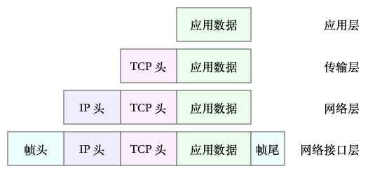
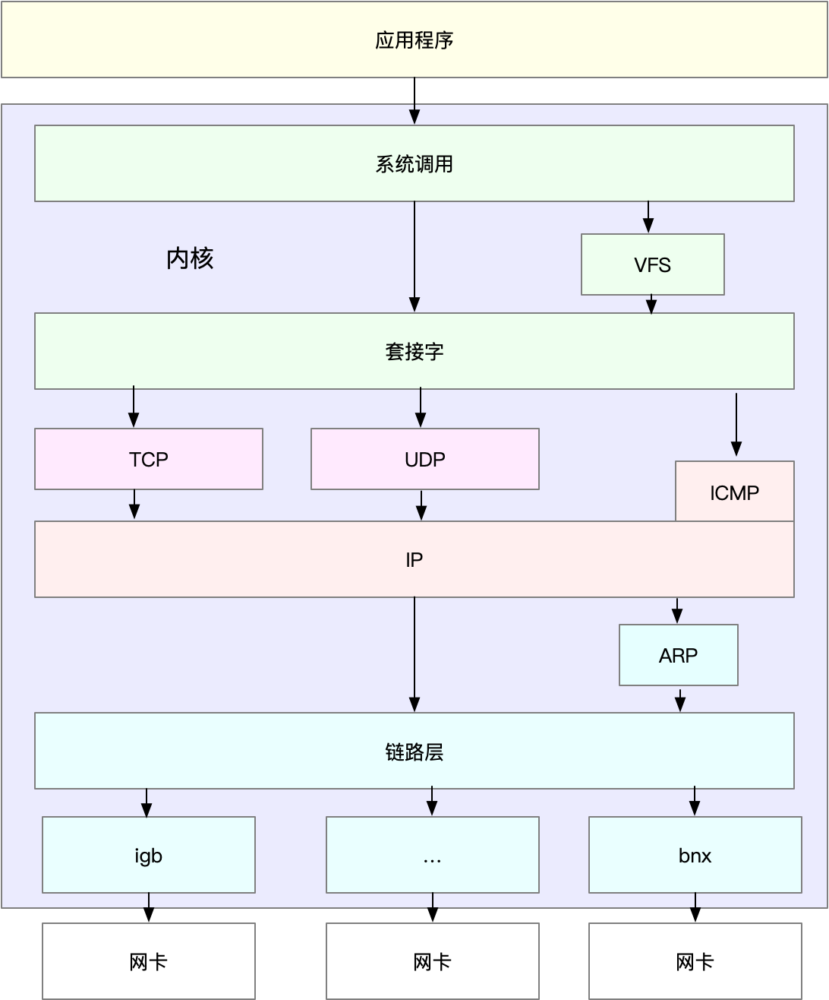
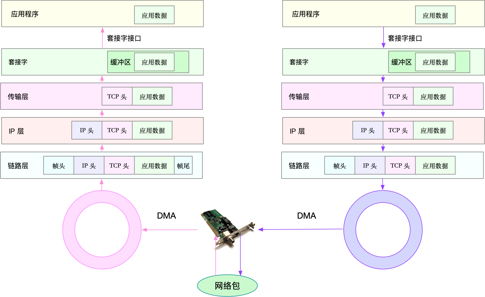
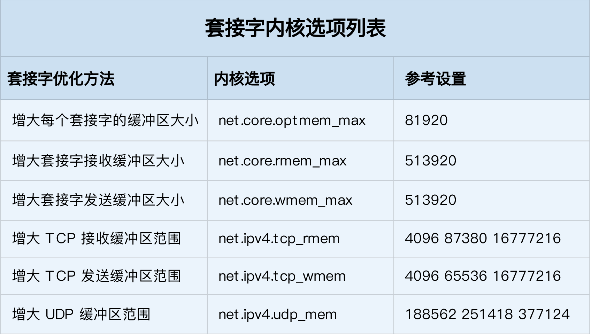
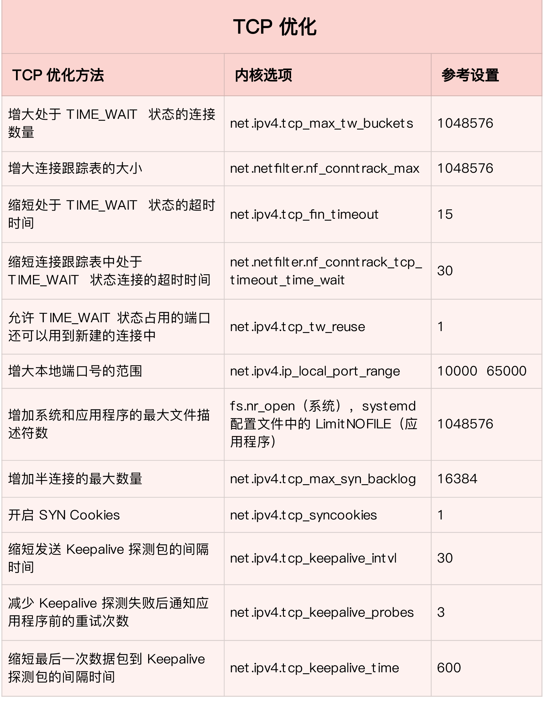

# 4.1 网络模型

前几节，我们一起学习了文件系统和磁盘 I/O 的工作原理，以及相应的性能分析和优化方法。接下来，我们将进入下一个重要模块—— Linux 的网络子系统。

由于网络处理的流程最复杂，跟我们前面讲到的进程调度、中断处理、内存管理以及 I/O 等都密不可分，所以，我把网络模块作为最后一个资源模块来讲解。

同 CPU、内存以及 I/O 一样，网络也是 Linux 系统最核心的功能。网络是一种把不同计算机或网络设备连接到一起的技术，它本质上是一种进程间通信方式，特别是跨系统的进程间通信，必须要通过网络才能进行。随着高并发、分布式、云计算、微服务等技术的普及，网络的性能也变得越来越重要。

## 4.1.1 网络模型
说到网络，我想你肯定经常提起七层负载均衡、四层负载均衡，或者三层设备、二层设备等等。那么，这里说的二层、三层、四层、七层又都是什么意思呢？

实际上，这些层都来自国际标准化组织制定的开放式系统互联通信参考模型（Open System Interconnection Reference Model），简称为 OSI 网络模型。

为了解决网络互联中异构设备的兼容性问题，并解耦复杂的网络包处理流程，OSI 模型把网络互联的框架分为应用层、表示层、会话层、传输层、网络层、数据链路层以及物理层等七层，每个层负责不同的功能。其中，
* 应用层，负责为应用程序提供统一的接口。
* 表示层，负责把数据转换成兼容接收系统的格式。
* 会话层，负责维护计算机之间的通信连接。
* 传输层，负责为数据加上传输表头，形成数据包。
* 网络层，负责数据的路由和转发。
* 数据链路层，负责 MAC 寻址、错误侦测和改错。
* 物理层，负责在物理网络中传输数据帧。

但是 OSI 模型还是太复杂了，也没能提供一个可实现的方法。所以，在 Linux 中，我们实际上使用的是另一个更实用的四层模型，即 TCP/IP 网络模型。

TCP/IP 模型，把网络互联的框架分为应用层、传输层、网络层、网络接口层等四层，其中，
* 应用层，负责向用户提供一组应用程序，比如 HTTP、FTP、DNS 等。
* 传输层，负责端到端的通信，比如 TCP、UDP 等。
* 网络层，负责网络包的封装、寻址和路由，比如 IP、ICMP 等。
* 网络接口层，负责网络包在物理网络中的传输，比如 MAC 寻址、错误侦测以及通过网卡传输网络帧等。

## 4.1.2 Linux 网络栈
有了 TCP/IP 模型后，在进行网络传输时，数据包就会按照协议栈，对上一层发来的数据进行逐层处理；然后封装上该层的协议头，再发送给下一层。

当然，网络包在每一层的处理逻辑，都取决于各层采用的网络协议。比如在应用层，一个提供 REST API 的应用，可以使用 HTTP 协议，把它需要传输的 JSON 数据封装到 HTTP 协议中，然后向下传递给 TCP 层。

而封装做的事情就很简单了，只是在原来的负载前后，增加固定格式的元数据，原始的负载数据并不会被修改。

比如，以通过 TCP 协议通信的网络包为例，通过下面这张图，我们可以看到，应用程序数据在每个层的封装格式。


理解了 TCP/IP 网络模型和网络包的封装原理后，你很容易能想到，Linux 内核中的网络栈，其实也类似于 TCP/IP 的四层结构。如下图所示，就是 Linux 通用 IP 网络栈的示意图：


我们从上到下来看这个网络栈，你可以发现，

* 最上层的应用程序，需要通过系统调用，来跟套接字接口进行交互；

* 套接字的下面，就是我们前面提到的传输层、网络层和网络接口层；

* 最底层，则是网卡驱动程序以及物理网卡设备。

这里我简单说一下网卡。网卡是发送和接收网络包的基本设备。在系统启动过程中，网卡通过内核中的网卡驱动程序注册到系统中。而在网络收发过程中，内核通过中断跟网卡进行交互。

再结合前面提到的 Linux 网络栈，可以看出，网络包的处理非常复杂。所以，网卡硬中断只处理最核心的网卡数据读取或发送，而协议栈中的大部分逻辑，都会放到软中断中处理。

这里我简单说一下网卡。网卡是发送和接收网络包的基本设备。在系统启动过程中，网卡通过内核中的网卡驱动程序注册到系统中。而在网络收发过程中，内核通过中断跟网卡进行交互。

再结合前面提到的 Linux 网络栈，可以看出，网络包的处理非常复杂。所以，网卡硬中断只处理最核心的网卡数据读取或发送，而协议栈中的大部分逻辑，都会放到软中断中处理。

## 4.1.3 Linux 网络收发流程

### 4.1.3.1 网络包的接收流程
我们先来看网络包的接收流程。

当一个网络帧到达网卡后，网卡会通过 DMA 方式，把这个网络包放到收包队列中；然后通过硬中断，告诉中断处理程序已经收到了网络包。

接着，网卡中断处理程序会为网络帧分配内核数据结构（sk_buff），并将其拷贝到 sk_buff 缓冲区中；然后再通过软中断，通知内核收到了新的网络帧。

接下来，内核协议栈从缓冲区中取出网络帧，并通过网络协议栈，从下到上逐层处理这个网络帧。比如，

在链路层检查报文的合法性，找出上层协议的类型（比如 IPv4 还是 IPv6），再去掉帧头、帧尾，然后交给网络层。

网络层取出 IP 头，判断网络包下一步的走向，比如是交给上层处理还是转发。当网络层确认这个包是要发送到本机后，就会取出上层协议的类型（比如 TCP 还是 UDP），去掉 IP 头，再交给传输层处理。

传输层取出 TCP 头或者 UDP 头后，根据 < 源 IP、源端口、目的 IP、目的端口 > 四元组作为标识，找出对应的 Socket，并把数据拷贝到 Socket 的接收缓存中。

最后，应用程序就可以使用 Socket 接口，读取到新接收到的数据了。


### 4.1.3.2 网络包的发送流程
了解网络包的接收流程后，就很容易理解网络包的发送流程。网络包的发送流程就是上图的右半部分，很容易发现，网络包的发送方向，正好跟接收方向相反。

首先，应用程序调用 Socket API（比如 sendmsg）发送网络包。

由于这是一个系统调用，所以会陷入到内核态的套接字层中。套接字层会把数据包放到 Socket 发送缓冲区中。

接下来，网络协议栈从 Socket 发送缓冲区中，取出数据包；再按照 TCP/IP 栈，从上到下逐层处理。比如，传输层和网络层，分别为其增加 TCP 头和 IP 头，执行路由查找确认下一跳的 IP，并按照 MTU 大小进行分片。

分片后的网络包，再送到网络接口层，进行物理地址寻址，以找到下一跳的 MAC 地址。然后添加帧头和帧尾，放到发包队列中。这一切完成后，会有软中断通知驱动程序：发包队列中有新的网络帧需要发送。

最后，驱动程序通过 DMA ，从发包队列中读出网络帧，并通过物理网卡把它发送出去。


# 4.2 关于 Linux 网络，你必须知道这些（下）
了解 Linux 网络的基本原理和收发流程后，你肯定迫不及待想知道，如何去观察网络的性能情况。具体而言，哪些指标可以用来衡量 Linux 的网络性能呢？

## 4.2.1 性能指标
实际上，我们通常用带宽、吞吐量、延时、PPS（Packet Per Second）等指标衡量网络的性能。

* 带宽，表示链路的最大传输速率，单位通常为 b/s （比特 / 秒）。

* 吞吐量，表示单位时间内成功传输的数据量，单位通常为 b/s（比特 / 秒）或者 B/s（字节 / 秒）。吞吐量受带宽限制，而吞吐量 / 带宽，也就是该网络的使用率。

* 延时，表示从网络请求发出后，一直到收到远端响应，所需要的时间延迟。在不同场景中，这一指标可能会有不同含义。比如，它可以表示，建立连接需要的时间（比如 TCP 握手延时），或一个数据包往返所需的时间（比如 RTT）。

* PPS，是 Packet Per Second（包 / 秒）的缩写，表示以网络包为单位的传输速率。PPS 通常用来评估网络的转发能力，比如硬件交换机，通常可以达到线性转发（即 PPS 可以达到或者接近理论最大值）。而基于 Linux 服务器的转发，则容易受网络包大小的影响。

除了这些指标，网络的可用性（网络能否正常通信）、并发连接数（TCP 连接数量）、丢包率（丢包百分比）、重传率（重新传输的网络包比例）等也是常用的性能指标。

接下来，请你打开一个终端，SSH 登录到服务器上，然后跟我一起来探索、观测这些性能指标。


## 4.2.2 网络配置
分析网络问题的第一步，通常是查看网络接口的配置和状态。你可以使用 ifconfig 或者 ip 命令，来查看网络的配置。我个人更推荐使用 ip 工具，因为它提供了更丰富的功能和更易用的接口。

ifconfig 和 ip 分别属于软件包 net-tools 和 iproute2，iproute2 是 net-tools 的下一代。通常情况下它们会在发行版中默认安装。但如果你找不到 ifconfig 或者 ip 命令，可以安装这两个软件包。

以网络接口 eth0 为例，你可以运行下面的两个命令，查看它的配置和状态：
```
$ ifconfig eth0
eth0: flags=4163<UP,BROADCAST,RUNNING,MULTICAST> mtu 1500
      inet 10.240.0.30 netmask 255.240.0.0 broadcast 10.255.255.255
      inet6 fe80::20d:3aff:fe07:cf2a prefixlen 64 scopeid 0x20<link>
      ether 78:0d:3a:07:cf:3a txqueuelen 1000 (Ethernet)
      RX packets 40809142 bytes 9542369803 (9.5 GB)
      RX errors 0 dropped 0 overruns 0 frame 0
      TX packets 32637401 bytes 4815573306 (4.8 GB)
      TX errors 0 dropped 0 overruns 0 carrier 0 collisions 0
​
$ ip -s addr show dev eth0
2: eth0: <BROADCAST,MULTICAST,UP,LOWER_UP> mtu 1500 qdisc mq state UP group default qlen 1000
  link/ether 78:0d:3a:07:cf:3a brd ff:ff:ff:ff:ff:ff
  inet 10.240.0.30/12 brd 10.255.255.255 scope global eth0
      valid_lft forever preferred_lft forever
  inet6 fe80::20d:3aff:fe07:cf2a/64 scope link
      valid_lft forever preferred_lft forever
  RX: bytes packets errors dropped overrun mcast
   9542432350 40809397 0       0       0       193
  TX: bytes packets errors dropped carrier collsns
   4815625265 32637658 0       0       0       0
```

你可以看到，ifconfig 和 ip 命令输出的指标基本相同，只是显示格式略微不同。比如，它们都包括了网络接口的状态标志、MTU 大小、IP、子网、MAC 地址以及网络包收发的统计信息。

这些具体指标的含义，在文档中都有详细的说明，不过，这里有几个跟网络性能密切相关的指标，需要你特别关注一下。

* 第一，网络接口的状态标志。ifconfig 输出中的 RUNNING ，或 ip 输出中的 LOWER_UP ，都表示物理网络是连通的，即网卡已经连接到了交换机或者路由器中。如果你看不到它们，通常表示网线被拔掉了。

* 第二，MTU 的大小。MTU 默认大小是 1500，根据网络架构的不同（比如是否使用了 VXLAN 等叠加网络），你可能需要调大或者调小 MTU 的数值。

* 第三，网络接口的 IP 地址、子网以及 MAC 地址。这些都是保障网络功能正常工作所必需的，你需要确保配置正确。

* 第四，网络收发的字节数、包数、错误数以及丢包情况，特别是 TX 和 RX 部分的 errors、dropped、overruns、carrier 以及 collisions 等指标不为 0 时，通常表示出现了网络 I/O 问题。其中：
    * errors 表示发生错误的数据包数，比如校验错误、帧同步错误等；
    * dropped 表示丢弃的数据包数，即数据包已经收到了 Ring Buffer，但因为内存不足等原因丢包；
    * overruns 表示超限数据包数，即网络 I/O 速度过快，导致 Ring Buffer 中的数据包来不及处理（队列满）而导致的丢包；
    * carrier 表示发生 carrirer 错误的数据包数，比如双工模式不匹配、物理电缆出现问题等；
    * collisions 表示碰撞数据包数。


## 4.2.3 套接字信息
ifconfig 和 ip 只显示了网络接口收发数据包的统计信息，但在实际的性能问题中，网络协议栈中的统计信息，我们也必须关注。你可以用 netstat 或者 ss ，来查看套接字、网络栈、网络接口以及路由表的信息。

我个人更推荐，使用 ss 来查询网络的连接信息，因为它比 netstat 提供了更好的性能（速度更快）。

比如，你可以执行下面的命令，查询套接字信
```
# head -n 3 表示只显示前面3行
# -l 表示只显示监听套接字
# -n 表示显示数字地址和端口(而不是名字)
# -p 表示显示进程信息
$ netstat -nlp | head -n 3
Active Internet connections (only servers)
Proto Recv-Q Send-Q Local Address           Foreign Address         State       PID/Program name
tcp        0      0 127.0.0.53:53           0.0.0.0:*               LISTEN      840/systemd-resolve

# -l 表示只显示监听套接字
# -t 表示只显示 TCP 套接字
# -n 表示显示数字地址和端口(而不是名字)
# -p 表示显示进程信息
$ ss -ltnp | head -n 3
State    Recv-Q    Send-Q        Local Address:Port        Peer Address:Port
LISTEN   0         128           127.0.0.53%lo:53               0.0.0.0:*        users:(("systemd-resolve",pid=840,fd=13))
LISTEN   0         128                 0.0.0.0:22               0.0.0.0:*        users:(("sshd",pid=1459,fd=3))
```

netstat 和 ss 的输出也是类似的，都展示了套接字的状态、接收队列、发送队列、本地地址、远端地址、进程 PID 和进程名称等。

其中，接收队列（Recv-Q）和发送队列（Send-Q）需要你特别关注，它们通常应该是 0。当你发现它们不是 0 时，说明有网络包的堆积发生。当然还要注意，在不同套接字状态下，它们的含义不同。

当套接字处于连接状态（Established）时，
* Recv-Q 表示套接字缓冲还没有被应用程序取走的字节数（即接收队列长度）。
* 而 Send-Q 表示还没有被远端主机确认的字节数（即发送队列长度）。

当套接字处于监听状态（Listening）时，
* Recv-Q 表示全连接队列的长度。
* 而 Send-Q 表示全连接队列的最大长度。

<u>所谓全连接，是指服务器收到了客户端的 ACK，完成了 TCP 三次握手，然后就会把这个连接挪到全连接队列中。这些全连接中的套接字，还需要被 accept() 系统调用取走，服务器才可以开始真正处理客户端的请求。</u>

<u>与全连接队列相对应的，还有一个半连接队列。所谓半连接是指还没有完成 TCP 三次握手的连接，连接只进行了一半。服务器收到了客户端的 SYN 包后，就会把这个连接放到半连接队列中，然后再向客户端发送 SYN+ACK 包。</u>

## 4.2.3 协议栈统计信息
```
$ netstat -s
...
Tcp:
    3244906 active connection openings
    23143 passive connection openings
    115732 failed connection attempts
    2964 connection resets received
    1 connections established
    13025010 segments received
    17606946 segments sent out
    44438 segments retransmitted
    42 bad segments received
    5315 resets sent
    InCsumErrors: 42
...

$ ss -s
Total: 186 (kernel 1446)
TCP:   4 (estab 1, closed 0, orphaned 0, synrecv 0, timewait 0/0), ports 0

Transport Total     IP        IPv6
*    1446      -         -
RAW    2         1         1
UDP    2         2         0
TCP    4         3         1
...
```

这些协议栈的统计信息都很直观。ss 只显示已经连接、关闭、孤儿套接字等简要统计，而 netstat 则提供的是更详细的网络协议栈信息。

比如，上面 netstat 的输出示例，就展示了 TCP 协议的主动连接、被动连接、失败重试、发送和接收的分段数量等各种信息。


## 4.2.4 网络吞吐和 PPS
接下来，我们再来看看，如何查看系统当前的网络吞吐量和 PPS。在这里，我推荐使用我们的老朋友 sar，在前面的 CPU、内存和 I/O 模块中，我们已经多次用到它。

给 sar 增加 -n 参数就可以查看网络的统计信息，比如网络接口（DEV）、网络接口错误（EDEV）、TCP、UDP、ICMP 等等。执行下面的命令，你就可以得到网络接口统计信息：

```
# 数字1表示每隔1秒输出一组数据
$ sar -n DEV 1
Linux 4.15.0-1035 (ubuntu)   01/06/19   _x86_64_  (2 CPU)

13:21:40        IFACE   rxpck/s   txpck/s    rxkB/s    txkB/s   rxcmp/s   txcmp/s  rxmcst/s   %ifutil
13:21:41         eth0     18.00     20.00      5.79      4.25      0.00      0.00      0.00      0.00
13:21:41      docker0      0.00      0.00      0.00      0.00      0.00      0.00      0.00      0.00
13:21:41           lo      0.00      0.00      0.00      0.00      0.00      0.00      0.00      0.00
```

这儿输出的指标比较多，我来简单解释下它们的含义。
* rxpck/s 和 txpck/s 分别是接收和发送的 PPS，单位为包 / 秒。

* rxkB/s 和 txkB/s 分别是接收和发送的吞吐量，单位是 KB/ 秒。

* rxcmp/s 和 txcmp/s 分别是接收和发送的压缩数据包数，单位是包 / 秒。

* %ifutil 是网络接口的使用率，即半双工模式下为 (rxkB/s+txkB/s)/Bandwidth，而全双工模式下为 max(rxkB/s, txkB/s)/Bandwidth。

其中，Bandwidth 可以用 ethtool 来查询，它的单位通常是 Gb/s 或者 Mb/s，不过注意这里小写字母 b ，表示比特而不是字节。我们通常提到的千兆网卡、万兆网卡等，单位也都是比特。如下你可以看到，我的 eth0 网卡就是一个千兆网卡：
```
$ ethtool eth0 | grep Speed
  Speed: 1000Mb/s
```

### 4.2.4 通性和延时
最后，我们通常使用 ping ，来测试远程主机的连通性和延时，而这基于 ICMP 协议。比如，执行下面的命令，你就可以测试本机到 114.114.114.114 这个 IP 地址的连通性和延时：
```
# -c3表示发送三次ICMP包后停止
$ ping -c3 114.114.114.114
PING 114.114.114.114 (114.114.114.114) 56(84) bytes of data.
64 bytes from 114.114.114.114: icmp_seq=1 ttl=54 time=244 ms
64 bytes from 114.114.114.114: icmp_seq=2 ttl=47 time=244 ms
64 bytes from 114.114.114.114: icmp_seq=3 ttl=67 time=244 ms

--- 114.114.114.114 ping statistics ---
3 packets transmitted, 3 received, 0% packet loss, time 2001ms
rtt min/avg/max/mdev = 244.023/244.070/244.105/0.034 ms
```

ping 的输出，可以分为两部分。


第一部分，是每个 ICMP 请求的信息，包括 ICMP 序列号（icmp_seq）、TTL（生存时间，或者跳数）以及往返延时。

第二部分，则是三次 ICMP 请求的汇总。

比如上面的示例显示，发送了 3 个网络包，并且接收到 3 个响应，没有丢包发生，这说明测试主机到 114.114.114.114 是连通的；平均往返延时（RTT）是 244ms，也就是从发送 ICMP 开始，到接收到 114.114.114.114 回复的确认，总共经历 244ms。


# 4.3 C10K 和 C1000K 回顾

今天，我们主要来回顾下经典的 C10K 和 C1000K 问题，以更好理解 Linux 网络的工作原理，并进一步分析，如何做到单机支持 C10M。

注意，C10K 和 C1000K 的首字母 C 是 Client 的缩写。C10K 就是单机同时处理 1 万个请求（并发连接 1 万）的问题，而 C1000K 也就是单机支持处理 100 万个请求（并发连接 100 万）的问题。

## 4.3.2 C10K
C10K 问题最早由 Dan Kegel 在 1999 年提出。那时的服务器还只是 32 位系统，运行着 Linux 2.2 版本（后来又升级到了 2.4 和 2.6，而 2.6 才支持 x86_64），只配置了很少的内存（2GB）和千兆网卡。

怎么在这样的系统中支持并发 1 万的请求呢？

从资源上来说，对 2GB 内存和千兆网卡的服务器来说，同时处理 10000 个请求，只要每个请求处理占用不到 200KB（2GB/10000）的内存和 100Kbit （1000Mbit/10000）的网络带宽就可以。所以，物理资源是足够的，接下来自然是软件的问题，特别是网络的 I/O 模型问题。

说到 I/O 的模型，我在文件系统的原理中，曾经介绍过文件 I/O，其实网络 I/O 模型也类似。在 C10K 以前，Linux 中网络处理都用同步阻塞的方式，也就是每个请求都分配一个进程或者线程。请求数只有 100 个时，这种方式自然没问题，但增加到 10000 个请求时，10000 个进程或线程的调度、上下文切换乃至它们占用的内存，都会成为瓶颈。

既然每个请求分配一个线程的方式不合适，那么，为了支持 10000 个并发请求，这里就有两个问题需要我们解决。

第一，怎样在一个线程内处理多个请求，也就是要在一个线程内响应多个网络 I/O。以前的同步阻塞方式下，一个线程只能处理一个请求，到这里不再适用，是不是可以用非阻塞 I/O 或者异步 I/O 来处理多个网络请求呢？

第二，怎么更节省资源地处理客户请求，也就是要用更少的线程来服务这些请求。是不是可以继续用原来的 100 个或者更少的线程，来服务现在的 10000 个请求呢？

当然，事实上，现在 C10K 的问题早就解决了，在继续学习下面的内容前，你可以先自己思考一下这两个问题。结合前面学过的内容，你是不是已经有了解决思路呢？

## 4.3.3 I/O 模型优化
异步、非阻塞 I/O 的解决思路，你应该听说过，其实就是我们在网络编程中经常用到的 I/O 多路复用（I/O Multiplexing）。I/O 多路复用是什么意思呢？

别急，详细了解前，我先来讲两种 I/O 事件通知的方式：水平触发和边缘触发，它们常用在套接字接口的文件描述符中。

* 水平触发：只要文件描述符可以非阻塞地执行 I/O ，就会触发通知。也就是说，应用程序可以随时检查文件描述符的状态，然后再根据状态，进行 I/O 操作。

* 边缘触发：只有在文件描述符的状态发生改变（也就是 I/O 请求达到）时，才发送一次通知。这时候，应用程序需要尽可能多地执行 I/O，直到无法继续读写，才可以停止。如果 I/O 没执行完，或者因为某种原因没来得及处理，那么这次通知也就丢失了。

接下来，我们再回过头来看 I/O 多路复用的方法。这里其实有很多实现方法，我带你来逐个分析一下。

**第一种，使用非阻塞 I/O 和水平触发通知，比如使用 select 或者 poll。**
根据刚才水平触发的原理，select 和 poll 需要从文件描述符列表中，找出哪些可以执行 I/O ，然后进行真正的网络 I/O 读写。由于 I/O 是非阻塞的，一个线程中就可以同时监控一批套接字的文件描述符，这样就达到了单线程处理多请求的目的。

所以，这种方式的最大优点，是对应用程序比较友好，它的 API 非常简单。

但是，应用软件使用 select 和 poll 时，需要对这些文件描述符列表进行轮询，这样，请求数多的时候就会比较耗时。并且，select 和 poll 还有一些其他的限制。

select 使用固定长度的位相量，表示文件描述符的集合，因此会有最大描述符数量的限制。比如，在 32 位系统中，默认限制是 1024。并且，在 select 内部，检查套接字状态是用轮询的方法，处理耗时跟描述符数量是 O(N) 的关系。

而 poll 改进了 select 的表示方法，换成了一个没有固定长度的数组，这样就没有了最大描述符数量的限制（当然还会受到系统文件描述符限制）。但应用程序在使用 poll 时，同样需要对文件描述符列表进行轮询，这样，处理耗时跟描述符数量就是 O(N) 的关系。

除此之外，应用程序每次调用 select 和 poll 时，还需要把文件描述符的集合，从用户空间传入内核空间，由内核修改后，再传出到用户空间中。这一来一回的内核空间与用户空间切换，也增加了处理成本。

有没有什么更好的方式来处理呢？答案自然是肯定的。

**第二种，使用非阻塞 I/O 和边缘触发通知，比如 epoll。**

既然 select 和 poll 有那么多的问题，就需要继续对其进行优化，而 epoll 就很好地解决了这些问题。

epoll 使用红黑树，在内核中管理文件描述符的集合，这样，就不需要应用程序在每次操作时都传入、传出这个集合。

epoll 使用事件驱动的机制，只关注有 I/O 事件发生的文件描述符，不需要轮询扫描整个集合。

不过要注意，epoll 是在 Linux 2.6 中才新增的功能（2.4 虽然也有，但功能不完善）。由于边缘触发只在文件描述符可读或可写事件发生时才通知，那么应用程序就需要尽可能多地执行 I/O，并要处理更多的异常事件。

**第三种，使用异步 I/O（Asynchronous I/O，简称为 AIO）。**
在前面文件系统原理的内容中，我曾介绍过异步 I/O 与同步 I/O 的区别。异步 I/O 允许应用程序同时发起很多 I/O 操作，而不用等待这些操作完成。而在 I/O 完成后，系统会用事件通知（比如信号或者回调函数）的方式，告诉应用程序。这时，应用程序才会去查询 I/O 操作的结果。

异步 I/O 也是到了 Linux 2.6 才支持的功能，并且在很长时间里都处于不完善的状态，比如 glibc 提供的异步 I/O 库，就一直被社区诟病。同时，由于异步 I/O 跟我们的直观逻辑不太一样，想要使用的话，一定要小心设计，其使用难度比较高。


# 4.4 网络性能优化的思路

## 4.4.1 应用程序

应用程序，通常通过套接字接口进行网络操作。由于网络收发通常比较耗时，所以应用程序的优化，主要就是对网络 I/O 和进程自身的工作模型的优化。

相关内容，其实我们在 C10K 和 C1000K 回顾 的文章中已经学过了。这里我们简单回顾一下。

从网络 I/O 的角度来说，主要有下面两种优化思路。

第一种是最常用的 I/O 多路复用技术 epoll，主要用来取代 select 和 poll。这其实是解决 C10K 问题的关键，也是目前很多网络应用默认使用的机制。

第二种是使用异步 I/O（Asynchronous I/O，AIO）。AIO 允许应用程序同时发起很多 I/O 操作，而不用等待这些操作完成。等到 I/O 完成后，系统会用事件通知的方式，告诉应用程序结果。不过，AIO 的使用比较复杂，你需要小心处理很多边缘情况。

而从进程的工作模型来说，也有两种不同的模型用来优化。

第一种，主进程 + 多个 worker 子进程。其中，主进程负责管理网络连接，而子进程负责实际的业务处理。这也是最常用的一种模型。

第二种，监听到相同端口的多进程模型。在这种模型下，所有进程都会监听相同接口，并且开启 SO_REUSEPORT 选项，由内核负责，把请求负载均衡到这些监听进程中去。

除了网络 I/O 和进程的工作模型外，应用层的网络协议优化，也是至关重要的一点。我总结了常见的几种优化方法。

* 使用长连接取代短连接，可以显著降低 TCP 建立连接的成本。在每秒请求次数较多时，这样做的效果非常明显。

* 使用内存等方式，来缓存不常变化的数据，可以降低网络 I/O 次数，同时加快应用程序的响应速度。

* 使用 Protocol Buffer 等序列化的方式，压缩网络 I/O 的数据量，可以提高应用程序的吞吐。

* 使用 DNS 缓存、预取、HTTPDNS 等方式，减少 DNS 解析的延迟，也可以提升网络 I/O 的整体速度。

## 4.4.2 套接字
套接字可以屏蔽掉 Linux 内核中不同协议的差异，为应用程序提供统一的访问接口。每个套接字，都有一个读写缓冲区。
* 读缓冲区，缓存了远端发过来的数据。如果读缓冲区已满，就不能再接收新的数据。

* 写缓冲区，缓存了要发出去的数据。如果写缓冲区已满，应用程序的写操作就会被阻塞。

所以，为了提高网络的吞吐量，你通常需要调整这些缓冲区的大小。比如：

增大每个套接字的缓冲区大小 net.core.optmem_max；

增大套接字接收缓冲区大小 net.core.rmem_max 和发送缓冲区大小 net.core.wmem_max；

增大 TCP 接收缓冲区大小 net.ipv4.tcp_rmem 和发送缓冲区大小 net.ipv4.tcp_wmem。


至于套接字的内核选项，我把它们整理成了一个表格，方便你在需要时参考：


不过有几点需要你注意。

tcp_rmem 和 tcp_wmem 的三个数值分别是 min，default，max，系统会根据这些设置，自动调整 TCP 接收 / 发送缓冲区的大小。

udp_mem 的三个数值分别是 min，pressure，max，系统会根据这些设置，自动调整 UDP 发送缓冲区的大小。

当然，表格中的数值只提供参考价值，具体应该设置多少，还需要你根据实际的网络状况来确定。比如，发送缓冲区大小，理想数值是吞吐量 * 延迟，这样才可以达到最大网络利用率。

除此之外，套接字接口还提供了一些配置选项，用来修改网络连接的行为：

* 为 TCP 连接设置 TCP_NODELAY 后，就可以禁用 Nagle 算法；

* 为 TCP 连接开启 TCP_CORK 后，可以让小包聚合成大包后再发送（注意会阻塞小包的发送）；

* 使用 SO_SNDBUF 和 SO_RCVBUF ，可以分别调整套接字发送缓冲区和接收缓冲区的大小。

## 4.4.3 传输层
传输层最重要的是 TCP 和 UDP 协议，所以这儿的优化，其实主要就是对这两种协议的优化。

我们首先来看 TCP 协议的优化。

TCP 提供了面向连接的可靠传输服务。要优化 TCP，我们首先要掌握 TCP 协议的基本原理，比如流量控制、慢启动、拥塞避免、延迟确认以及状态流图（如下图所示）等。

第一类，在请求数比较大的场景下，你可能会看到大量处于 TIME_WAIT 状态的连接，它们会占用大量内存和端口资源。这时，我们可以优化与 TIME_WAIT 状态相关的内核选项，比如采取下面几种措施。

* 增大处于 TIME_WAIT 状态的连接数量 net.ipv4.tcp_max_tw_buckets ，并增大连接跟踪表的大小 net.netfilter.nf_conntrack_max。

* 减小 net.ipv4.tcp_fin_timeout 和 net.netfilter.nf_conntrack_tcp_timeout_time_wait ，让系统尽快释放它们所占用的资源。

* 开启端口复用 net.ipv4.tcp_tw_reuse。这样，被 TIME_WAIT 状态占用的端口，还能用到新建的连接中。

* 增大本地端口的范围 net.ipv4.ip_local_port_range 。这样就可以支持更多连接，提高整体的并发能力。

* 增加最大文件描述符的数量。你可以使用 fs.nr_open 和 fs.file-max ，分别增大进程和系统的最大文件描述符数；或在应用程序的 systemd 配置文件中，配置 LimitNOFILE ，设置应用程序的最大文件描述符数。

第二类，为了缓解 SYN FLOOD 等，利用 TCP 协议特点进行攻击而引发的性能问题，你可以考虑优化与 SYN 状态相关的内核选项，比如采取下面几种措施。

* 增大 TCP 半连接的最大数量 net.ipv4.tcp_max_syn_backlog ，或者开启 TCP SYN Cookies net.ipv4.tcp_syncookies ，来绕开半连接数量限制的问题（注意，这两个选项不可同时使用）。

* 减少 SYN_RECV 状态的连接重传 SYN+ACK 包的次数 net.ipv4.tcp_synack_retries。


第三类，在长连接的场景中，通常使用 Keepalive 来检测 TCP 连接的状态，以便对端连接断开后，可以自动回收。但是，系统默认的 Keepalive 探测间隔和重试次数，一般都无法满足应用程序的性能要求。所以，这时候你需要优化与 Keepalive 相关的内核选项，比如：

* 缩短最后一次数据包到 Keepalive 探测包的间隔时间 net.ipv4.tcp_keepalive_time；

* 缩短发送 Keepalive 探测包的间隔时间 net.ipv4.tcp_keepalive_intvl；

* 减少 Keepalive 探测失败后，一直到通知应用程序前的重试次数 net.ipv4.tcp_keepalive_probes。

讲了这么多 TCP 优化方法，我也把它们整理成了一个表格，方便你在需要时参考（数值仅供参考，具体配置还要结合你的实际场景来调整）：


优化 TCP 性能时，你还要注意，如果同时使用不同优化方法，可能会产生冲突。

比如，就像网络请求延迟的案例中我们曾经分析过的，服务器端开启 Nagle 算法，而客户端开启延迟确认机制，就很容易导致网络延迟增大。

另外，在使用  NAT 的服务器上，如果开启 net.ipv4.tcp_tw_recycle ，就很容易导致各种连接失败。实际上，由于坑太多，这个选项在内核的 4.1 版本中已经删除了。

说完 TCP，我们再来看 UDP 的优化。

UDP 提供了面向数据报的网络协议，它不需要网络连接，也不提供可靠性保障。所以，UDP 优化，相对于 TCP 来说，要简单得多。这里我也总结了常见的几种优化方案。

* 跟上篇套接字部分提到的一样，增大套接字缓冲区大小以及 UDP 缓冲区范围；

* 跟前面 TCP 部分提到的一样，增大本地端口号的范围；

* 根据 MTU 大小，调整 UDP 数据包的大小，减少或者避免分片的发生。


## 4.4.4 网络层
接下来，我们再来看网络层的优化。

网络层，负责网络包的封装、寻址和路由，包括 IP、ICMP 等常见协议。在网络层，最主要的优化，其实就是对路由、 IP 分片以及 ICMP 等进行调优。

第一种，从路由和转发的角度出发，你可以调整下面的内核选项。

在需要转发的服务器中，比如用作 NAT 网关的服务器或者使用 Docker 容器时，开启 IP 转发，即设置 net.ipv4.ip_forward = 1。

调整数据包的生存周期 TTL，比如设置 net.ipv4.ip_default_ttl = 64。注意，增大该值会降低系统性能。

开启数据包的反向地址校验，比如设置 net.ipv4.conf.eth0.rp_filter = 1。这样可以防止 IP 欺骗，并减少伪造 IP 带来的 DDoS 问题。

第二种，从分片的角度出发，最主要的是调整 MTU（Maximum Transmission Unit）的大小。

通常，MTU 的大小应该根据以太网的标准来设置。以太网标准规定，一个网络帧最大为 1518B，那么去掉以太网头部的 18B 后，剩余的 1500 就是以太网 MTU 的大小。

在使用 VXLAN、GRE 等叠加网络技术时，要注意，网络叠加会使原来的网络包变大，导致 MTU 也需要调整。

比如，就以 VXLAN 为例，它在原来报文的基础上，增加了 14B 的以太网头部、 8B 的 VXLAN 头部、8B 的 UDP 头部以及 20B 的 IP 头部。换句话说，每个包比原来增大了 50B。

所以，我们就需要把交换机、路由器等的 MTU，增大到 1550， 或者把 VXLAN 封包前（比如虚拟化环境中的虚拟网卡）的 MTU 减小为 1450。


另外，现在很多网络设备都支持巨帧，如果是这种环境，你还可以把 MTU 调大为 9000，以提高网络吞吐量。


第三种，从 ICMP 的角度出发，为了避免 ICMP 主机探测、ICMP Flood 等各种网络问题，你可以通过内核选项，来限制 ICMP 的行为。


比如，你可以禁止 ICMP 协议，即设置 net.ipv4.icmp_echo_ignore_all = 1。这样，外部主机就无法通过 ICMP 来探测主机。

或者，你还可以禁止广播 ICMP，即设置 net.ipv4.icmp_echo_ignore_broadcasts = 1。

## 4.4.5 链路层
网络层的下面是链路层，所以最后，我们再来看链路层的优化方法。

链路层负责网络包在物理网络中的传输，比如 MAC 寻址、错误侦测以及通过网卡传输网络帧等。自然，链路层的优化，也是围绕这些基本功能进行的。接下来，我们从不同的几个方面分别来看。

由于网卡收包后调用的中断处理程序（特别是软中断），需要消耗大量的 CPU。所以，将这些中断处理程序调度到不同的 CPU 上执行，就可以显著提高网络吞吐量。这通常可以采用下面两种方法。

* 比如，你可以为网卡硬中断配置 CPU 亲和性（smp_affinity），或者开启 irqbalance 服务。

* 再如，你可以开启 RPS（Receive Packet Steering）和 RFS（Receive Flow Steering），将应用程序和软中断的处理，调度到相同 CPU 上，这样就可以增加 CPU 缓存命中率，减少网络延迟。

另外，现在的网卡都有很丰富的功能，原来在内核中通过软件处理的功能，可以卸载到网卡中，通过硬件来执行。

* TSO（TCP Segmentation Offload）和 UFO（UDP Fragmentation Offload）：在 TCP/UDP 协议中直接发送大包；而 TCP 包的分段（按照 MSS 分段）和 UDP 的分片（按照 MTU 分片）功能，由网卡来完成 。

* GSO（Generic Segmentation Offload）：在网卡不支持 TSO/UFO 时，将 TCP/UDP 包的分段，延迟到进入网卡前再执行。这样，不仅可以减少 CPU 的消耗，还可以在发生丢包时只重传分段后的包。

* LRO（Large Receive Offload）：在接收 TCP 分段包时，由网卡将其组装合并后，再交给上层网络处理。不过要注意，在需要 IP 转发的情况下，不能开启 LRO，因为如果多个包的头部信息不一致，LRO 合并会导致网络包的校验错误。

* GRO（Generic Receive Offload）：GRO 修复了 LRO 的缺陷，并且更为通用，同时支持 TCP 和 UDP。

* RSS（Receive Side Scaling）：也称为多队列接收，它基于硬件的多个接收队列，来分配网络接收进程，这样可以让多个 CPU 来处理接收到的网络包。

* VXLAN 卸载：也就是让网卡来完成 VXLAN 的组包功能。

最后，对于网络接口本身，也有很多方法，可以优化网络的吞吐量。

比如，你可以开启网络接口的多队列功能。这样，每个队列就可以用不同的中断号，调度到不同 CPU 上执行，从而提升网络的吞吐量。

再如，你可以增大网络接口的缓冲区大小，以及队列长度等，提升网络传输的吞吐量（注意，这可能导致延迟增大）。

你还可以使用 Traffic Control 工具，为不同网络流量配置 QoS。

到这里，我就从应用程序、套接字、传输层、网络层，再到链路层，分别介绍了相应的网络性能优化方法。通过这些方法的优化后，网络性能就可以满足绝大部分场景了。

最后，别忘了一种极限场景。还记得我们学过的的 C10M 问题吗？


在单机并发 1000 万的场景中，对 Linux 网络协议栈进行的各种优化策略，基本都没有太大效果。因为这种情况下，网络协议栈的冗长流程，其实才是最主要的性能负担。


这时，我们可以用两种方式来优化。

第一种，使用 DPDK 技术，跳过内核协议栈，直接由用户态进程用轮询的方式，来处理网络请求。同时，再结合大页、CPU 绑定、内存对齐、流水线并发等多种机制，优化网络包的处理效率。

第二种，使用内核自带的 XDP 技术，在网络包进入内核协议栈前，就对其进行处理，这样也可以实现很好的性能。

